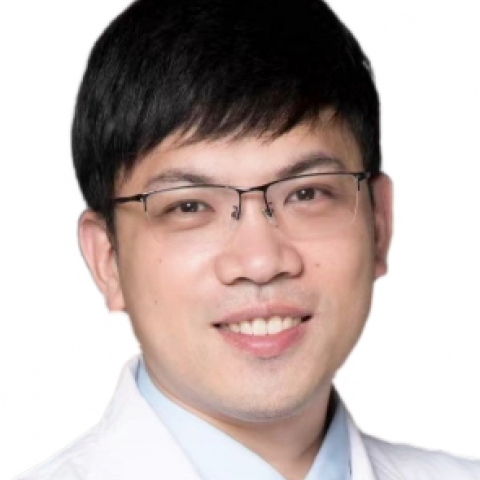

<!-- AUTO-GENERATED-BY: work/generate_obsidian_profiles.py -->

<!-- TEMPLATE: D:\workspace\信息收集整理\医生画像仓库\模板\医生画像模板.md -->

# 张赟建

## 基础信息

| 字段 | 内容 |
|---|---|
| 姓名 | 张赟建 |
| 医院 | 中山大学附属第一医院 |
| 科室 | 乳腺外科 |
| 职称/身份 | 主任医师 |
| 来源链接 | [官网原文](https://www.fahsysu.org.cn/node/731) |
| 采集日期 | 2026-08-13 |

## 简介/擅长

乳腺各类疑难复杂病例诊治，乳房整形修复，微创手术，保乳整形等，尤其是乳腺癌术后重建（假体/皮瓣），机器人腔镜手术等处于国际领先技术。 研究方向主攻：复发转移性乳腺癌肿瘤微环境，结合人工智能多模态预测转移模型，代谢性疾病与乳腺癌风险和乳腺癌生活质量等。 2010年 中山大学外科学博士研究生毕业 2010-2014年 中山大学附属第一医院血管甲状腺乳腺外科 2014-2022年 中山大学附属第一医院甲状腺乳腺外科 2022年-至今 中山大学附属第一医院乳腺外科 2016年 瑞典Karolinska医学院访问学者 2023-2024年 海湾医学院医学教育学硕士 社会任职： 国际医学教育联盟副会士（Associated Fellow of AMEE） 中国抗衰老促进会肿瘤营养专业委员会副主任委员； 中国整形美容协会理事会理事； 广东省医学会乳腺病学分会委员； 广州市抗癌协会乳腺癌专业委员会常委； 广东省抗癌协会乳腺癌专业委员会委员； 中国医师协会科学普及分会乳腺科普学组委员； 广东省医院协会乳腺科管理专业委员会副主任委员； 广东省研究型医院学会微创外科专业委员会副主任委员； 广东省科技成果转化促进会乳腺专业委员会副主任委员； ...

## 教育与进修经历

- 2010年 中山大学外科学博士研究生毕业 2010-2014年 中山大学附属第一医院血管甲状腺乳腺外科 2014-2022年 中山大学附属第一医院甲状腺乳腺外科 2022年-至今 中山大学附属第一医院乳腺外科 2016年 瑞典Karolinska医学院访问学者 2023-2024年 海湾医学院医学教育学硕士 社会任职： 国际医学教育联盟副会士（Associated Fellow of AMEE） 中国抗衰老促进会肿瘤营养专业委员会副主任委员；

## 科研项目与成果

- 广东省科技成果转化促进会乳腺专业委员会副主任委员；
- 以第一作者或通讯作者发表SCI论文30余篇，主持国家自然科学基金面上项目，广东省自然科学基金面上项目，广州市科技局重点研发项目（创新药与肿瘤微环境方向），南沙区科技局民生重点研发项目（人工智能方向），广东省中医药局项目，CSCO基金会等多个课题。

## 论文与学术产出

- 以第一作者或通讯作者发表SCI论文30余篇，主持国家自然科学基金面上项目，广东省自然科学基金面上项目，广州市科技局重点研发项目（创新药与肿瘤微环境方向），南沙区科技局民生重点研发项目（人工智能方向），广东省中医药局项目，CSCO基金会等多个课题。

## 可包装亮点

- 擅长乳腺各类疑难复杂病例诊治，乳房整形修复，微创手术，保乳整形等，尤其是乳腺癌术后重建（假体/皮瓣），机器人腔镜手术等处于国际领先技术。
- 医疗特长：擅长乳腺各类疑难复杂病例诊治，乳房整形修复，微创手术，保乳整形等，尤其是乳腺癌术后重建（假体/皮瓣），机器人腔镜手术等处于国际领先技术。
- 2010年 中山大学外科学博士研究生毕业 2010-2014年 中山大学附属第一医院血管甲状腺乳腺外科 2014-2022年 中山大学附属第一医院甲状腺乳腺外科 2022年-至今 中山大学附属第一医院乳腺外科 2016年 瑞典Karolinska医学院访问学者 2023-2024年 海湾医学院医学教育学硕士 社会任职： 国际医学教育联盟副会士（Associ…
- 中国整形美容协会理事会理事；

## 重点疾病/人群标签

- 慢性病：代谢、肿瘤、癌、乳腺癌、术后、营养、疑难、复杂、多学科
- 肿瘤：代谢、肿瘤、癌、乳腺癌、术后、营养、疑难、复杂、多学科
- 生殖疾病：
- 免疫/风湿：
- 术后恢复/康复：代谢、肿瘤、癌、乳腺癌、术后、营养、疑难、复杂、多学科
- 疑难重症：代谢、肿瘤、癌、乳腺癌、术后、营养、疑难、复杂、多学科

## 证据摘录

> 只摘录官网公开信息中的短句或关键字段，不复制大段原文。

- 官网身份字段：主任医师
- 官网简介/擅长：乳腺各类疑难复杂病例诊治，乳房整形修复，微创手术，保乳整形等，尤其是乳腺癌术后重建（假体/皮瓣），机器人腔镜手术等处于国际领先技术。 研究方向主攻：复发转移性乳腺癌肿瘤微环境，结合人工智能多模态预测转移模型，代谢性疾病与乳腺癌风险和乳腺癌生活质量等。 2010年 中山大学外科学博士研究生毕业 2010-2014年 中山大学附属第一医院血管甲状腺乳腺外科 2014-2022年 中山大学附属第一医院甲状腺乳腺外科 2022年-至今 中山大…
- 官网亮眼经历线索：擅长乳腺各类疑难复杂病例诊治，乳房整形修复，微创手术，保乳整形等，尤其是乳腺癌术后重建（假体/皮瓣），机器人腔镜手术等处于国际领先技术。 医疗特长：擅长乳腺各类疑难复杂病例诊治，乳房整形修复，微创手术，保乳整形等，尤其是乳腺癌术后重建（假体/皮瓣），机器人腔镜手术等处于国际领先技术。 2010年 中山大学外科学博士研究生毕业 2010-2014年 中山大学附属第一医院血管甲状腺乳腺外科 2014-2022年 中山大学附属第一医院甲状腺…
- 来源链接：https://www.fahsysu.org.cn/node/731

## BD 画像摘要

张赟建医生可作为慢性病、肿瘤、术后恢复/康复、疑难重症方向的基础画像候选。后续 BD 使用应继续以官网来源和人工复核为准，不添加疗效承诺或无来源包装。

## 合规边界

- 仅使用医院官网、官方公众号、官方小程序等公开渠道。
- 不采集私人电话、私人微信、家庭住址、患者隐私或非公开排班信息。
- 不写“保证治愈”“疗效第一”“包治疑难杂症”等无法由官网证明的表述。
