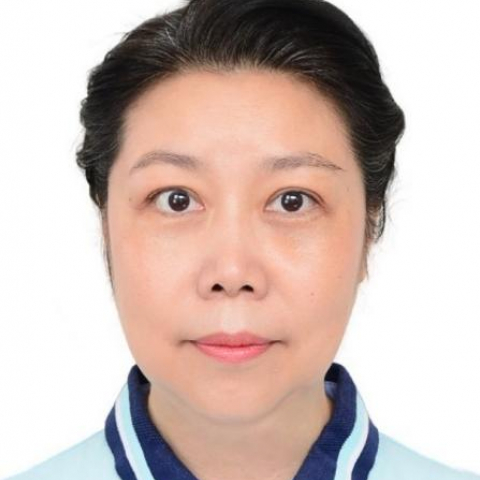

<!-- AUTO-GENERATED-BY: work/generate_obsidian_profiles.py -->

<!-- TEMPLATE: D:\workspace\信息收集整理\医生画像仓库\模板\医生画像模板.md -->

# 张颖

## 基础信息

| 字段 | 内容 |
|---|---|
| 姓名 | 张颖 |
| 医院 | 中山大学附属第一医院 |
| 科室 | 产科 |
| 职称/身份 | 副主任医师 |
| 来源链接 | [官网原文](https://www.fahsysu.org.cn/node/600) |
| 采集日期 | 2026-08-13 |

## 简介/擅长

在中山大学附属第一医院从事近30年临床、教学和科研工作，专业方向为：围产医学、母胎监护。 主攻妊娠合并内、外科疾病和妊娠各种并发症。 擅长肿瘤性疾病、血管和血栓性疾病、神经科疾病在妊娠期的处理。 在妇产科疾病方面有多年积累，注重子宫肌瘤合并妊娠、宫颈机能不全的诊断与产科全程管理。 对甲状腺疾病、糖尿病的孕前、孕期及产后的系统综合治疗经验丰富。 熟练掌握产科各种手术，特别是高难度及腹部盆腔手术史的剖宫产； 分娩及助产技巧娴熟。 研究方向：围产医学 主要教育和工作经历：1993年毕业于中山医科大学本科。 一直在在中山大学（原中山医科大学）附属第一医院妇产科工作。 2001年中山医科大学硕士毕业。 2008年香港大学玛丽医院进修 社会兼职：广东省医师协会围产分会委员 妇产科ALSO培训导师 中山一院基础妇产科学院导师 广东省、中山一院住院医师培训师资 论著：在国内外期刊发表文章30余篇 其他主要工作成绩（比如获奖情况）：多年优秀教师. 多年先进工作者 论著：20多篇 专著：参编2部

## 教育与进修经历

- 研究方向：围产医学 主要教育和工作经历：1993年毕业于中山医科大学本科。
- 2001年中山医科大学硕士毕业。
- 2008年香港大学玛丽医院进修 社会兼职：广东省医师协会围产分会委员 妇产科ALSO培训导师 中山一院基础妇产科学院导师 广东省、中山一院住院医师培训师资 论著：在国内外期刊发表文章30余篇 其他主要工作成绩（比如获奖情况）：多年优秀教师. 多年先进工作者 论著：20多篇 专著：参编2部

## 科研项目与成果

- 在中山大学附属第一医院从事近30年临床、教学和科研工作，专业方向为：围产医学、母胎监护。
- 医疗特长： 在中山大学附属第一医院从事近30年临床、教学和科研工作，专业方向为：围产医学、母胎监护。

## 论文与学术产出

- 2008年香港大学玛丽医院进修 社会兼职：广东省医师协会围产分会委员 妇产科ALSO培训导师 中山一院基础妇产科学院导师 广东省、中山一院住院医师培训师资 论著：在国内外期刊发表文章30余篇 其他主要工作成绩（比如获奖情况）：多年优秀教师. 多年先进工作者 论著：20多篇 专著：参编2部

## 可包装亮点

- 2008年香港大学玛丽医院进修 社会兼职：广东省医师协会围产分会委员 妇产科ALSO培训导师 中山一院基础妇产科学院导师 广东省、中山一院住院医师培训师资 论著：在国内外期刊发表文章30余篇 其他主要工作成绩（比如获奖情况）：多年优秀教师. 多年先进工作者 论著：20多篇 专著：参编2部

## 重点疾病/人群标签

- 慢性病：糖尿病、肿瘤、瘤
- 肿瘤：糖尿病、肿瘤、瘤
- 生殖疾病：
- 免疫/风湿：
- 术后恢复/康复：
- 疑难重症：

## 证据摘录

> 只摘录官网公开信息中的短句或关键字段，不复制大段原文。

- 官网身份字段：副主任医师
- 官网简介/擅长：在中山大学附属第一医院从事近30年临床、教学和科研工作，专业方向为：围产医学、母胎监护。 主攻妊娠合并内、外科疾病和妊娠各种并发症。 擅长肿瘤性疾病、血管和血栓性疾病、神经科疾病在妊娠期的处理。 在妇产科疾病方面有多年积累，注重子宫肌瘤合并妊娠、宫颈机能不全的诊断与产科全程管理。 对甲状腺疾病、糖尿病的孕前、孕期及产后的系统综合治疗经验丰富。 熟练掌握产科各种手术，特别是高难度及腹部盆腔手术史的剖宫产； 分娩及助产技巧娴熟。 研究方向…
- 官网亮眼经历线索：2008年香港大学玛丽医院进修 社会兼职：广东省医师协会围产分会委员 妇产科ALSO培训导师 中山一院基础妇产科学院导师 广东省、中山一院住院医师培训师资 论著：在国内外期刊发表文章30余篇 其他主要工作成绩（比如获奖情况）：多年优秀教师. 多年先进工作者 论著：20多篇 专著：参编2部
- 来源链接：https://www.fahsysu.org.cn/node/600

## BD 画像摘要

张颖医生可作为慢性病、肿瘤方向的基础画像候选。后续 BD 使用应继续以官网来源和人工复核为准，不添加疗效承诺或无来源包装。

## 合规边界

- 仅使用医院官网、官方公众号、官方小程序等公开渠道。
- 不采集私人电话、私人微信、家庭住址、患者隐私或非公开排班信息。
- 不写“保证治愈”“疗效第一”“包治疑难杂症”等无法由官网证明的表述。
