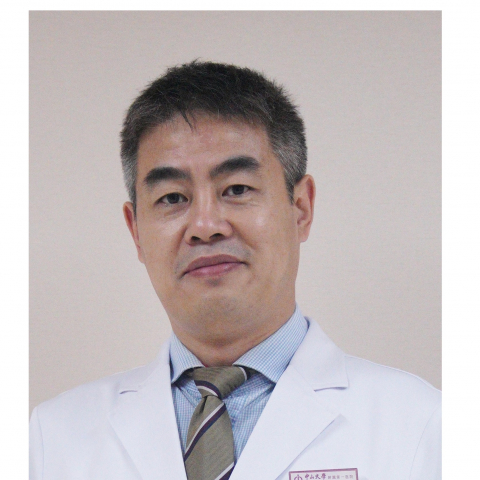

<!-- AUTO-GENERATED-BY: work/generate_obsidian_profiles.py -->

<!-- TEMPLATE: D:\workspace\信息收集整理\医生画像仓库\模板\医生画像模板.md -->

# 彭建军

## 基础信息

| 字段 | 内容 |
|---|---|
| 姓名 | 彭建军 |
| 医院 | 中山大学附属第一医院 |
| 科室 | 胃肠外科二科 |
| 职称/身份 | 副主任医师 |
| 来源链接 | [官网原文](https://www.fahsysu.org.cn/node/25422) |
| 采集日期 | 2026-08-13 |

## 简介/擅长

## 教育与进修经历

- 研究方向： 胃肠道肿瘤个体化治疗 主要教育和工作经历： 2001年本科毕业于郑州大学，2008年博士研究生毕业于中山大学，2008年中山大学附属第一医院工作至今，2010年澳大利亚墨尔本Peter MacCollum Cancer Centre访问学者 社会兼职： 中国临床肿瘤学会（CSCO）青年专家委员会委员 中国抗癌协会靶向治疗专业委员会青年委员 中国医药教育协会常务理事 中国医疗保健国际交流促进会消化道肿瘤MDT分会委员 国家食品药品监督管理总局（CFDA）药物临床研究数据核查员 Annals of Onc…

## 论文与学术产出

- 专著： 参编《加速康复外科理念在胃肠外科中的临床应用新进展》（副主编）、《静脉输液港的植入与管理》、《胃癌外科学》、《胃癌淋巴转移》、《胃肠外科学》。

## 可包装亮点

- 长期从事食管、胃、结直肠、肛肠良恶性疾病的规范化治疗，擅长胃癌、结肠癌、直肠癌、十二指肠癌、食管癌手术及新辅助、辅助、转化、晚期及复发肿瘤的化疗、靶向药物治疗及生物免疫治疗，对胃肠肿瘤多学科治疗（MDT）具有丰富的经验，熟练掌握消化内镜在胃肠道疾病中的诊断和治疗技术。
- 研究方向： 胃肠道肿瘤个体化治疗 主要教育和工作经历： 2001年本科毕业于郑州大学，2008年博士研究生毕业于中山大学，2008年中山大学附属第一医院工作至今，2010年澳大利亚墨尔本Peter MacCollum Cancer Centre访问学者 社会兼职： 中国临床肿瘤学会（CSCO）青年专家委员会委员 中国抗癌协会靶向治疗专业委员会青年委员 中国…

## 重点疾病/人群标签

- 慢性病：
- 肿瘤：肿瘤、癌、化疗、靶向、胃癌、肠癌、免疫、康复、多学科、MDT
- 生殖疾病：
- 免疫/风湿：肿瘤、癌、化疗、靶向、胃癌、肠癌、免疫、康复、多学科、MDT
- 术后恢复/康复：肿瘤、癌、化疗、靶向、胃癌、肠癌、免疫、康复、多学科、MDT
- 疑难重症：肿瘤、癌、化疗、靶向、胃癌、肠癌、免疫、康复、多学科、MDT

## 证据摘录

> 只摘录官网公开信息中的短句或关键字段，不复制大段原文。

- 官网身份字段：副主任医师
- 官网亮眼经历线索：长期从事食管、胃、结直肠、肛肠良恶性疾病的规范化治疗，擅长胃癌、结肠癌、直肠癌、十二指肠癌、食管癌手术及新辅助、辅助、转化、晚期及复发肿瘤的化疗、靶向药物治疗及生物免疫治疗，对胃肠肿瘤多学科治疗（MDT）具有丰富的经验，熟练掌握消化内镜在胃肠道疾病中的诊断和治疗技术。 研究方向： 胃肠道肿瘤个体化治疗 主要教育和工作经历： 2001年本科毕业于郑州大学，2008年博士研究生毕业于中山大学，2008年中山大学附属第一医院工作至今，201…
- 来源链接：https://www.fahsysu.org.cn/node/25422

## BD 画像摘要

彭建军医生可作为肿瘤、免疫/风湿/感染、术后恢复/康复、疑难重症方向的基础画像候选。后续 BD 使用应继续以官网来源和人工复核为准，不添加疗效承诺或无来源包装。

## 合规边界

- 仅使用医院官网、官方公众号、官方小程序等公开渠道。
- 不采集私人电话、私人微信、家庭住址、患者隐私或非公开排班信息。
- 不写“保证治愈”“疗效第一”“包治疑难杂症”等无法由官网证明的表述。
