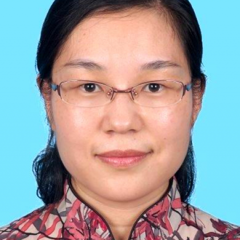

<!-- AUTO-GENERATED-BY: work/generate_obsidian_profiles.py -->

<!-- TEMPLATE: D:\workspace\信息收集整理\医生画像仓库\模板\医生画像模板.md -->

# 彭挺生

## 基础信息

| 字段 | 内容 |
|---|---|
| 姓名 | 彭挺生 |
| 医院 | 中山大学附属第一医院 |
| 科室 | 病理科 |
| 职称/身份 | 主任医师/教授 |
| 来源链接 | [官网原文](https://www.fahsysu.org.cn/node/5808) |
| 采集日期 | 2026-08-13 |

## 简介/擅长

## 教育与进修经历

- 熟练掌握各个系统常规标本、冰冻标本病理诊断技术，专长于淋巴造血系统肿瘤和骨髓病理诊断 医疗特长（限400字内）： 熟练掌握各个系统常规标本、冰冻标本病理诊断技术，专长于淋巴造血系统肿瘤和骨髓病理诊断 研究方向： 骨肉瘤发生发展以及侵袭转移机制的研究 主要教育和工作经历： 1994年毕业于河南医科大学临床医疗系获医学学士；
- 1998年毕业于中山医科大学基础医学院病理学专业获医学硕士；
- 2004年毕业于中山大学病理学与病理生理学专业获医学博士；
- 2009年至2011年在美国德克萨斯大学MD Anderson Cancer Center从事博士后研究工作两年；

## 科研项目与成果

- 主持国自然、教育部留学回国人员基金、省自然等科研基金项目5项，作为主要参与人参与科研基金7项。

## 论文与学术产出

- 广东省医疗行业协会病理医学管理分会委员 论著： 共发表论文40余篇，已发表SCI论文20篇。
- 主编或参编《病理学》教材/专著8部。
- SCI论文： 1.Tian R, Xie X, Han J, Luo C, Yong B, Peng H, Shen J, Peng T. miR-199a-3p negatively regulates the progression of osteosarcoma through targeting AXL American Journal of Cancer Research. 2014;

## 可包装亮点

- 2009年至2011年在美国德克萨斯大学MD Anderson Cancer Center从事博士后研究工作两年；
- 2015年起任中山大学附属第一医院病理科主任医师。
- 社会兼职： 现任广东省医学会病理学分会第十届委员会常务委员；
- 中国抗癌协会肿瘤病理专业委员会青年委员会委员；

## 重点疾病/人群标签

- 慢性病：
- 肿瘤：肿瘤、癌、瘤
- 生殖疾病：
- 免疫/风湿：
- 术后恢复/康复：
- 疑难重症：

## 证据摘录

> 只摘录官网公开信息中的短句或关键字段，不复制大段原文。

- 官网身份字段：主任医师/教授
- 官网亮眼经历线索：2009年至2011年在美国德克萨斯大学MD Anderson Cancer Center从事博士后研究工作两年； 2015年起任中山大学附属第一医院病理科主任医师。 社会兼职： 现任广东省医学会病理学分会第十届委员会常务委员； 中国抗癌协会肿瘤病理专业委员会青年委员会委员；
- 来源链接：https://www.fahsysu.org.cn/node/5808

## BD 画像摘要

彭挺生医生可作为肿瘤方向的基础画像候选。后续 BD 使用应继续以官网来源和人工复核为准，不添加疗效承诺或无来源包装。

## 合规边界

- 仅使用医院官网、官方公众号、官方小程序等公开渠道。
- 不采集私人电话、私人微信、家庭住址、患者隐私或非公开排班信息。
- 不写“保证治愈”“疗效第一”“包治疑难杂症”等无法由官网证明的表述。
