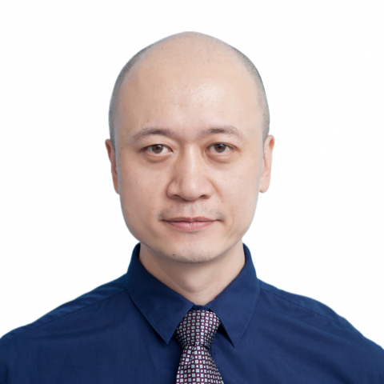

<!-- AUTO-GENERATED-BY: work/generate_obsidian_profiles.py -->

<!-- TEMPLATE: D:\workspace\信息收集整理\医生画像仓库\模板\医生画像模板.md -->

# 徐哲

## 基础信息

| 字段 | 内容 |
|---|---|
| 姓名 | 徐哲 |
| 医院 | 中山大学附属第一医院 |
| 科室 | 小儿外科 |
| 职称/身份 | 主任医师 |
| 来源链接 | [官网原文](https://www.fahsysu.org.cn/node/33115) |
| 采集日期 | 2026-08-13 |

## 简介/擅长

从事小儿外科临床与科研工作近30年，擅长小儿泌尿外科疾病的诊治，对尿道下裂、肾积水、重复肾、膀胱输尿管返流等疾病有丰富的临床经验，牵头组建国家级“儿童膀胱功能障碍疾病临床诊疗中心”。 擅长小儿恶性实体肿瘤尤其是复杂型、难治性肿瘤的临床诊治。 擅长小儿外科微创技术，2015年开展华南地区首例小儿外科达芬奇机器人手术，至今手术例数及效果处于国内前列。 主要研究方向：小儿泌尿、普外疾病和小儿实体性肿瘤的临床诊治及分子生物学研究。 学习工作经历：1997年毕业于中山医科大学临床医疗系七年制，获硕士学位， 2002年获中山大学泌尿外科博士学位，2014年7-9月于德国SLK KLINIKEN师从世界著名的泌尿外科Rassweiller教授学习泌尿系统腹腔镜及机器人手术。 自1997年起一直在中山大学附属第一医院小儿外科从事临床研究工作，积累了丰富的临床经验。 社会兼职：中华医学会小儿外科学会肿瘤组委员、国家卫生健康委儿童血液病恶性肿瘤专家委员会委员、广东省医学会小儿外科分会常务委员、小儿微创专业组组长、广东省卫生经济学会儿童健康发展分会副会长、广东省健康管理学会儿童肿瘤相关心脏病专业委员会副主任委员、广东省精准医学应用学会儿童肿...

## 教育与进修经历

- 学习工作经历：1997年毕业于中山医科大学临床医疗系七年制，获硕士学位， 2002年获中山大学泌尿外科博士学位，2014年7-9月于德国SLK KLINIKEN师从世界著名的泌尿外科Rassweiller教授学习泌尿系统腹腔镜及机器人手术。

## 科研项目与成果

- 从事小儿外科临床与科研工作近30年，擅长小儿泌尿外科疾病的诊治，对尿道下裂、肾积水、重复肾、膀胱输尿管返流等疾病有丰富的临床经验，牵头组建国家级“儿童膀胱功能障碍疾病临床诊疗中心”。
- 医疗特长： 从事小儿外科临床与科研工作近30年，擅长小儿泌尿外科疾病的诊治，对尿道下裂、肾积水、重复肾、膀胱输尿管返流等疾病有丰富的临床经验，牵头组建国家级“儿童膀胱功能障碍疾病临床诊疗中心”。
- 科研情况：承担广东省自然科学基金2项、广东省科技计划项目1项。

## 论文与学术产出

- 相关研究在国内外权威杂志发表文章数十篇，其中SCI文章十余篇。

## 可包装亮点

- 学习工作经历：1997年毕业于中山医科大学临床医疗系七年制，获硕士学位， 2002年获中山大学泌尿外科博士学位，2014年7-9月于德国SLK KLINIKEN师从世界著名的泌尿外科Rassweiller教授学习泌尿系统腹腔镜及机器人手术。
- 社会兼职：中华医学会小儿外科学会肿瘤组委员、国家卫生健康委儿童血液病恶性肿瘤专家委员会委员、广东省医学会小儿外科分会常务委员、小儿微创专业组组长、广东省卫生经济学会儿童健康发展分会副会长、广东省健康管理学会儿童肿瘤相关心脏病专业委员会副主任委员、广东省精准医学应用学会儿童肿瘤分会副主任委员、广东省妇幼保健协会小儿外科专业委员会副主任委员、广东省抗癌协会小儿…
- 相关研究在国内外权威杂志发表文章数十篇，其中SCI文章十余篇。

## 重点疾病/人群标签

- 慢性病：
- 肿瘤：肿瘤、癌、功能障碍、难治、复杂
- 生殖疾病：
- 免疫/风湿：
- 术后恢复/康复：肿瘤、癌、功能障碍、难治、复杂
- 疑难重症：肿瘤、癌、功能障碍、难治、复杂

## 证据摘录

> 只摘录官网公开信息中的短句或关键字段，不复制大段原文。

- 官网身份字段：主任医师
- 官网简介/擅长：从事小儿外科临床与科研工作近30年，擅长小儿泌尿外科疾病的诊治，对尿道下裂、肾积水、重复肾、膀胱输尿管返流等疾病有丰富的临床经验，牵头组建国家级“儿童膀胱功能障碍疾病临床诊疗中心”。 擅长小儿恶性实体肿瘤尤其是复杂型、难治性肿瘤的临床诊治。 擅长小儿外科微创技术，2015年开展华南地区首例小儿外科达芬奇机器人手术，至今手术例数及效果处于国内前列。 主要研究方向：小儿泌尿、普外疾病和小儿实体性肿瘤的临床诊治及分子生物学研究。 学习工作经…
- 官网亮眼经历线索：学习工作经历：1997年毕业于中山医科大学临床医疗系七年制，获硕士学位， 2002年获中山大学泌尿外科博士学位，2014年7-9月于德国SLK KLINIKEN师从世界著名的泌尿外科Rassweiller教授学习泌尿系统腹腔镜及机器人手术。 社会兼职：中华医学会小儿外科学会肿瘤组委员、国家卫生健康委儿童血液病恶性肿瘤专家委员会委员、广东省医学会小儿外科分会常务委员、小儿微创专业组组长、广东省卫生经济学会儿童健康发展分会副会长、广东省健…
- 来源链接：https://www.fahsysu.org.cn/node/33115

## BD 画像摘要

徐哲医生可作为肿瘤、术后恢复/康复、疑难重症方向的基础画像候选。后续 BD 使用应继续以官网来源和人工复核为准，不添加疗效承诺或无来源包装。

## 合规边界

- 仅使用医院官网、官方公众号、官方小程序等公开渠道。
- 不采集私人电话、私人微信、家庭住址、患者隐私或非公开排班信息。
- 不写“保证治愈”“疗效第一”“包治疑难杂症”等无法由官网证明的表述。
