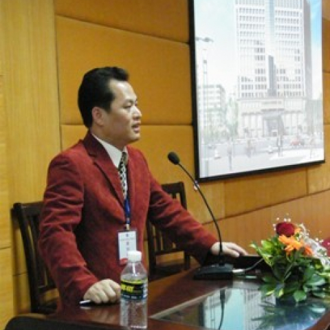

<!-- AUTO-GENERATED-BY: work/generate_obsidian_profiles.py -->

<!-- TEMPLATE: D:\workspace\信息收集整理\医生画像仓库\模板\医生画像模板.md -->

# 徐康清

## 基础信息

| 字段 | 内容 |
|---|---|
| 姓名 | 徐康清 |
| 医院 | 中山大学附属第一医院 |
| 科室 | 麻醉科 |
| 职称/身份 | 教授 |
| 来源链接 | [官网原文](https://www.fahsysu.org.cn/node/5783) |
| 采集日期 | 2026-08-13 |

## 简介/擅长

从事临床麻醉及危重病医学工作近20年，是中山大学麻醉学医、教、研工作的中青年骨干，主要开展体外循环、颅脑、肝胆、肝肾移植及急危重等重大手术的临床麻醉，医疗效果好，临床麻醉未发生医疗事故与意外，深受同行的好评，是“中山一院抗击非典先进个人”。 研究方向：擅长麻醉手术期器官保护与急危重病复苏处理，尤其是在术后急慢性镇痛治疗与各种无痛胃肠镜检查，无痛人流或取卵与分娩镇痛等领域造诣高。 主要教育和工作经历： 2001年毕业于中山医科大学, 获外科学博士研究生学位，2006在德国接受困难气道管理培训，2008年在英国接受静脉麻醉培训； 1993年在中山一院麻醉科参加工作至今，2005年任科室副主任，2007年兼任黄埔院区麻醉手术中心主任 ，2008年任中山大学国家临床技能中心副主任。 社会兼职：中山大学教学指导委员会委员，广东省自然科学基金评委，广东省医疗事故鉴定委员会专家，广东省医学会麻醉学会器官移植学组委员，广东省抗癌学会肿瘤麻醉与镇痛专业委员会副主任委员，广东省生物医学工程学会麻醉技术专业委员会主任委员。 论著：在国内外有影响的医学核心期刊发表论文约50多篇，其中博士学位论文《体外循环心脏手术肺的炎性反应及乌司他丁对其影响...

## 教育与进修经历

- 主要教育和工作经历： 2001年毕业于中山医科大学, 获外科学博士研究生学位，2006在德国接受困难气道管理培训，2008年在英国接受静脉麻醉培训；
- 论著：在国内外有影响的医学核心期刊发表论文约50多篇，其中博士学位论文《体外循环心脏手术肺的炎性反应及乌司他丁对其影响的临床研究》获得2001年度裘法祖优秀医学论文一等奖。

## 科研项目与成果

- 社会兼职：中山大学教学指导委员会委员，广东省自然科学基金评委，广东省医疗事故鉴定委员会专家，广东省医学会麻醉学会器官移植学组委员，广东省抗癌学会肿瘤麻醉与镇痛专业委员会副主任委员，广东省生物医学工程学会麻醉技术专业委员会主任委员。
- 其他主要工作成绩（比如获奖情况）：科研态度认真，治学严谨，主持国家及教育部、卫生部、广东省科技厅、上海市吴孟超医学科技基金、广州市科委和中山大学资助的科研课题共20项。

## 论文与学术产出

- 论著：在国内外有影响的医学核心期刊发表论文约50多篇，其中博士学位论文《体外循环心脏手术肺的炎性反应及乌司他丁对其影响的临床研究》获得2001年度裘法祖优秀医学论文一等奖。
- 专著：主编专著3部:《临床麻醉设备与耗材学》(高等教育出版社)、《麻醉药物治疗学》(人民卫生出版社)和《麻醉急症与意外救治指南》(人民军医出版社)。

## 可包装亮点

- 从事临床麻醉及危重病医学工作近20年，是中山大学麻醉学医、教、研工作的中青年骨干，主要开展体外循环、颅脑、肝胆、肝肾移植及急危重等重大手术的临床麻醉，医疗效果好，临床麻醉未发生医疗事故与意外，深受同行的好评，是“中山一院抗击非典先进个人”。
- 医疗特长： 从事临床麻醉及危重病医学工作近20年，是中山大学麻醉学医、教、研工作的中青年骨干，主要开展体外循环、颅脑、肝胆、肝肾移植及急危重等重大手术的临床麻醉，医疗效果好，临床麻醉未发生医疗事故与意外，深受同行的好评，是“中山一院抗击非典先进个人”。
- 研究方向：擅长麻醉手术期器官保护与急危重病复苏处理，尤其是在术后急慢性镇痛治疗与各种无痛胃肠镜检查，无痛人流或取卵与分娩镇痛等领域造诣高。
- 主要教育和工作经历： 2001年毕业于中山医科大学, 获外科学博士研究生学位，2006在德国接受困难气道管理培训，2008年在英国接受静脉麻醉培训；

## 重点疾病/人群标签

- 慢性病：慢性、肿瘤、癌、术后、危重、急危重
- 肿瘤：慢性、肿瘤、癌、术后、危重、急危重
- 生殖疾病：
- 免疫/风湿：
- 术后恢复/康复：慢性、肿瘤、癌、术后、危重、急危重
- 疑难重症：慢性、肿瘤、癌、术后、危重、急危重

## 证据摘录

> 只摘录官网公开信息中的短句或关键字段，不复制大段原文。

- 官网身份字段：教授
- 官网简介/擅长：从事临床麻醉及危重病医学工作近20年，是中山大学麻醉学医、教、研工作的中青年骨干，主要开展体外循环、颅脑、肝胆、肝肾移植及急危重等重大手术的临床麻醉，医疗效果好，临床麻醉未发生医疗事故与意外，深受同行的好评，是“中山一院抗击非典先进个人”。 研究方向：擅长麻醉手术期器官保护与急危重病复苏处理，尤其是在术后急慢性镇痛治疗与各种无痛胃肠镜检查，无痛人流或取卵与分娩镇痛等领域造诣高。 主要教育和工作经历： 2001年毕业于中山医科大学, 获…
- 官网亮眼经历线索：从事临床麻醉及危重病医学工作近20年，是中山大学麻醉学医、教、研工作的中青年骨干，主要开展体外循环、颅脑、肝胆、肝肾移植及急危重等重大手术的临床麻醉，医疗效果好，临床麻醉未发生医疗事故与意外，深受同行的好评，是“中山一院抗击非典先进个人”。 医疗特长： 从事临床麻醉及危重病医学工作近20年，是中山大学麻醉学医、教、研工作的中青年骨干，主要开展体外循环、颅脑、肝胆、肝肾移植及急危重等重大手术的临床麻醉，医疗效果好，临床麻醉未发生医疗事故…
- 来源链接：https://www.fahsysu.org.cn/node/5783

## BD 画像摘要

徐康清医生可作为慢性病、肿瘤、术后恢复/康复、疑难重症方向的基础画像候选。后续 BD 使用应继续以官网来源和人工复核为准，不添加疗效承诺或无来源包装。

## 合规边界

- 仅使用医院官网、官方公众号、官方小程序等公开渠道。
- 不采集私人电话、私人微信、家庭住址、患者隐私或非公开排班信息。
- 不写“保证治愈”“疗效第一”“包治疑难杂症”等无法由官网证明的表述。
