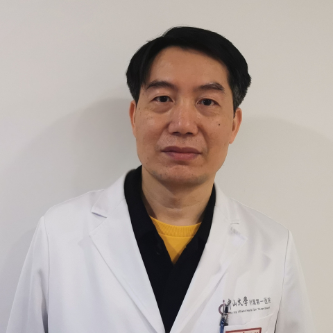

<!-- AUTO-GENERATED-BY: work/generate_obsidian_profiles.py -->

<!-- TEMPLATE: D:\workspace\信息收集整理\医生画像仓库\模板\医生画像模板.md -->

# 徐成康

## 基础信息

| 字段 | 内容 |
|---|---|
| 姓名 | 徐成康 |
| 医院 | 中山大学附属第一医院 |
| 科室 | 妇科 |
| 职称/身份 | 主任医师 |
| 来源链接 | [官网原文](https://www.fahsysu.org.cn/node/575) |
| 采集日期 | 2026-08-13 |

## 简介/擅长

各种妇科微创手术，主要是保留子宫的手术包括子宫肌瘤、子宫腺肌症病灶剔除术，保存卵巢功能的卵巢手术包括巧克力囊肿、卵巢畸胎瘤、卵巢囊腺瘤等剔除术，子宫畸形及缺陷的矫正，包括双子宫、残角子宫、子宫纵隔的矫形，子宫瘢痕憩室切除修补、子宫瘢痕妊娠切除修补，先天性无阴道成形术。 宫颈机能不全环扎手术，宫腔粘连分离术，外阴微整形包括处女膜修补、小阴唇肥大切除、阴道紧缩术等。 研究方向：子宫内膜异位症，子宫肌瘤，宫颈机能不全 主要教育和工作经历： 1988年本科毕业于中山医科大学 1997年攻读中山医科大学妇科肿瘤硕士学位。 1996-2002年任职于中山医科大学附属第一医院主治医生 2002-2014年，任职于中山大学附属第一医院副主任医师 2014-至今任职于中山大学附属第一医院主任医师 社会兼职： 广东省自然医学会产后康复专委会副主任委员 广东省行业协会自然流产分会副主任委员 论著：腹腔镜下卵巢创面两种止血方法对卵巢功能影响的临床研究 子宫内膜异位症合并不孕者生殖内分泌的改变 专著：妇科肿瘤学 其他主要工作成绩（比如获奖情况）：参与的妇科腔镜手术系列研究获得广东省科技进步二等奖

## 教育与进修经历

- 研究方向：子宫内膜异位症，子宫肌瘤，宫颈机能不全 主要教育和工作经历： 1988年本科毕业于中山医科大学 1997年攻读中山医科大学妇科肿瘤硕士学位。

## 可包装亮点

- 1996-2002年任职于中山医科大学附属第一医院主治医生 2002-2014年，任职于中山大学附属第一医院副主任医师 2014-至今任职于中山大学附属第一医院主任医师 社会兼职： 广东省自然医学会产后康复专委会副主任委员 广东省行业协会自然流产分会副主任委员 论著：腹腔镜下卵巢创面两种止血方法对卵巢功能影响的临床研究 子宫内膜异位症合并不孕者生殖内分泌的…

## 重点疾病/人群标签

- 慢性病：
- 肿瘤：肿瘤、瘤、生殖、不孕、卵巢、康复、创面
- 生殖疾病：肿瘤、瘤、生殖、不孕、卵巢、康复、创面
- 免疫/风湿：
- 术后恢复/康复：肿瘤、瘤、生殖、不孕、卵巢、康复、创面
- 疑难重症：

## 证据摘录

> 只摘录官网公开信息中的短句或关键字段，不复制大段原文。

- 官网身份字段：主任医师
- 官网简介/擅长：各种妇科微创手术，主要是保留子宫的手术包括子宫肌瘤、子宫腺肌症病灶剔除术，保存卵巢功能的卵巢手术包括巧克力囊肿、卵巢畸胎瘤、卵巢囊腺瘤等剔除术，子宫畸形及缺陷的矫正，包括双子宫、残角子宫、子宫纵隔的矫形，子宫瘢痕憩室切除修补、子宫瘢痕妊娠切除修补，先天性无阴道成形术。 宫颈机能不全环扎手术，宫腔粘连分离术，外阴微整形包括处女膜修补、小阴唇肥大切除、阴道紧缩术等。 研究方向：子宫内膜异位症，子宫肌瘤，宫颈机能不全 主要教育和工作经历：…
- 官网亮眼经历线索：1996-2002年任职于中山医科大学附属第一医院主治医生 2002-2014年，任职于中山大学附属第一医院副主任医师 2014-至今任职于中山大学附属第一医院主任医师 社会兼职： 广东省自然医学会产后康复专委会副主任委员 广东省行业协会自然流产分会副主任委员 论著：腹腔镜下卵巢创面两种止血方法对卵巢功能影响的临床研究 子宫内膜异位症合并不孕者生殖内分泌的改变 专著：妇科肿瘤学 其他主要工作成绩（比如获奖情况）：参与的妇科腔镜手术系列…
- 来源链接：https://www.fahsysu.org.cn/node/575

## BD 画像摘要

徐成康医生可作为肿瘤、生殖疾病、术后恢复/康复方向的基础画像候选。后续 BD 使用应继续以官网来源和人工复核为准，不添加疗效承诺或无来源包装。

## 合规边界

- 仅使用医院官网、官方公众号、官方小程序等公开渠道。
- 不采集私人电话、私人微信、家庭住址、患者隐私或非公开排班信息。
- 不写“保证治愈”“疗效第一”“包治疑难杂症”等无法由官网证明的表述。
