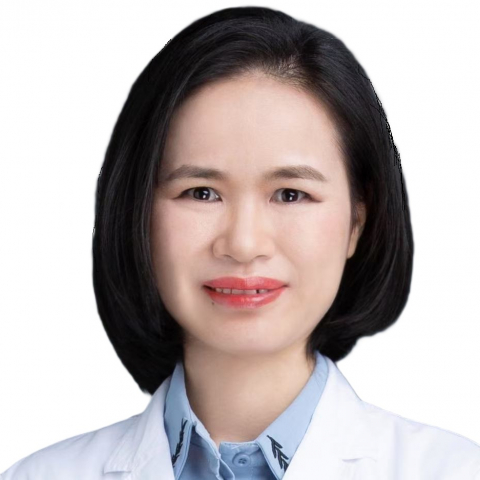

<!-- AUTO-GENERATED-BY: work/generate_obsidian_profiles.py -->

<!-- TEMPLATE: D:\workspace\信息收集整理\医生画像仓库\模板\医生画像模板.md -->

# 徐玲玲

## 基础信息

| 字段 | 内容 |
|---|---|
| 姓名 | 徐玲玲 |
| 医院 | 中山大学附属第一医院 |
| 科室 | 儿科ICU |
| 职称/身份 | 副主任医师 |
| 来源链接 | [官网原文](https://www.fahsysu.org.cn/node/33069) |
| 采集日期 | 2026-08-13 |

## 简介/擅长

采用独特的自然医学疗法，擅长儿童神经免疫（过敏相关）常见病和罕见疾病，如：难治性抽动障碍、慢性咳嗽、注意力缺陷多动障碍、癫痫、孤独症、精神运动发育迟缓、语言发育迟缓、各种神经肌肉疾病如（庞贝病、脊髓型肌萎缩、神经纤维瘤、假肥大型肌营养不良等）及肌无力查因、脑瘫、脓毒症、重症肺炎、脑炎、脑膜炎的抗感染等的诊治 主要教育和工作经历： 2011年儿科学毕业后开始从事儿科临床工作 现任中山一院儿科本科教学秘书、副主任医师、硕士生导师 2023.9-2025.6中东名校(阿联酋海湾医科大学)，国际医学教育学硕士学位 2018.9-2021.6 中山大学临床儿科博士研究生，获博士学位 2008.9-2011.6中山大学临床儿科硕士研究生，获硕士学位 2003.9-2008.6南昌大学医学院儿科系，获学士学位 教学成就: 荣获全球最大的医学教育学术组织(AMEE)的AssociateFellows(AFAMEE)称号 获广东省柯麟医学基金会临床医学专业优秀临床带教教师 获中山大学附属第一医院十佳优秀教师、优秀教育管理者 中山大学教学病例讨论比赛二等奖 学术成就: 主持省级及厅局级项目共3项 以第一作者或共同第一作者发表 SCI和中文...

## 可包装亮点

- 采用独特的自然医学疗法，擅长儿童神经免疫（过敏相关）常见病和罕见疾病，如：难治性抽动障碍、慢性咳嗽、注意力缺陷多动障碍、癫痫、孤独症、精神运动发育迟缓、语言发育迟缓、各种神经肌肉疾病如（庞贝病、脊髓型肌萎缩、神经纤维瘤、假肥大型肌营养不良等）及肌无力查因、脑瘫、脓毒症、重症肺炎、脑炎、脑膜炎的抗感染等的诊治 医疗特长： 采用独特的自然医学疗法，擅长儿童神经…

## 重点疾病/人群标签

- 慢性病：慢性、瘤、免疫、感染、营养、危重、重症、急危重、难治、罕见
- 肿瘤：慢性、瘤、免疫、感染、营养、危重、重症、急危重、难治、罕见
- 生殖疾病：
- 免疫/风湿：慢性、瘤、免疫、感染、营养、危重、重症、急危重、难治、罕见
- 术后恢复/康复：慢性、瘤、免疫、感染、营养、危重、重症、急危重、难治、罕见
- 疑难重症：慢性、瘤、免疫、感染、营养、危重、重症、急危重、难治、罕见

## 证据摘录

> 只摘录官网公开信息中的短句或关键字段，不复制大段原文。

- 官网身份字段：副主任医师
- 官网简介/擅长：采用独特的自然医学疗法，擅长儿童神经免疫（过敏相关）常见病和罕见疾病，如：难治性抽动障碍、慢性咳嗽、注意力缺陷多动障碍、癫痫、孤独症、精神运动发育迟缓、语言发育迟缓、各种神经肌肉疾病如（庞贝病、脊髓型肌萎缩、神经纤维瘤、假肥大型肌营养不良等）及肌无力查因、脑瘫、脓毒症、重症肺炎、脑炎、脑膜炎的抗感染等的诊治 主要教育和工作经历： 2011年儿科学毕业后开始从事儿科临床工作 现任中山一院儿科本科教学秘书、副主任医师、硕士生导师 2023…
- 官网亮眼经历线索：采用独特的自然医学疗法，擅长儿童神经免疫（过敏相关）常见病和罕见疾病，如：难治性抽动障碍、慢性咳嗽、注意力缺陷多动障碍、癫痫、孤独症、精神运动发育迟缓、语言发育迟缓、各种神经肌肉疾病如（庞贝病、脊髓型肌萎缩、神经纤维瘤、假肥大型肌营养不良等）及肌无力查因、脑瘫、脓毒症、重症肺炎、脑炎、脑膜炎的抗感染等的诊治 医疗特长： 采用独特的自然医学疗法，擅长儿童神经免疫（过敏相关）常见病和罕见疾病，如：难治性抽动障碍、慢性咳嗽、注意力缺陷多动障…
- 来源链接：https://www.fahsysu.org.cn/node/33069

## BD 画像摘要

徐玲玲医生可作为慢性病、肿瘤、免疫/风湿/感染、术后恢复/康复、疑难重症方向的基础画像候选。后续 BD 使用应继续以官网来源和人工复核为准，不添加疗效承诺或无来源包装。

## 合规边界

- 仅使用医院官网、官方公众号、官方小程序等公开渠道。
- 不采集私人电话、私人微信、家庭住址、患者隐私或非公开排班信息。
- 不写“保证治愈”“疗效第一”“包治疑难杂症”等无法由官网证明的表述。
