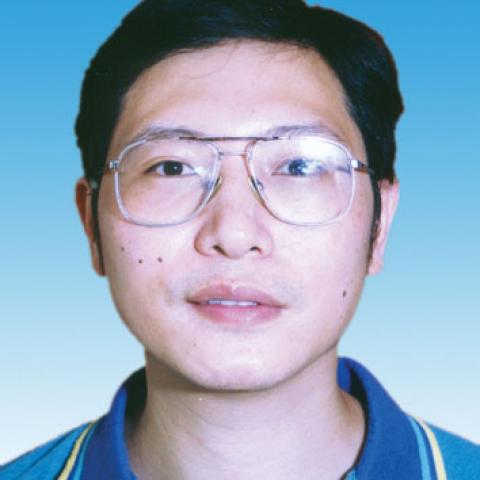

<!-- AUTO-GENERATED-BY: work/generate_obsidian_profiles.py -->

<!-- TEMPLATE: D:\workspace\信息收集整理\医生画像仓库\模板\医生画像模板.md -->

# 徐颖琦

## 基础信息

| 字段 | 内容 |
|---|---|
| 姓名 | 徐颖琦 |
| 医院 | 中山大学附属第一医院 |
| 科室 | 心脏外科 |
| 职称/身份 | 主任医师 |
| 来源链接 | [官网原文](https://www.fahsysu.org.cn/node/950) |
| 采集日期 | 2026-08-13 |

## 简介/擅长

1983年毕业于中山医科大学，1989年获硕士学位，1994年芬兰坦佩雷大学医院心胸外科进修1年，熟练掌握心脏外科各项手术，如先天性心脏病、瓣膜外科、冠脉搭桥术，心脏移植等，有丰富的临床经验。 研究方向：心脏移植，冠脉搭桥及瓣膜外科 主要教育和工作经历： 1978.9-1983.7年毕业于中山医科大学本科毕业 1983.7-1989.9年获硕士学位 1994年芬兰坦佩雷大学医院心胸外科 1983.7-至今中山大学附属第一医院心脏外科主任医师 社会兼职：中华心胸血管外科委员会委员 论著： 以第一作者或通讯作者发表SCI、国内核心杂志20多篇。 第二作者或以下发表30多篇。 专著： 《现代小儿外科治疗学》第八章心血管疾病 《门诊外科疾病的诊断与治疗》第三十三章支气管、肺疾病 其他主要工作成绩（比如获奖情况）： 1．1993年“复杂先天性心脏病外科治疗”获校级三等奖2．1995年“保留全部瓣下结够的二尖瓣置换术”获校级三等奖

## 教育与进修经历

- 1983年毕业于中山医科大学，1989年获硕士学位，1994年芬兰坦佩雷大学医院心胸外科进修1年，熟练掌握心脏外科各项手术，如先天性心脏病、瓣膜外科、冠脉搭桥术，心脏移植等，有丰富的临床经验。
- 医疗特长： 1983年毕业于中山医科大学，1989年获硕士学位，1994年芬兰坦佩雷大学医院心胸外科进修1年，熟练掌握心脏外科各项手术，如先天性心脏病、瓣膜外科、冠脉搭桥术，心脏移植等，有丰富的临床经验。
- 研究方向：心脏移植，冠脉搭桥及瓣膜外科 主要教育和工作经历： 1978.9-1983.7年毕业于中山医科大学本科毕业 1983.7-1989.9年获硕士学位 1994年芬兰坦佩雷大学医院心胸外科 1983.7-至今中山大学附属第一医院心脏外科主任医师 社会兼职：中华心胸血管外科委员会委员 论著： 以第一作者或通讯作者发表SCI、国内核心杂志20多篇。

## 论文与学术产出

- 研究方向：心脏移植，冠脉搭桥及瓣膜外科 主要教育和工作经历： 1978.9-1983.7年毕业于中山医科大学本科毕业 1983.7-1989.9年获硕士学位 1994年芬兰坦佩雷大学医院心胸外科 1983.7-至今中山大学附属第一医院心脏外科主任医师 社会兼职：中华心胸血管外科委员会委员 论著： 以第一作者或通讯作者发表SCI、国内核心杂志20多篇。
- 第二作者或以下发表30多篇。

## 可包装亮点

- 1983年毕业于中山医科大学，1989年获硕士学位，1994年芬兰坦佩雷大学医院心胸外科进修1年，熟练掌握心脏外科各项手术，如先天性心脏病、瓣膜外科、冠脉搭桥术，心脏移植等，有丰富的临床经验。
- 医疗特长： 1983年毕业于中山医科大学，1989年获硕士学位，1994年芬兰坦佩雷大学医院心胸外科进修1年，熟练掌握心脏外科各项手术，如先天性心脏病、瓣膜外科、冠脉搭桥术，心脏移植等，有丰富的临床经验。
- 研究方向：心脏移植，冠脉搭桥及瓣膜外科 主要教育和工作经历： 1978.9-1983.7年毕业于中山医科大学本科毕业 1983.7-1989.9年获硕士学位 1994年芬兰坦佩雷大学医院心胸外科 1983.7-至今中山大学附属第一医院心脏外科主任医师 社会兼职：中华心胸血管外科委员会委员 论著： 以第一作者或通讯作者发表SCI、国内核心杂志20多篇。
- 第二作者或以下发表30多篇。

## 重点疾病/人群标签

- 慢性病：
- 肿瘤：
- 生殖疾病：
- 免疫/风湿：
- 术后恢复/康复：
- 疑难重症：复杂

## 证据摘录

> 只摘录官网公开信息中的短句或关键字段，不复制大段原文。

- 官网身份字段：主任医师
- 官网简介/擅长：1983年毕业于中山医科大学，1989年获硕士学位，1994年芬兰坦佩雷大学医院心胸外科进修1年，熟练掌握心脏外科各项手术，如先天性心脏病、瓣膜外科、冠脉搭桥术，心脏移植等，有丰富的临床经验。 研究方向：心脏移植，冠脉搭桥及瓣膜外科 主要教育和工作经历： 1978.9-1983.7年毕业于中山医科大学本科毕业 1983.7-1989.9年获硕士学位 1994年芬兰坦佩雷大学医院心胸外科 1983.7-至今中山大学附属第一医院心脏外科主…
- 官网亮眼经历线索：1983年毕业于中山医科大学，1989年获硕士学位，1994年芬兰坦佩雷大学医院心胸外科进修1年，熟练掌握心脏外科各项手术，如先天性心脏病、瓣膜外科、冠脉搭桥术，心脏移植等，有丰富的临床经验。 医疗特长： 1983年毕业于中山医科大学，1989年获硕士学位，1994年芬兰坦佩雷大学医院心胸外科进修1年，熟练掌握心脏外科各项手术，如先天性心脏病、瓣膜外科、冠脉搭桥术，心脏移植等，有丰富的临床经验。 研究方向：心脏移植，冠脉搭桥及瓣膜外科…
- 来源链接：https://www.fahsysu.org.cn/node/950

## BD 画像摘要

徐颖琦医生可作为疑难重症方向的基础画像候选。后续 BD 使用应继续以官网来源和人工复核为准，不添加疗效承诺或无来源包装。

## 合规边界

- 仅使用医院官网、官方公众号、官方小程序等公开渠道。
- 不采集私人电话、私人微信、家庭住址、患者隐私或非公开排班信息。
- 不写“保证治愈”“疗效第一”“包治疑难杂症”等无法由官网证明的表述。
