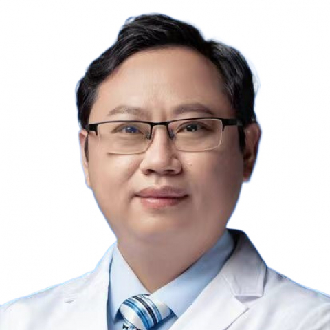

<!-- AUTO-GENERATED-BY: work/generate_obsidian_profiles.py -->

<!-- TEMPLATE: D:\workspace\信息收集整理\医生画像仓库\模板\医生画像模板.md -->

# 戴伟钢

## 基础信息

| 字段 | 内容 |
|---|---|
| 姓名 | 戴伟钢 |
| 医院 | 中山大学附属第一医院 |
| 科室 | 胃肠外科三科 |
| 职称/身份 | 副主任医师 |
| 来源链接 | [官网原文](https://www.fahsysu.org.cn/node/33147) |
| 采集日期 | 2026-08-13 |

## 简介/擅长

对胃肠外科常见病，多发病积累了较为厚实的诊治经验。 擅长开放或微创技术治疗胃肠良恶性肿瘤，直肠肛门良恶性疾病，腹壁疝和食管裂孔疝等。 对低位或超低位直肠癌保肛手术以及复发直肠癌扩大手术等具备扎实的专业基础和实践经验。 研究方向： 1. 胃肠肿瘤微创治疗和规范化全程管理 2. 腹壁疝、腹股沟疝、食管裂孔疝等微创治疗 3. 复发直肠癌综合治疗 4. 外科营养治疗 主要教育和工作经历： 在中山大学附属第一医院胃肠外科先后取得临床医学外科学硕士和博士学位。 2010年至今一直在中山大学附属第一医院胃肠外科工作。 主要论著： 发表中华系列核心杂志期刊论文30余篇，其中SCI论著13篇。 获国家发明专利和实用新型专利共5项。 专著： 参编专著6本，副主编专著1本 社会兼职： 广东省医学会消化肿瘤学会委员 广东省临床医学会结直肠分会委员 广东省肠道保健协会常委 广东省基层医药学会结直肠委员会委员 中山大学期刊联盟理事 消化肿瘤杂志（电子版）编审 其他主要工作成绩（比如获奖情况）： 2013年获全国优秀病案奖 2014年获得中国抗癌协会肿瘤营养分会组织的全国肿瘤营养学青年学者演讲比赛一等奖 2016年获得中山大学附属第一医院青年教师授...

## 教育与进修经历

- 研究方向： 1. 胃肠肿瘤微创治疗和规范化全程管理 2. 腹壁疝、腹股沟疝、食管裂孔疝等微创治疗 3. 复发直肠癌综合治疗 4. 外科营养治疗 主要教育和工作经历： 在中山大学附属第一医院胃肠外科先后取得临床医学外科学硕士和博士学位。

## 科研项目与成果

- 获国家发明专利和实用新型专利共5项。

## 论文与学术产出

- 主要论著： 发表中华系列核心杂志期刊论文30余篇，其中SCI论著13篇。
- 专著： 参编专著6本，副主编专著1本 社会兼职： 广东省医学会消化肿瘤学会委员 广东省临床医学会结直肠分会委员 广东省肠道保健协会常委 广东省基层医药学会结直肠委员会委员 中山大学期刊联盟理事 消化肿瘤杂志（电子版）编审 其他主要工作成绩（比如获奖情况）： 2013年获全国优秀病案奖 2014年获得中国抗癌协会肿瘤营养分会组织的全国肿瘤营养学青年学者演讲比赛一等奖 2016年获得中山大学附属第一医院青年教师授课大赛三等奖 2023年获得中华医学会结直肠分会组织的全国结直肠精英团队技能邀请赛二等奖

## 可包装亮点

- 主要论著： 发表中华系列核心杂志期刊论文30余篇，其中SCI论著13篇。
- 获国家发明专利和实用新型专利共5项。
- 专著： 参编专著6本，副主编专著1本 社会兼职： 广东省医学会消化肿瘤学会委员 广东省临床医学会结直肠分会委员 广东省肠道保健协会常委 广东省基层医药学会结直肠委员会委员 中山大学期刊联盟理事 消化肿瘤杂志（电子版）编审 其他主要工作成绩（比如获奖情况）： 2013年获全国优秀病案奖 2014年获得中国抗癌协会肿瘤营养分会组织的全国肿瘤营养学青年学者演讲比…

## 重点疾病/人群标签

- 慢性病：
- 肿瘤：肿瘤、癌、肠癌、营养
- 生殖疾病：
- 免疫/风湿：
- 术后恢复/康复：肿瘤、癌、肠癌、营养
- 疑难重症：

## 证据摘录

> 只摘录官网公开信息中的短句或关键字段，不复制大段原文。

- 官网身份字段：副主任医师
- 官网简介/擅长：对胃肠外科常见病，多发病积累了较为厚实的诊治经验。 擅长开放或微创技术治疗胃肠良恶性肿瘤，直肠肛门良恶性疾病，腹壁疝和食管裂孔疝等。 对低位或超低位直肠癌保肛手术以及复发直肠癌扩大手术等具备扎实的专业基础和实践经验。 研究方向： 1. 胃肠肿瘤微创治疗和规范化全程管理 2. 腹壁疝、腹股沟疝、食管裂孔疝等微创治疗 3. 复发直肠癌综合治疗 4. 外科营养治疗 主要教育和工作经历： 在中山大学附属第一医院胃肠外科先后取得临床医学外科学硕…
- 官网亮眼经历线索：主要论著： 发表中华系列核心杂志期刊论文30余篇，其中SCI论著13篇。 获国家发明专利和实用新型专利共5项。 专著： 参编专著6本，副主编专著1本 社会兼职： 广东省医学会消化肿瘤学会委员 广东省临床医学会结直肠分会委员 广东省肠道保健协会常委 广东省基层医药学会结直肠委员会委员 中山大学期刊联盟理事 消化肿瘤杂志（电子版）编审 其他主要工作成绩（比如获奖情况）： 2013年获全国优秀病案奖 2014年获得中国抗癌协会肿瘤营养分会组…
- 来源链接：https://www.fahsysu.org.cn/node/33147

## BD 画像摘要

戴伟钢医生可作为肿瘤、术后恢复/康复方向的基础画像候选。后续 BD 使用应继续以官网来源和人工复核为准，不添加疗效承诺或无来源包装。

## 合规边界

- 仅使用医院官网、官方公众号、官方小程序等公开渠道。
- 不采集私人电话、私人微信、家庭住址、患者隐私或非公开排班信息。
- 不写“保证治愈”“疗效第一”“包治疑难杂症”等无法由官网证明的表述。
