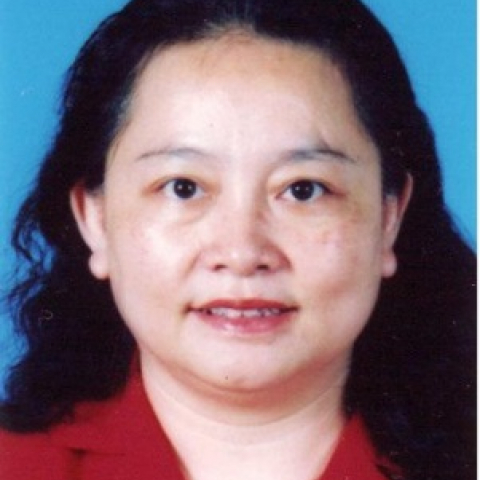

<!-- AUTO-GENERATED-BY: work/generate_obsidian_profiles.py -->

<!-- TEMPLATE: D:\workspace\信息收集整理\医生画像仓库\模板\医生画像模板.md -->

# 戴启麟

## 基础信息

| 字段 | 内容 |
|---|---|
| 姓名 | 戴启麟 |
| 医院 | 中山大学附属第一医院 |
| 科室 | 神经一科 |
| 职称/身份 | 副主任医师 |
| 来源链接 | [官网原文](https://www.fahsysu.org.cn/node/891) |
| 采集日期 | 2026-08-13 |

## 简介/擅长

1、对癫痫的诊断和治疗水平颇高，尤其是对儿童癫痫的诊断和治疗，合理用药等有丰富的临床经验； 对女性癫痫的正确诊断及个体化治疗均有独到之处 2、在神经心理学方面，尤其是对抑郁症、焦虑症、睡眠障碍、器质性精神障碍等相关疾病方面具有较高的诊治水平 3、对脑血管病方面：诊断，尤其是个体化治疗和综合治疗方面具有较高的技巧 4、对神经系统变性疾病及头痛、头晕、神经痛等常见临床症状均有丰富的临床经验； 5、对神经免疫性疾病（多发性硬化、视神经脊椎炎、免疫疾病并发神经系统病变）及周围神经病变具有均相当经验 6、积极参加对患者的科普教育。 已多次举行有关癫痫方面及睡眠、心理障碍的相关知识的讲座，使患者即得到了疾病的正确诊断和治疗，同时使病人和家属对疾病的认识和正确理解、配合治疗都起到了积极的作用。 研究方向：癫痫诊断及治疗； 抑郁焦虑障碍的诊断与治疗 主要教育和工作经历： 1982年本科毕业于中山医科大学医学系。 1989年硕士研究生毕业于中山医科大学神经病学专业。 从事神经病学临床工作30年。 社会兼职： 中国抗癫痫协会理事，广东省抗癫痫协会常务理事，中华医学会广东神经分会神经心理学组成员，广东省医师协会神经病学分医师分会委员 论著：...

## 教育与进修经历

- 抑郁焦虑障碍的诊断与治疗 主要教育和工作经历： 1982年本科毕业于中山医科大学医学系。
- 1989年硕士研究生毕业于中山医科大学神经病学专业。

## 可包装亮点

- 社会兼职： 中国抗癫痫协会理事，广东省抗癫痫协会常务理事，中华医学会广东神经分会神经心理学组成员，广东省医师协会神经病学分医师分会委员 论著：癫痫临床学

## 重点疾病/人群标签

- 慢性病：
- 肿瘤：
- 生殖疾病：
- 免疫/风湿：免疫
- 术后恢复/康复：
- 疑难重症：

## 证据摘录

> 只摘录官网公开信息中的短句或关键字段，不复制大段原文。

- 官网身份字段：副主任医师
- 官网简介/擅长：1、对癫痫的诊断和治疗水平颇高，尤其是对儿童癫痫的诊断和治疗，合理用药等有丰富的临床经验； 对女性癫痫的正确诊断及个体化治疗均有独到之处 2、在神经心理学方面，尤其是对抑郁症、焦虑症、睡眠障碍、器质性精神障碍等相关疾病方面具有较高的诊治水平 3、对脑血管病方面：诊断，尤其是个体化治疗和综合治疗方面具有较高的技巧 4、对神经系统变性疾病及头痛、头晕、神经痛等常见临床症状均有丰富的临床经验； 5、对神经免疫性疾病（多发性硬化、视神经脊椎炎…
- 官网亮眼经历线索：社会兼职： 中国抗癫痫协会理事，广东省抗癫痫协会常务理事，中华医学会广东神经分会神经心理学组成员，广东省医师协会神经病学分医师分会委员 论著：癫痫临床学
- 来源链接：https://www.fahsysu.org.cn/node/891

## BD 画像摘要

戴启麟医生可作为免疫/风湿/感染方向的基础画像候选。后续 BD 使用应继续以官网来源和人工复核为准，不添加疗效承诺或无来源包装。

## 合规边界

- 仅使用医院官网、官方公众号、官方小程序等公开渠道。
- 不采集私人电话、私人微信、家庭住址、患者隐私或非公开排班信息。
- 不写“保证治愈”“疗效第一”“包治疑难杂症”等无法由官网证明的表述。
