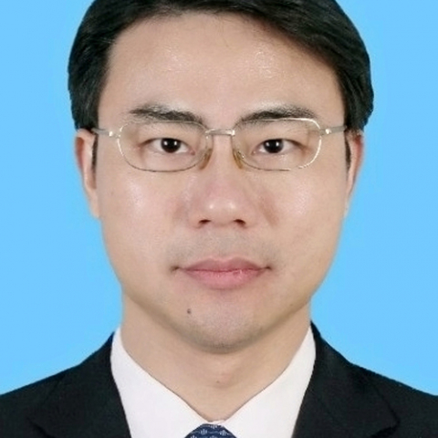

<!-- AUTO-GENERATED-BY: work/generate_obsidian_profiles.py -->

<!-- TEMPLATE: D:\workspace\信息收集整理\医生画像仓库\模板\医生画像模板.md -->

# 戴强生

## 基础信息

| 字段 | 内容 |
|---|---|
| 姓名 | 戴强生 |
| 医院 | 中山大学附属第一医院 |
| 科室 | 肿瘤科 |
| 职称/身份 | 副主任医师 |
| 来源链接 | [官网原文](https://www.fahsysu.org.cn/node/5827) |
| 采集日期 | 2026-08-13 |

## 简介/擅长

1997年中山医科大学临床医学系毕业，直接留校后在中山一院历任住院医师，主治医师，副主任医师。 获肿瘤学硕士学位，长期工作在医疗、教学、科研第一线，积累了丰富的肿瘤诊治临床经验。 擅长常见肿瘤的诊断以及化疗、靶向治疗、生物免疫治疗等肿瘤内科治疗，熟悉肺癌、乳腺癌、胃癌、结直肠癌、胆管癌、胰腺癌、前列腺癌、食管癌、肝癌、黑色素瘤、软组织肉瘤及淋巴瘤等全身各部位恶性肿瘤的全面病情评估、最新进展与综合治疗，对晚期恶性肿瘤病人以姑息止痛治疗、营养支持治疗为主的综合治疗有丰富的经验。 尤其对各种肿瘤并发症处理，减轻化疗毒副反应等方面有独特经验。 研究方向： 全身各部位恶性肿瘤的根治性化疗、新辅助化疗、辅助化疗、同期化疗放疗、化疗联合靶向治疗、化疗联合生物细胞免疫治疗以及晚期肿瘤的姑息治疗、靶向治疗、免疫治疗。 尤其是肺癌、乳腺癌、胃肠道恶性肿瘤的综合治疗。 主要教育和工作经历： 1992.9—1997.6中山医科大学临床医学系本科 2009.9—2012.6中山大学肿瘤学硕士 1997.7—2002.6中山大学附属第一医院住院医师 2002.6—2015.12中山大学附属第一医院主治医师 2016.1至今中山大学附属第一医院副主...

## 教育与进修经历

- 1997年中山医科大学临床医学系毕业，直接留校后在中山一院历任住院医师，主治医师，副主任医师。
- 获肿瘤学硕士学位，长期工作在医疗、教学、科研第一线，积累了丰富的肿瘤诊治临床经验。
- 医疗特长： 1997年中山医科大学临床医学系毕业，直接留校后在中山一院历任住院医师，主治医师，副主任医师。

## 科研项目与成果

- 获肿瘤学硕士学位，长期工作在医疗、教学、科研第一线，积累了丰富的肿瘤诊治临床经验。

## 可包装亮点

- 1997年中山医科大学临床医学系毕业，直接留校后在中山一院历任住院医师，主治医师，副主任医师。
- 医疗特长： 1997年中山医科大学临床医学系毕业，直接留校后在中山一院历任住院医师，主治医师，副主任医师。
- 主要教育和工作经历： 1992.9—1997.6中山医科大学临床医学系本科 2009.9—2012.6中山大学肿瘤学硕士 1997.7—2002.6中山大学附属第一医院住院医师 2002.6—2015.12中山大学附属第一医院主治医师 2016.1至今中山大学附属第一医院副主任医师 社会兼职： 广东省抗癌协会癌症康复与姑息治疗专业委员会 青年委员 广东省健…

## 重点疾病/人群标签

- 慢性病：
- 肿瘤：肿瘤、癌、瘤、淋巴瘤、放疗、化疗、靶向、肺癌、肝癌、胃癌、肠癌、乳腺癌、免疫、康复、营养、姑息
- 生殖疾病：
- 免疫/风湿：肿瘤、癌、瘤、淋巴瘤、放疗、化疗、靶向、肺癌、肝癌、胃癌、肠癌、乳腺癌、免疫、康复、营养、姑息
- 术后恢复/康复：肿瘤、癌、瘤、淋巴瘤、放疗、化疗、靶向、肺癌、肝癌、胃癌、肠癌、乳腺癌、免疫、康复、营养、姑息
- 疑难重症：

## 证据摘录

> 只摘录官网公开信息中的短句或关键字段，不复制大段原文。

- 官网身份字段：副主任医师
- 官网简介/擅长：1997年中山医科大学临床医学系毕业，直接留校后在中山一院历任住院医师，主治医师，副主任医师。 获肿瘤学硕士学位，长期工作在医疗、教学、科研第一线，积累了丰富的肿瘤诊治临床经验。 擅长常见肿瘤的诊断以及化疗、靶向治疗、生物免疫治疗等肿瘤内科治疗，熟悉肺癌、乳腺癌、胃癌、结直肠癌、胆管癌、胰腺癌、前列腺癌、食管癌、肝癌、黑色素瘤、软组织肉瘤及淋巴瘤等全身各部位恶性肿瘤的全面病情评估、最新进展与综合治疗，对晚期恶性肿瘤病人以姑息止痛治疗…
- 官网亮眼经历线索：1997年中山医科大学临床医学系毕业，直接留校后在中山一院历任住院医师，主治医师，副主任医师。 医疗特长： 1997年中山医科大学临床医学系毕业，直接留校后在中山一院历任住院医师，主治医师，副主任医师。 主要教育和工作经历： 1992.9—1997.6中山医科大学临床医学系本科 2009.9—2012.6中山大学肿瘤学硕士 1997.7—2002.6中山大学附属第一医院住院医师 2002.6—2015.12中山大学附属第一医院主治医师…
- 来源链接：https://www.fahsysu.org.cn/node/5827

## BD 画像摘要

戴强生医生可作为肿瘤、免疫/风湿/感染、术后恢复/康复方向的基础画像候选。后续 BD 使用应继续以官网来源和人工复核为准，不添加疗效承诺或无来源包装。

## 合规边界

- 仅使用医院官网、官方公众号、官方小程序等公开渠道。
- 不采集私人电话、私人微信、家庭住址、患者隐私或非公开排班信息。
- 不写“保证治愈”“疗效第一”“包治疑难杂症”等无法由官网证明的表述。
