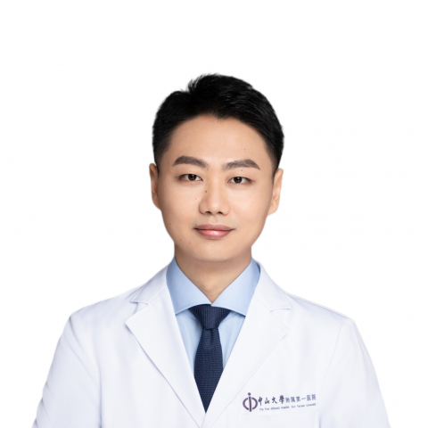

<!-- AUTO-GENERATED-BY: work/generate_obsidian_profiles.py -->

<!-- TEMPLATE: D:\workspace\信息收集整理\医生画像仓库\模板\医生画像模板.md -->

# 戴驭虎

## 基础信息

| 字段 | 内容 |
|---|---|
| 姓名 | 戴驭虎 |
| 医院 | 中山大学附属第一医院 |
| 科室 | 脊柱外科 |
| 职称/身份 | 副主任医师/副研究员 |
| 来源链接 | [官网原文](https://www.fahsysu.org.cn/node/33113) |
| 采集日期 | 2026-08-13 |

## 简介/擅长

专注脊柱外科疾患诊疗十余年，对脊柱外科常见病、多发病的诊断与治疗上积累了丰富的临床经验。 专长脊柱退变性疾病的诊断、治疗与康复，包括腰椎间盘突出症、腰椎管狭窄症、腰椎滑脱症、颈椎病等。 擅长于显微镜下脊柱微创手术治疗，包括腰椎间盘突出症、腰椎管狭窄症及颈椎病的显微镜下手术操作。 教育及工作经历：本、硕、博均毕业于中山大学。 2018年留院从事脊柱外科至今。 2024年升任副主任医师。 社会任职：广东省医学会骨科学分会基层组副组长、广东省医学会脊柱外科学分会微创学组成员、广东省医疗行业协会骨科管理分会第二届委员会委员、广东省医师协会脊柱外科医师分会颈椎专业组成员、广东省生物医学工程学会生物力学分会委员。 研究方向：骨衰老与骨病、肿瘤骨转移的相关机制。 发表SCI论文20余篇，主持国家自然科学基金面上项目、广东省自然面上项目等各级基金9项，共获资助470余万元。 成功入选中山一院柯麟人才项目。

## 教育与进修经历

- 教育及工作经历：本、硕、博均毕业于中山大学。

## 科研项目与成果

- 发表SCI论文20余篇，主持国家自然科学基金面上项目、广东省自然面上项目等各级基金9项，共获资助470余万元。
- 成功入选中山一院柯麟人才项目。

## 论文与学术产出

- 发表SCI论文20余篇，主持国家自然科学基金面上项目、广东省自然面上项目等各级基金9项，共获资助470余万元。

## 可包装亮点

- 2024年升任副主任医师。
- 社会任职：广东省医学会骨科学分会基层组副组长、广东省医学会脊柱外科学分会微创学组成员、广东省医疗行业协会骨科管理分会第二届委员会委员、广东省医师协会脊柱外科医师分会颈椎专业组成员、广东省生物医学工程学会生物力学分会委员。
- 发表SCI论文20余篇，主持国家自然科学基金面上项目、广东省自然面上项目等各级基金9项，共获资助470余万元。
- 成功入选中山一院柯麟人才项目。

## 重点疾病/人群标签

- 慢性病：
- 肿瘤：肿瘤、康复
- 生殖疾病：
- 免疫/风湿：
- 术后恢复/康复：肿瘤、康复
- 疑难重症：

## 证据摘录

> 只摘录官网公开信息中的短句或关键字段，不复制大段原文。

- 官网身份字段：副主任医师/副研究员
- 官网简介/擅长：专注脊柱外科疾患诊疗十余年，对脊柱外科常见病、多发病的诊断与治疗上积累了丰富的临床经验。 专长脊柱退变性疾病的诊断、治疗与康复，包括腰椎间盘突出症、腰椎管狭窄症、腰椎滑脱症、颈椎病等。 擅长于显微镜下脊柱微创手术治疗，包括腰椎间盘突出症、腰椎管狭窄症及颈椎病的显微镜下手术操作。 教育及工作经历：本、硕、博均毕业于中山大学。 2018年留院从事脊柱外科至今。 2024年升任副主任医师。 社会任职：广东省医学会骨科学分会基层组副组长、广东…
- 官网亮眼经历线索：2024年升任副主任医师。 社会任职：广东省医学会骨科学分会基层组副组长、广东省医学会脊柱外科学分会微创学组成员、广东省医疗行业协会骨科管理分会第二届委员会委员、广东省医师协会脊柱外科医师分会颈椎专业组成员、广东省生物医学工程学会生物力学分会委员。 发表SCI论文20余篇，主持国家自然科学基金面上项目、广东省自然面上项目等各级基金9项，共获资助470余万元。 成功入选中山一院柯麟人才项目。
- 来源链接：https://www.fahsysu.org.cn/node/33113

## BD 画像摘要

戴驭虎医生可作为肿瘤、术后恢复/康复方向的基础画像候选。后续 BD 使用应继续以官网来源和人工复核为准，不添加疗效承诺或无来源包装。

## 合规边界

- 仅使用医院官网、官方公众号、官方小程序等公开渠道。
- 不采集私人电话、私人微信、家庭住址、患者隐私或非公开排班信息。
- 不写“保证治愈”“疗效第一”“包治疑难杂症”等无法由官网证明的表述。
