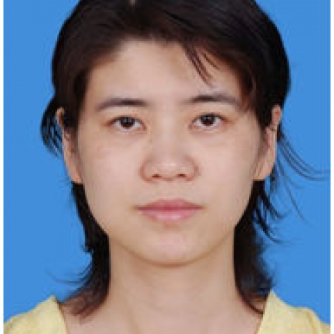

<!-- AUTO-GENERATED-BY: work/generate_obsidian_profiles.py -->

<!-- TEMPLATE: D:\workspace\信息收集整理\医生画像仓库\模板\医生画像模板.md -->

# 房洁渝

## 基础信息

| 字段 | 内容 |
|---|---|
| 姓名 | 房洁渝 |
| 医院 | 中山大学附属第一医院 |
| 科室 | 麻醉科 |
| 职称/身份 | 主任医师 |
| 来源链接 | [官网原文](https://www.fahsysu.org.cn/node/5785) |
| 采集日期 | 2026-08-13 |

## 简介/擅长

临床麻醉技术全面，对心血管、肝胆、胃肠外科、妇产科和小儿麻醉有丰富经验和深入研究。 研究方向： 心血管、肝胆、胃肠外科、妇产科和小儿麻醉 主要教育和工作经历： 1997 年毕业于中山医科大学。 2001年在香港中文大学临床进修1年 2007-2009年在加拿大 University of Western Ontario 访学研究。 社会兼职： 论著： 发表了医学论文30余篇 专著： 医学专著一本 其他主要工作成绩（比如获奖情况）：主持广东省级科研项目二项。

## 教育与进修经历

- 研究方向： 心血管、肝胆、胃肠外科、妇产科和小儿麻醉 主要教育和工作经历： 1997 年毕业于中山医科大学。
- 2001年在香港中文大学临床进修1年 2007-2009年在加拿大 University of Western Ontario 访学研究。

## 科研项目与成果

- 社会兼职： 论著： 发表了医学论文30余篇 专著： 医学专著一本 其他主要工作成绩（比如获奖情况）：主持广东省级科研项目二项。

## 论文与学术产出

- 社会兼职： 论著： 发表了医学论文30余篇 专著： 医学专著一本 其他主要工作成绩（比如获奖情况）：主持广东省级科研项目二项。

## 可包装亮点

- 2001年在香港中文大学临床进修1年 2007-2009年在加拿大 University of Western Ontario 访学研究。
- 社会兼职： 论著： 发表了医学论文30余篇 专著： 医学专著一本 其他主要工作成绩（比如获奖情况）：主持广东省级科研项目二项。

## 重点疾病/人群标签

- 慢性病：
- 肿瘤：
- 生殖疾病：
- 免疫/风湿：
- 术后恢复/康复：
- 疑难重症：

## 证据摘录

> 只摘录官网公开信息中的短句或关键字段，不复制大段原文。

- 官网身份字段：主任医师
- 官网简介/擅长：临床麻醉技术全面，对心血管、肝胆、胃肠外科、妇产科和小儿麻醉有丰富经验和深入研究。 研究方向： 心血管、肝胆、胃肠外科、妇产科和小儿麻醉 主要教育和工作经历： 1997 年毕业于中山医科大学。 2001年在香港中文大学临床进修1年 2007-2009年在加拿大 University of Western Ontario 访学研究。 社会兼职： 论著： 发表了医学论文30余篇 专著： 医学专著一本 其他主要工作成绩（比如获奖情况）：主持…
- 官网亮眼经历线索：2001年在香港中文大学临床进修1年 2007-2009年在加拿大 University of Western Ontario 访学研究。 社会兼职： 论著： 发表了医学论文30余篇 专著： 医学专著一本 其他主要工作成绩（比如获奖情况）：主持广东省级科研项目二项。
- 来源链接：https://www.fahsysu.org.cn/node/5785

## BD 画像摘要

房洁渝医生可作为中山大学附属第一医院麻醉科的基础医生资料入库。当前重点方向以总底表标签为准，官网未展示的信息保持空白。

## 合规边界

- 仅使用医院官网、官方公众号、官方小程序等公开渠道。
- 不采集私人电话、私人微信、家庭住址、患者隐私或非公开排班信息。
- 不写“保证治愈”“疗效第一”“包治疑难杂症”等无法由官网证明的表述。
