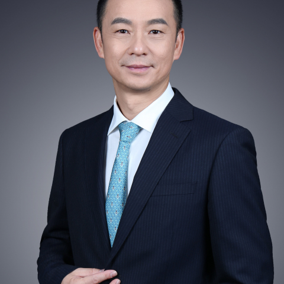

<!-- AUTO-GENERATED-BY: work/generate_obsidian_profiles.py -->

<!-- TEMPLATE: D:\workspace\信息收集整理\医生画像仓库\模板\医生画像模板.md -->

# 文卫平

## 基础信息

| 字段 | 内容 |
|---|---|
| 姓名 | 文卫平 |
| 医院 | 中山大学附属第一医院 |
| 科室 | 咽喉专科 |
| 职称/身份 | 主任医师/教授 |
| 来源链接 | [官网原文](https://www.fahsysu.org.cn/node/5698) |
| 采集日期 | 2026-08-13 |

## 简介/擅长

## 科研项目与成果

- 主持国自然项目4项，国家级863、十一五攻关项目的子科研等项目，主持广东省科研项目包括重点项目、团队项目等共6项和其他项目多项。

## 论文与学术产出

- 在国内外学术刊物发表论文90多篇，其中以第一作者或通讯作者发表SCI论著40篇，参编专著6部。

## 可包装亮点

- 学术任职： 中华医学会耳鼻咽喉头颈外科学分会 副主任委员 中国医师协会耳鼻咽喉科医师分会 副会长 广东省医师协会 副会长 广东省医学会耳鼻咽喉科学分会 主任委员 中国抗癌协会头颈肿瘤专业委员会 常委 中国医师协会内镜医师分会委员会 常委 迄至2018年止，先后获得广东省科技进步一等奖，国家教育部科技进步二等奖等，获广东省医学领军人才称号。
- 在国内外学术刊物发表论文90多篇，其中以第一作者或通讯作者发表SCI论著40篇，参编专著6部。

## 重点疾病/人群标签

- 慢性病：
- 肿瘤：肿瘤、癌、瘤、鼻咽癌
- 生殖疾病：
- 免疫/风湿：
- 术后恢复/康复：
- 疑难重症：

## 证据摘录

> 只摘录官网公开信息中的短句或关键字段，不复制大段原文。

- 官网身份字段：主任医师/教授
- 官网亮眼经历线索：学术任职： 中华医学会耳鼻咽喉头颈外科学分会 副主任委员 中国医师协会耳鼻咽喉科医师分会 副会长 广东省医师协会 副会长 广东省医学会耳鼻咽喉科学分会 主任委员 中国抗癌协会头颈肿瘤专业委员会 常委 中国医师协会内镜医师分会委员会 常委 迄至2018年止，先后获得广东省科技进步一等奖，国家教育部科技进步二等奖等，获广东省医学领军人才称号。 在国内外学术刊物发表论文90多篇，其中以第一作者或通讯作者发表SCI论著40篇，参编专著6部。
- 来源链接：https://www.fahsysu.org.cn/node/5698

## BD 画像摘要

文卫平医生可作为肿瘤方向的基础画像候选。后续 BD 使用应继续以官网来源和人工复核为准，不添加疗效承诺或无来源包装。

## 合规边界

- 仅使用医院官网、官方公众号、官方小程序等公开渠道。
- 不采集私人电话、私人微信、家庭住址、患者隐私或非公开排班信息。
- 不写“保证治愈”“疗效第一”“包治疑难杂症”等无法由官网证明的表述。
