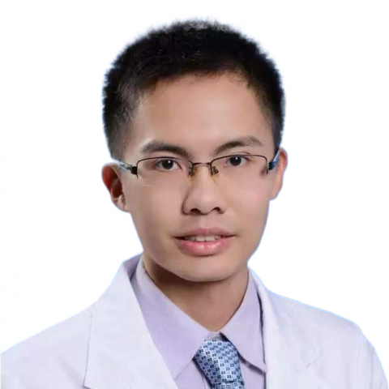

<!-- AUTO-GENERATED-BY: work/generate_obsidian_profiles.py -->

<!-- TEMPLATE: D:\workspace\信息收集整理\医生画像仓库\模板\医生画像模板.md -->

# 文扬幸

## 基础信息

| 字段 | 内容 |
|---|---|
| 姓名 | 文扬幸 |
| 医院 | 中山大学附属第一医院 |
| 科室 | 生殖医学中心 |
| 职称/身份 | 副主任医师 |
| 来源链接 | [官网原文](https://www.fahsysu.org.cn/node/33092) |
| 采集日期 | 2026-08-13 |

## 简介/擅长

毕业留院10余年来一直在临床一线工作，专注于疑难不孕症和遗传性疾病的试管治疗。 擅长个体化促排卵治疗和各项辅助生殖临床操作。 研究方向： 子宫内膜异位症患者行胚胎移植的内膜准备策略； 多囊卵巢综合征的临床和基础研究； AI在胚胎筛选和生殖健康管理的应用。 在IEEE Internet of Things Journal、Fertility and Sterility、BJOG、Human Fertility等SCI杂志发表研究文章多篇，作为主要成员参与国家自然科学基金、广东省自然科学基金、广州市重点研发项目、中山大学“5010临床研究”等多层次的研究项目。 教育和工作经历： 2014年博士毕业于中山大学临床医学八年制，毕业后在中山大学附属第一医院妇产科和生殖中心工作。 从事辅助生殖医疗、教学、科研工作10余年。 社会兼职： 广东省医师协会生殖医学分会青年医师专业组成员 广东省住院医师规范化培训妇产科骨干师资培训班讲师

## 教育与进修经历

- 毕业留院10余年来一直在临床一线工作，专注于疑难不孕症和遗传性疾病的试管治疗。
- 医疗特长： 毕业留院10余年来一直在临床一线工作，专注于疑难不孕症和遗传性疾病的试管治疗。
- 教育和工作经历： 2014年博士毕业于中山大学临床医学八年制，毕业后在中山大学附属第一医院妇产科和生殖中心工作。
- 社会兼职： 广东省医师协会生殖医学分会青年医师专业组成员 广东省住院医师规范化培训妇产科骨干师资培训班讲师

## 科研项目与成果

- 在IEEE Internet of Things Journal、Fertility and Sterility、BJOG、Human Fertility等SCI杂志发表研究文章多篇，作为主要成员参与国家自然科学基金、广东省自然科学基金、广州市重点研发项目、中山大学“5010临床研究”等多层次的研究项目。
- 从事辅助生殖医疗、教学、科研工作10余年。

## 论文与学术产出

- 在IEEE Internet of Things Journal、Fertility and Sterility、BJOG、Human Fertility等SCI杂志发表研究文章多篇，作为主要成员参与国家自然科学基金、广东省自然科学基金、广州市重点研发项目、中山大学“5010临床研究”等多层次的研究项目。

## 可包装亮点

- 毕业留院10余年来一直在临床一线工作，专注于疑难不孕症和遗传性疾病的试管治疗。
- 医疗特长： 毕业留院10余年来一直在临床一线工作，专注于疑难不孕症和遗传性疾病的试管治疗。
- 在IEEE Internet of Things Journal、Fertility and Sterility、BJOG、Human Fertility等SCI杂志发表研究文章多篇，作为主要成员参与国家自然科学基金、广东省自然科学基金、广州市重点研发项目、中山大学“5010临床研究”等多层次的研究项目。
- 社会兼职： 广东省医师协会生殖医学分会青年医师专业组成员 广东省住院医师规范化培训妇产科骨干师资培训班讲师

## 重点疾病/人群标签

- 慢性病：
- 肿瘤：
- 生殖疾病：生殖、不孕、卵巢、辅助生殖、试管、胚胎、多囊、疑难
- 免疫/风湿：
- 术后恢复/康复：
- 疑难重症：生殖、不孕、卵巢、辅助生殖、试管、胚胎、多囊、疑难

## 证据摘录

> 只摘录官网公开信息中的短句或关键字段，不复制大段原文。

- 官网身份字段：副主任医师
- 官网简介/擅长：毕业留院10余年来一直在临床一线工作，专注于疑难不孕症和遗传性疾病的试管治疗。 擅长个体化促排卵治疗和各项辅助生殖临床操作。 研究方向： 子宫内膜异位症患者行胚胎移植的内膜准备策略； 多囊卵巢综合征的临床和基础研究； AI在胚胎筛选和生殖健康管理的应用。 在IEEE Internet of Things Journal、Fertility and Sterility、BJOG、Human Fertility等SCI杂志发表研究文章多篇…
- 官网亮眼经历线索：毕业留院10余年来一直在临床一线工作，专注于疑难不孕症和遗传性疾病的试管治疗。 医疗特长： 毕业留院10余年来一直在临床一线工作，专注于疑难不孕症和遗传性疾病的试管治疗。 在IEEE Internet of Things Journal、Fertility and Sterility、BJOG、Human Fertility等SCI杂志发表研究文章多篇，作为主要成员参与国家自然科学基金、广东省自然科学基金、广州市重点研发项目、中山大学…
- 来源链接：https://www.fahsysu.org.cn/node/33092

## BD 画像摘要

文扬幸医生可作为生殖疾病、疑难重症方向的基础画像候选。后续 BD 使用应继续以官网来源和人工复核为准，不添加疗效承诺或无来源包装。

## 合规边界

- 仅使用医院官网、官方公众号、官方小程序等公开渠道。
- 不采集私人电话、私人微信、家庭住址、患者隐私或非公开排班信息。
- 不写“保证治愈”“疗效第一”“包治疑难杂症”等无法由官网证明的表述。
