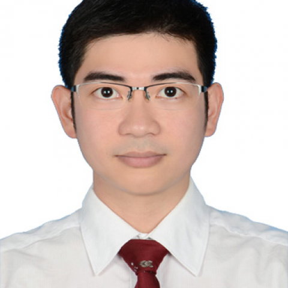

<!-- AUTO-GENERATED-BY: work/generate_obsidian_profiles.py -->

<!-- TEMPLATE: D:\workspace\信息收集整理\医生画像仓库\模板\医生画像模板.md -->

# 文译辉

## 基础信息

| 字段 | 内容 |
|---|---|
| 姓名 | 文译辉 |
| 医院 | 中山大学附属第一医院 |
| 科室 | 鼻专科 |
| 职称/身份 | 主任医师 |
| 来源链接 | [官网原文](https://www.fahsysu.org.cn/node/5694) |
| 采集日期 | 2026-08-13 |

## 简介/擅长

各类鼻部炎症及鼻颅底肿瘤的鼻内镜微创手术，在鼻窦炎、鼻息肉、嗅觉障碍、鼻中隔偏曲，以及成人与儿童鼾症（腺样体/扁桃体肥大）的微创手术与综合治疗方面经验丰富。 精于鼻眼相关疾病（外伤性视神经损伤、慢性泪囊炎）、脑脊液鼻漏及鼻窦颅底、良恶性肿瘤的内镜手术治疗，并在鼻咽癌的早期诊断和复发后微创手术领域有深入造诣。 研究方向：鼻黏膜慢性炎症的发病机制； 鼻咽癌的早期诊断； 复发性鼻咽癌手术治疗； 颅底肿瘤靶向和免疫治疗。 主要教育和工作经历：2009年毕业于中山大学中山医学院临床七年制取得硕士学位并留院工作； 2016年获得医学博士学位。 曾获中国癌症基金会资助到美国MSKCC、MDACC头颈外科临床进修并在UPMC眼耳研究所从事2年科学研究。 在鼻咽癌早诊早治及鼻颅底内镜微创外科领域以第一/通讯作者在Lancet Oncology、Advanced Science、EClinicalmedicine、AAAI、Head Neck、Laryngoscope等杂志发表论文超30篇。 授权国家发明专利3项（第一）、软著2项（第一）、国际发明2项（第二）、实用新型专利4项。 国家重点研发项目、国家科技部重大专项子课题中心负责人2项。...

## 教育与进修经历

- 主要教育和工作经历：2009年毕业于中山大学中山医学院临床七年制取得硕士学位并留院工作；
- 2016年获得医学博士学位。
- 曾获中国癌症基金会资助到美国MSKCC、MDACC头颈外科临床进修并在UPMC眼耳研究所从事2年科学研究。

## 科研项目与成果

- 曾获中国癌症基金会资助到美国MSKCC、MDACC头颈外科临床进修并在UPMC眼耳研究所从事2年科学研究。
- 授权国家发明专利3项（第一）、软著2项（第一）、国际发明2项（第二）、实用新型专利4项。
- 国家重点研发项目、国家科技部重大专项子课题中心负责人2项。
- 主持国家省部级基金共5项，教育部中山大学青年教师培育基金1项。

## 论文与学术产出

- 在鼻咽癌早诊早治及鼻颅底内镜微创外科领域以第一/通讯作者在Lancet Oncology、Advanced Science、EClinicalmedicine、AAAI、Head Neck、Laryngoscope等杂志发表论文超30篇。

## 可包装亮点

- 曾获中国癌症基金会资助到美国MSKCC、MDACC头颈外科临床进修并在UPMC眼耳研究所从事2年科学研究。
- 在鼻咽癌早诊早治及鼻颅底内镜微创外科领域以第一/通讯作者在Lancet Oncology、Advanced Science、EClinicalmedicine、AAAI、Head Neck、Laryngoscope等杂志发表论文超30篇。
- 授权国家发明专利3项（第一）、软著2项（第一）、国际发明2项（第二）、实用新型专利4项。
- 国家重点研发项目、国家科技部重大专项子课题中心负责人2项。

## 重点疾病/人群标签

- 慢性病：慢性、肿瘤、癌、靶向、鼻咽癌、免疫、康复
- 肿瘤：慢性、肿瘤、癌、靶向、鼻咽癌、免疫、康复
- 生殖疾病：
- 免疫/风湿：慢性、肿瘤、癌、靶向、鼻咽癌、免疫、康复
- 术后恢复/康复：慢性、肿瘤、癌、靶向、鼻咽癌、免疫、康复
- 疑难重症：

## 证据摘录

> 只摘录官网公开信息中的短句或关键字段，不复制大段原文。

- 官网身份字段：主任医师
- 官网简介/擅长：各类鼻部炎症及鼻颅底肿瘤的鼻内镜微创手术，在鼻窦炎、鼻息肉、嗅觉障碍、鼻中隔偏曲，以及成人与儿童鼾症（腺样体/扁桃体肥大）的微创手术与综合治疗方面经验丰富。 精于鼻眼相关疾病（外伤性视神经损伤、慢性泪囊炎）、脑脊液鼻漏及鼻窦颅底、良恶性肿瘤的内镜手术治疗，并在鼻咽癌的早期诊断和复发后微创手术领域有深入造诣。 研究方向：鼻黏膜慢性炎症的发病机制； 鼻咽癌的早期诊断； 复发性鼻咽癌手术治疗； 颅底肿瘤靶向和免疫治疗。 主要教育和工作经历：…
- 官网亮眼经历线索：曾获中国癌症基金会资助到美国MSKCC、MDACC头颈外科临床进修并在UPMC眼耳研究所从事2年科学研究。 在鼻咽癌早诊早治及鼻颅底内镜微创外科领域以第一/通讯作者在Lancet Oncology、Advanced Science、EClinicalmedicine、AAAI、Head Neck、Laryngoscope等杂志发表论文超30篇。 授权国家发明专利3项（第一）、软著2项（第一）、国际发明2项（第二）、实用新型专利4项…
- 来源链接：https://www.fahsysu.org.cn/node/5694

## BD 画像摘要

文译辉医生可作为慢性病、肿瘤、免疫/风湿/感染、术后恢复/康复方向的基础画像候选。后续 BD 使用应继续以官网来源和人工复核为准，不添加疗效承诺或无来源包装。

## 合规边界

- 仅使用医院官网、官方公众号、官方小程序等公开渠道。
- 不采集私人电话、私人微信、家庭住址、患者隐私或非公开排班信息。
- 不写“保证治愈”“疗效第一”“包治疑难杂症”等无法由官网证明的表述。
