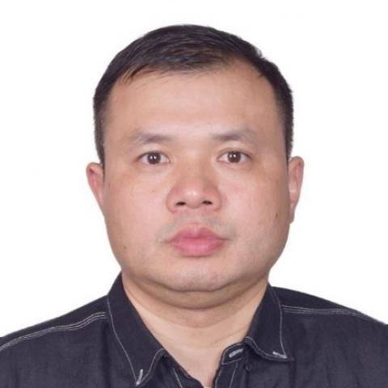

<!-- AUTO-GENERATED-BY: work/generate_obsidian_profiles.py -->

<!-- TEMPLATE: D:\workspace\信息收集整理\医生画像仓库\模板\医生画像模板.md -->

# 方咏

## 基础信息

| 字段 | 内容 |
|---|---|
| 姓名 | 方咏 |
| 医院 | 中山大学附属第一医院 |
| 科室 | 泌尿外科 |
| 职称/身份 | 副主任医师 |
| 来源链接 | [官网原文](https://www.fahsysu.org.cn/node/36760) |
| 采集日期 | 2026-08-13 |

## 简介/擅长

泌尿系肿瘤、结石、畸形的微创治疗以及男科疾病的发生、发展机制 研究方向：专注于泌尿系统常见病、多发病的诊疗十余年，尤擅于泌尿系肿瘤、结石、畸形的微创治疗，对男科疾病有丰富的诊疗经验。 主要教育和工作经历： 中山大学博士毕业，曾于2020-2021年在美国西南医学中心访学一年。

## 教育与进修经历

- 主要教育和工作经历： 中山大学博士毕业，曾于2020-2021年在美国西南医学中心访学一年。

## 可包装亮点

- 主要教育和工作经历： 中山大学博士毕业，曾于2020-2021年在美国西南医学中心访学一年。

## 重点疾病/人群标签

- 慢性病：
- 肿瘤：肿瘤
- 生殖疾病：
- 免疫/风湿：
- 术后恢复/康复：
- 疑难重症：

## 证据摘录

> 只摘录官网公开信息中的短句或关键字段，不复制大段原文。

- 官网身份字段：副主任医师
- 官网简介/擅长：泌尿系肿瘤、结石、畸形的微创治疗以及男科疾病的发生、发展机制 研究方向：专注于泌尿系统常见病、多发病的诊疗十余年，尤擅于泌尿系肿瘤、结石、畸形的微创治疗，对男科疾病有丰富的诊疗经验。 主要教育和工作经历： 中山大学博士毕业，曾于2020-2021年在美国西南医学中心访学一年。
- 官网亮眼经历线索：主要教育和工作经历： 中山大学博士毕业，曾于2020-2021年在美国西南医学中心访学一年。
- 来源链接：https://www.fahsysu.org.cn/node/36760

## BD 画像摘要

方咏医生可作为肿瘤方向的基础画像候选。后续 BD 使用应继续以官网来源和人工复核为准，不添加疗效承诺或无来源包装。

## 合规边界

- 仅使用医院官网、官方公众号、官方小程序等公开渠道。
- 不采集私人电话、私人微信、家庭住址、患者隐私或非公开排班信息。
- 不写“保证治愈”“疗效第一”“包治疑难杂症”等无法由官网证明的表述。
