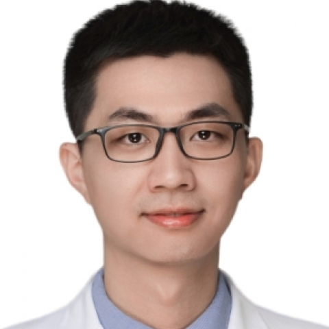

<!-- AUTO-GENERATED-BY: work/generate_obsidian_profiles.py -->

<!-- TEMPLATE: D:\workspace\信息收集整理\医生画像仓库\模板\医生画像模板.md -->

# 方淑斌

## 基础信息

| 字段 | 内容 |
|---|---|
| 姓名 | 方淑斌 |
| 医院 | 中山大学附属第一医院 |
| 科室 | 耳专科 |
| 职称/身份 | 副主任医师 |
| 来源链接 | [官网原文](https://www.fahsysu.org.cn/node/38089) |
| 采集日期 | 2026-08-13 |

## 简介/擅长

1）耳内镜及显微外科手术：慢性化脓性中耳炎、中耳胆脂瘤、听骨链中断等中耳疾病的规范化诊治； 听觉功能重建手术； 分泌性中耳炎综合治疗，包括：腺扁手术、鼓膜切开置管等； 2）人工听觉植入：人工耳蜗植入、骨导助听器植入等人工听觉技术； 3）侧颅底外科：对侧颅底肿瘤（如颈静脉球体瘤、听神经瘤、外耳道/中耳癌）有一定的造诣； 4）耳内科疾病：擅长各种类型耳聋个体化治疗以及的诊治； 眩晕的诊治。 一、学习及工作经历： 医学博士，硕士生导师，美国Texas A&M University访问学者。 本人于中山大学附属第一医院获耳鼻咽喉科学博士学位（硕博连读），博士期间赴美国Texas A&M University再生医学研究所访学1年，曾获国家博士研究生奖学金、广东省优秀研究生、中山大学优秀博士毕业生等荣誉。 博士毕业后留院进入本单位临床博士后工作站。 自工作以来，在中山一院进行严格的临床规范化培训及住院总培训，历任住院医师、主治医师及副主任医师，对耳鼻喉常见病及多发病有丰富的临床经验，目前主攻耳科疾病的诊治，尤其是耳内镜和耳显微手术。 二、科研业绩： 目前主要聚焦于感音神经性聋的发病机制与干预策略研究，以（共同）第一或通讯作者在 ...

## 教育与进修经历

- 一、学习及工作经历： 医学博士，硕士生导师，美国Texas A&M University访问学者。
- 本人于中山大学附属第一医院获耳鼻咽喉科学博士学位（硕博连读），博士期间赴美国Texas A&M University再生医学研究所访学1年，曾获国家博士研究生奖学金、广东省优秀研究生、中山大学优秀博士毕业生等荣誉。
- 博士毕业后留院进入本单位临床博士后工作站。
- 自工作以来，在中山一院进行严格的临床规范化培训及住院总培训，历任住院医师、主治医师及副主任医师，对耳鼻喉常见病及多发病有丰富的临床经验，目前主攻耳科疾病的诊治，尤其是耳内镜和耳显微手术。

## 科研项目与成果

- 二、科研业绩： 目前主要聚焦于感音神经性聋的发病机制与干预策略研究，以（共同）第一或通讯作者在 J Extracell Vesicles、Cell Death & Disease（2篇）、Stem Cell Research & Therapy（2篇）等期刊发表论文近20篇，系统阐明了细胞外囊泡的免疫调控作用及耳聋免疫微环境变化机制，旨在为耳聋提供新型的治疗策略。
- 先后主持国家自然科学基金青年项目、广东省自然科学基金面上项目（2项）、广东省区域联合基金青年项目、中国博士后科学基金面上项目及中山一院“柯麟新星”人才等8项科研课题。
- 获授权国家发明专利1项，获省部级科技进步奖1项。

## 论文与学术产出

- 二、科研业绩： 目前主要聚焦于感音神经性聋的发病机制与干预策略研究，以（共同）第一或通讯作者在 J Extracell Vesicles、Cell Death & Disease（2篇）、Stem Cell Research & Therapy（2篇）等期刊发表论文近20篇，系统阐明了细胞外囊泡的免疫调控作用及耳聋免疫微环境变化机制，旨在为耳聋提供新型的治疗策略。

## 可包装亮点

- 一、学习及工作经历： 医学博士，硕士生导师，美国Texas A&M University访问学者。
- 本人于中山大学附属第一医院获耳鼻咽喉科学博士学位（硕博连读），博士期间赴美国Texas A&M University再生医学研究所访学1年，曾获国家博士研究生奖学金、广东省优秀研究生、中山大学优秀博士毕业生等荣誉。
- 自工作以来，在中山一院进行严格的临床规范化培训及住院总培训，历任住院医师、主治医师及副主任医师，对耳鼻喉常见病及多发病有丰富的临床经验，目前主攻耳科疾病的诊治，尤其是耳内镜和耳显微手术。
- 二、科研业绩： 目前主要聚焦于感音神经性聋的发病机制与干预策略研究，以（共同）第一或通讯作者在 J Extracell Vesicles、Cell Death & Disease（2篇）、Stem Cell Research & Therapy（2篇）等期刊发表论文近20篇，系统阐明了细胞外囊泡的免疫调控作用及耳聋免疫微环境变化...

## 重点疾病/人群标签

- 慢性病：慢性、肿瘤、癌、瘤、免疫
- 肿瘤：慢性、肿瘤、癌、瘤、免疫
- 生殖疾病：
- 免疫/风湿：慢性、肿瘤、癌、瘤、免疫
- 术后恢复/康复：
- 疑难重症：

## 证据摘录

> 只摘录官网公开信息中的短句或关键字段，不复制大段原文。

- 官网身份字段：副主任医师
- 官网简介/擅长：1）耳内镜及显微外科手术：慢性化脓性中耳炎、中耳胆脂瘤、听骨链中断等中耳疾病的规范化诊治； 听觉功能重建手术； 分泌性中耳炎综合治疗，包括：腺扁手术、鼓膜切开置管等； 2）人工听觉植入：人工耳蜗植入、骨导助听器植入等人工听觉技术； 3）侧颅底外科：对侧颅底肿瘤（如颈静脉球体瘤、听神经瘤、外耳道/中耳癌）有一定的造诣； 4）耳内科疾病：擅长各种类型耳聋个体化治疗以及的诊治； 眩晕的诊治。 一、学习及工作经历： 医学博士，硕士生导师，美国…
- 官网亮眼经历线索：一、学习及工作经历： 医学博士，硕士生导师，美国Texas A&M University访问学者。 本人于中山大学附属第一医院获耳鼻咽喉科学博士学位（硕博连读），博士期间赴美国Texas A&M University再生医学研究所访学1年，曾获国家博士研究生奖学金、广东省优秀研究生、中山大学优秀博士毕业生等荣誉。 自工作以来，在中山一院进行严格的临床规范化培训及住院总培训，历任住院医师、主治医师及副主任医师，对耳鼻喉常见病及多发病有丰…
- 来源链接：https://www.fahsysu.org.cn/node/38089

## BD 画像摘要

方淑斌医生可作为慢性病、肿瘤、免疫/风湿/感染方向的基础画像候选。后续 BD 使用应继续以官网来源和人工复核为准，不添加疗效承诺或无来源包装。

## 合规边界

- 仅使用医院官网、官方公众号、官方小程序等公开渠道。
- 不采集私人电话、私人微信、家庭住址、患者隐私或非公开排班信息。
- 不写“保证治愈”“疗效第一”“包治疑难杂症”等无法由官网证明的表述。
