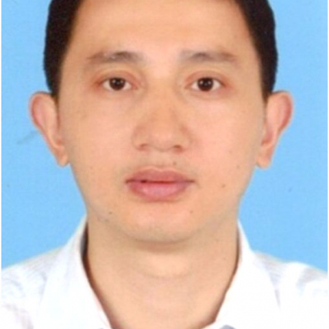

<!-- AUTO-GENERATED-BY: work/generate_obsidian_profiles.py -->

<!-- TEMPLATE: D:\workspace\信息收集整理\医生画像仓库\模板\医生画像模板.md -->

# 易建华

## 基础信息

| 字段 | 内容 |
|---|---|
| 姓名 | 易建华 |
| 医院 | 中山大学附属第一医院 |
| 科室 | 显微创伤外手科 |
| 职称/身份 | 副主任医师 |
| 来源链接 | [官网原文](https://www.fahsysu.org.cn/node/5646) |
| 采集日期 | 2026-08-13 |

## 简介/擅长

从事骨科临床工作17年，对骨折、肿物特别是神经肿物、皮肤软组织缺损皮瓣修复、神经血管损伤修复、断指肢再植、肩肘腕关节疾病的诊断和治疗积累了丰富的临床经验。 研究方向： 创伤骨科、显微外科、手外科 主要教育和工作经历： 2000年东南大学本科毕业，2003年、2008年中山大学硕士、博士毕业，毕业后一直在中山大学附属第一医院工作。 社会兼职： 中国医师协会康复分会显微骨科学组青年委员 论著： Jian-hua Yi , Dong Wang, Xiao-lin Liu,et al. C-Reactive Protein As a Prognostic Factor for Human Osteosarcoma:A Meta-Analysis and Literature Review，Plos One，2014.5 易建华，刘小林，朱家恺等.人源性同种异体去细胞外周神经材料标准制备方法的研究.中华显微外科杂志,2009,32(3):207-209. 易建华，李智勇，胡军等.腓动脉逆行岛状皮瓣联合腓肠神经营养皮瓣修复巨大前足部软组织缺损.中华显微外科杂志，2013,36(4):405-406。 专著： 《腕关节手术外科学》《...

## 教育与进修经历

- 研究方向： 创伤骨科、显微外科、手外科 主要教育和工作经历： 2000年东南大学本科毕业，2003年、2008年中山大学硕士、博士毕业，毕业后一直在中山大学附属第一医院工作。

## 可包装亮点

- 社会兼职： 中国医师协会康复分会显微骨科学组青年委员 论著： Jian-hua Yi , Dong Wang, Xiao-lin Liu,et al. C-Reactive Protein As a Prognostic Factor for Human Osteosarcoma:A Meta-Analysis and Literature Review…
- 专著： 《腕关节手术外科学》《实用儿童脑瘫畸形矫正手术学》 其他主要工作成绩（比如获奖情况）： 无

## 重点疾病/人群标签

- 慢性病：
- 肿瘤：
- 生殖疾病：
- 免疫/风湿：
- 术后恢复/康复：康复、营养
- 疑难重症：

## 证据摘录

> 只摘录官网公开信息中的短句或关键字段，不复制大段原文。

- 官网身份字段：副主任医师
- 官网简介/擅长：从事骨科临床工作17年，对骨折、肿物特别是神经肿物、皮肤软组织缺损皮瓣修复、神经血管损伤修复、断指肢再植、肩肘腕关节疾病的诊断和治疗积累了丰富的临床经验。 研究方向： 创伤骨科、显微外科、手外科 主要教育和工作经历： 2000年东南大学本科毕业，2003年、2008年中山大学硕士、博士毕业，毕业后一直在中山大学附属第一医院工作。 社会兼职： 中国医师协会康复分会显微骨科学组青年委员 论著： Jian-hua Yi , Dong Wan…
- 官网亮眼经历线索：社会兼职： 中国医师协会康复分会显微骨科学组青年委员 论著： Jian-hua Yi , Dong Wang, Xiao-lin Liu,et al. C-Reactive Protein As a Prognostic Factor for Human Osteosarcoma:A Meta-Analysis and Literature Review，Plos One，2014.5 易建华，刘小林，朱家恺等.人源性同种异体去细胞外…
- 来源链接：https://www.fahsysu.org.cn/node/5646

## BD 画像摘要

易建华医生可作为术后恢复/康复方向的基础画像候选。后续 BD 使用应继续以官网来源和人工复核为准，不添加疗效承诺或无来源包装。

## 合规边界

- 仅使用医院官网、官方公众号、官方小程序等公开渠道。
- 不采集私人电话、私人微信、家庭住址、患者隐私或非公开排班信息。
- 不写“保证治愈”“疗效第一”“包治疑难杂症”等无法由官网证明的表述。
