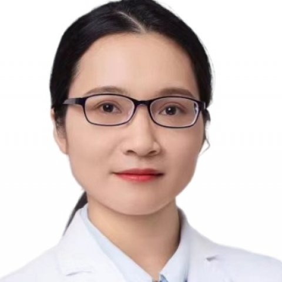

<!-- AUTO-GENERATED-BY: work/generate_obsidian_profiles.py -->

<!-- TEMPLATE: D:\workspace\信息收集整理\医生画像仓库\模板\医生画像模板.md -->

# 曹铁凤

## 基础信息

| 字段 | 内容 |
|---|---|
| 姓名 | 曹铁凤 |
| 医院 | 中山大学附属第一医院 |
| 科室 | 妇科 |
| 职称/身份 | 副主任医师 |
| 来源链接 | [官网原文](https://www.fahsysu.org.cn/node/33348) |
| 采集日期 | 2026-08-13 |

## 简介/擅长

长期从事妇科良恶性肿瘤的诊断、治疗、科学研究工作，积累了丰富的临床经验。 擅长： 1.妇科恶性肿瘤（卵巢癌、宫颈癌、子宫内膜癌等）的多学科诊疗、化学治疗、免疫治疗等综合治疗。 2.妇科良性肿瘤的规范化诊疗，及单孔腹腔镜手术等微创手术、开腹手术、药物治疗。 3.子宫内膜病变的宫腔镜手术治疗及长期管理。 4.宫颈病变的阴道镜检查及治疗。 教育经历 2008-09至2016-06中山大学临床医学八年制博士 2017-02至2019-04美国耶鲁大学妇产科 访问学者 工作经历 2024-01至今 中山大学附属第一医院 副主任医师 2022-01至2023-12 中山大学附属第一医院 主治医师 2016-07至2021-12 中山大学附属第一医院 住院医师 研究方向 主攻妇科肿瘤特别是卵巢癌的发病机制、转移机制及精准治疗； 主持国自然、省部级、市厅级、校级基金四项，以第一作者发表卵巢癌领域临床及基础论文十余篇，包括Nature communication、oncogene等杂志。 其他主要工作成绩及获奖情况 获得中山一院柯麟新苗计划、柯麟新星人才计划支持； 获得2024年中山大学附属第一医院青年医师授课大赛（英文组）一等奖

## 教育与进修经历

- 教育经历 2008-09至2016-06中山大学临床医学八年制博士 2017-02至2019-04美国耶鲁大学妇产科 访问学者 工作经历 2024-01至今 中山大学附属第一医院 副主任医师 2022-01至2023-12 中山大学附属第一医院 主治医师 2016-07至2021-12 中山大学附属第一医院 住院医师 研究方向 主攻妇科肿瘤特别是卵巢癌的发病机制、转移机制及精准治疗；

## 科研项目与成果

- 主持国自然、省部级、市厅级、校级基金四项，以第一作者发表卵巢癌领域临床及基础论文十余篇，包括Nature communication、oncogene等杂志。

## 论文与学术产出

- 主持国自然、省部级、市厅级、校级基金四项，以第一作者发表卵巢癌领域临床及基础论文十余篇，包括Nature communication、oncogene等杂志。

## 可包装亮点

- 擅长： 1.妇科恶性肿瘤（卵巢癌、宫颈癌、子宫内膜癌等）的多学科诊疗、化学治疗、免疫治疗等综合治疗。
- 教育经历 2008-09至2016-06中山大学临床医学八年制博士 2017-02至2019-04美国耶鲁大学妇产科 访问学者 工作经历 2024-01至今 中山大学附属第一医院 副主任医师 2022-01至2023-12 中山大学附属第一医院 主治医师 2016-07至2021-12 中山大学附属第一医院 住院医师 研究方向 主攻妇科肿瘤特别是卵巢癌的发…
- 主持国自然、省部级、市厅级、校级基金四项，以第一作者发表卵巢癌领域临床及基础论文十余篇，包括Nature communication、oncogene等杂志。

## 重点疾病/人群标签

- 慢性病：
- 肿瘤：肿瘤、癌、卵巢、免疫、多学科
- 生殖疾病：肿瘤、癌、卵巢、免疫、多学科
- 免疫/风湿：肿瘤、癌、卵巢、免疫、多学科
- 术后恢复/康复：
- 疑难重症：肿瘤、癌、卵巢、免疫、多学科

## 证据摘录

> 只摘录官网公开信息中的短句或关键字段，不复制大段原文。

- 官网身份字段：副主任医师
- 官网简介/擅长：长期从事妇科良恶性肿瘤的诊断、治疗、科学研究工作，积累了丰富的临床经验。 擅长： 1.妇科恶性肿瘤（卵巢癌、宫颈癌、子宫内膜癌等）的多学科诊疗、化学治疗、免疫治疗等综合治疗。 2.妇科良性肿瘤的规范化诊疗，及单孔腹腔镜手术等微创手术、开腹手术、药物治疗。 3.子宫内膜病变的宫腔镜手术治疗及长期管理。 4.宫颈病变的阴道镜检查及治疗。 教育经历 2008-09至2016-06中山大学临床医学八年制博士 2017-02至2019-04美国…
- 官网亮眼经历线索：擅长： 1.妇科恶性肿瘤（卵巢癌、宫颈癌、子宫内膜癌等）的多学科诊疗、化学治疗、免疫治疗等综合治疗。 擅长： 1.妇科恶性肿瘤（卵巢癌、宫颈癌、子宫内膜癌等）的多学科诊疗、化学治疗、免疫治疗等综合治疗。 教育经历 2008-09至2016-06中山大学临床医学八年制博士 2017-02至2019-04美国耶鲁大学妇产科 访问学者 工作经历 2024-01至今 中山大学附属第一医院 副主任医师 2022-01至2023-12 中山大学附…
- 来源链接：https://www.fahsysu.org.cn/node/33348

## BD 画像摘要

曹铁凤医生可作为肿瘤、生殖疾病、免疫/风湿/感染、疑难重症方向的基础画像候选。后续 BD 使用应继续以官网来源和人工复核为准，不添加疗效承诺或无来源包装。

## 合规边界

- 仅使用医院官网、官方公众号、官方小程序等公开渠道。
- 不采集私人电话、私人微信、家庭住址、患者隐私或非公开排班信息。
- 不写“保证治愈”“疗效第一”“包治疑难杂症”等无法由官网证明的表述。
