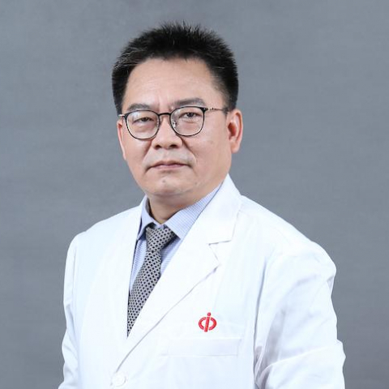

<!-- AUTO-GENERATED-BY: work/generate_obsidian_profiles.py -->

<!-- TEMPLATE: D:\workspace\信息收集整理\医生画像仓库\模板\医生画像模板.md -->

# 曾志荣

## 基础信息

| 字段 | 内容 |
|---|---|
| 姓名 | 曾志荣 |
| 医院 | 中山大学附属第一医院 |
| 科室 | 消化内科 |
| 职称/身份 | 主任医师/教授 |
| 来源链接 | [官网原文](https://www.fahsysu.org.cn/node/790) |
| 采集日期 | 2026-08-13 |

## 简介/擅长

从事消化内科临床30多年，重点在炎症性肠病（IBD）的临床诊治、功能性胃肠病（功能性消化不良、肠易激综合征等）、幽门螺杆菌（Hp）相关性疾病（慢行胃炎、消化性溃疡等），对胆胰疾病有丰富的临床经验。 主要研究方向是炎症性肠病、幽门螺杆菌相关性疾病等基础与临床研究。 主持及参与10多项国家及省厅级科研究基金项目，在国内外期刊上发表学术论文100多篇； 2011年获广东省政府科技进步奖二等奖（主持），2012年获华夏医学奖二等奖（主持）。 现为广东省医学会消化病学分会主任委员、兼炎症性肠病学组组长； 中华医学会第12届消化病学分会功能性胃肠病协作组副组长，中华医学会第11届消化病学分会幽门螺杆菌学组副组长； 中国医师协会消化病学分会委员，广东省中西医结合学会脾胃分会副主任委员。

## 科研项目与成果

- 主持及参与10多项国家及省厅级科研究基金项目，在国内外期刊上发表学术论文100多篇；

## 论文与学术产出

- 主持及参与10多项国家及省厅级科研究基金项目，在国内外期刊上发表学术论文100多篇；

## 可包装亮点

- 主持及参与10多项国家及省厅级科研究基金项目，在国内外期刊上发表学术论文100多篇；
- 2011年获广东省政府科技进步奖二等奖（主持），2012年获华夏医学奖二等奖（主持）。
- 现为广东省医学会消化病学分会主任委员、兼炎症性肠病学组组长；
- 中华医学会第12届消化病学分会功能性胃肠病协作组副组长，中华医学会第11届消化病学分会幽门螺杆菌学组副组长；

## 重点疾病/人群标签

- 慢性病：
- 肿瘤：
- 生殖疾病：
- 免疫/风湿：
- 术后恢复/康复：
- 疑难重症：

## 证据摘录

> 只摘录官网公开信息中的短句或关键字段，不复制大段原文。

- 官网身份字段：主任医师/教授
- 官网简介/擅长：从事消化内科临床30多年，重点在炎症性肠病（IBD）的临床诊治、功能性胃肠病（功能性消化不良、肠易激综合征等）、幽门螺杆菌（Hp）相关性疾病（慢行胃炎、消化性溃疡等），对胆胰疾病有丰富的临床经验。 主要研究方向是炎症性肠病、幽门螺杆菌相关性疾病等基础与临床研究。 主持及参与10多项国家及省厅级科研究基金项目，在国内外期刊上发表学术论文100多篇； 2011年获广东省政府科技进步奖二等奖（主持），2012年获华夏医学奖二等奖（主持）…
- 官网亮眼经历线索：主持及参与10多项国家及省厅级科研究基金项目，在国内外期刊上发表学术论文100多篇； 2011年获广东省政府科技进步奖二等奖（主持），2012年获华夏医学奖二等奖（主持）。 现为广东省医学会消化病学分会主任委员、兼炎症性肠病学组组长； 中华医学会第12届消化病学分会功能性胃肠病协作组副组长，中华医学会第11届消化病学分会幽门螺杆菌学组副组长；
- 来源链接：https://www.fahsysu.org.cn/node/790

## BD 画像摘要

曾志荣医生可作为中山大学附属第一医院消化内科的基础医生资料入库。当前重点方向以总底表标签为准，官网未展示的信息保持空白。

## 合规边界

- 仅使用医院官网、官方公众号、官方小程序等公开渠道。
- 不采集私人电话、私人微信、家庭住址、患者隐私或非公开排班信息。
- 不写“保证治愈”“疗效第一”“包治疑难杂症”等无法由官网证明的表述。
