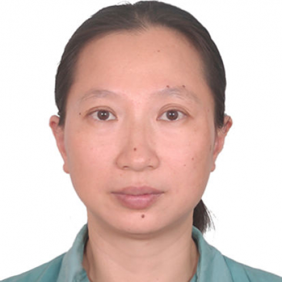

<!-- AUTO-GENERATED-BY: work/generate_obsidian_profiles.py -->

<!-- TEMPLATE: D:\workspace\信息收集整理\医生画像仓库\模板\医生画像模板.md -->

# 曾缨

## 基础信息

| 字段 | 内容 |
|---|---|
| 姓名 | 曾缨 |
| 医院 | 中山大学附属第一医院 |
| 科室 | 神经二科（脑血管病专科） |
| 职称/身份 | 副主任医师/副教授 |
| 来源链接 | [官网原文](https://www.fahsysu.org.cn/node/903) |
| 采集日期 | 2026-08-13 |

## 简介/擅长

1993年本科毕业于广州中山医科大学6年制临床医学系，毕业后一直在中山大学附属第一医院神经科从事临床、教学和科研工作，2001年和2004年先后获得中山大学神经病学硕士和博士学位。 对神经科疑难病的诊治和危重病的抢救积累了较丰富的经验。 尤其擅长肌营养不良症、周围神经病、运动神经元病等肌萎缩性疾病和重症肌无力、多发性肌炎、格林-巴利综合症、多发性硬化、视神经脊髓炎等神经免疫病的诊治。 对神经科常见病如脑血管病、癫痫、脑炎等以及神经科常见症状如头痛、头晕、失眠和疼痛等的诊治也颇有心得。 研究方向： 神经肌肉病 神经免疫病 干细胞移植 主要教育和工作经历： 1987年9月~1993年6月：广州中山医科大学临床医学系； 1993年7月~1999年11月：广州中山大学附属第一医院神经科住院医生； 1998年9月~2001年6月：广州中山大学附属第一医院神经科硕士研究生； 1999年12月~2007年11月：广州中山大学附属第一医院神经科主治医师； 2001年9月~2004年6月：广州中山大学附属第一医院神经科博士研究生 2007年12月~现在：广州中山大学附属第一医院神经科副教授、副主任医师 社会兼职： 论著： 在国家核心期刊...

## 教育与进修经历

- 1993年本科毕业于广州中山医科大学6年制临床医学系，毕业后一直在中山大学附属第一医院神经科从事临床、教学和科研工作，2001年和2004年先后获得中山大学神经病学硕士和博士学位。
- 医疗特长： 1993年本科毕业于广州中山医科大学6年制临床医学系，毕业后一直在中山大学附属第一医院神经科从事临床、教学和科研工作，2001年和2004年先后获得中山大学神经病学硕士和博士学位。

## 科研项目与成果

- 1993年本科毕业于广州中山医科大学6年制临床医学系，毕业后一直在中山大学附属第一医院神经科从事临床、教学和科研工作，2001年和2004年先后获得中山大学神经病学硕士和博士学位。
- 医疗特长： 1993年本科毕业于广州中山医科大学6年制临床医学系，毕业后一直在中山大学附属第一医院神经科从事临床、教学和科研工作，2001年和2004年先后获得中山大学神经病学硕士和博士学位。

## 论文与学术产出

- 2001年9月~2004年6月：广州中山大学附属第一医院神经科博士研究生 2007年12月~现在：广州中山大学附属第一医院神经科副教授、副主任医师 社会兼职： 论著： 在国家核心期刊发表论文30余篇。

## 可包装亮点

- 对神经科疑难病的诊治和危重病的抢救积累了较丰富的经验。
- 2001年9月~2004年6月：广州中山大学附属第一医院神经科博士研究生 2007年12月~现在：广州中山大学附属第一医院神经科副教授、副主任医师 社会兼职： 论著： 在国家核心期刊发表论文30余篇。
- 专著： 其他主要工作成绩（比如获奖情况）：

## 重点疾病/人群标签

- 慢性病：
- 肿瘤：
- 生殖疾病：
- 免疫/风湿：免疫、营养、疼痛、疑难、危重、重症
- 术后恢复/康复：免疫、营养、疼痛、疑难、危重、重症
- 疑难重症：免疫、营养、疼痛、疑难、危重、重症

## 证据摘录

> 只摘录官网公开信息中的短句或关键字段，不复制大段原文。

- 官网身份字段：副主任医师/副教授
- 官网简介/擅长：1993年本科毕业于广州中山医科大学6年制临床医学系，毕业后一直在中山大学附属第一医院神经科从事临床、教学和科研工作，2001年和2004年先后获得中山大学神经病学硕士和博士学位。 对神经科疑难病的诊治和危重病的抢救积累了较丰富的经验。 尤其擅长肌营养不良症、周围神经病、运动神经元病等肌萎缩性疾病和重症肌无力、多发性肌炎、格林-巴利综合症、多发性硬化、视神经脊髓炎等神经免疫病的诊治。 对神经科常见病如脑血管病、癫痫、脑炎等以及神经科常…
- 官网亮眼经历线索：对神经科疑难病的诊治和危重病的抢救积累了较丰富的经验。 对神经科疑难病的诊治和危重病的抢救积累了较丰富的经验。 2001年9月~2004年6月：广州中山大学附属第一医院神经科博士研究生 2007年12月~现在：广州中山大学附属第一医院神经科副教授、副主任医师 社会兼职： 论著： 在国家核心期刊发表论文30余篇。 专著： 其他主要工作成绩（比如获奖情况）：
- 来源链接：https://www.fahsysu.org.cn/node/903

## BD 画像摘要

曾缨医生可作为免疫/风湿/感染、术后恢复/康复、疑难重症方向的基础画像候选。后续 BD 使用应继续以官网来源和人工复核为准，不添加疗效承诺或无来源包装。

## 合规边界

- 仅使用医院官网、官方公众号、官方小程序等公开渠道。
- 不采集私人电话、私人微信、家庭住址、患者隐私或非公开排班信息。
- 不写“保证治愈”“疗效第一”“包治疑难杂症”等无法由官网证明的表述。
