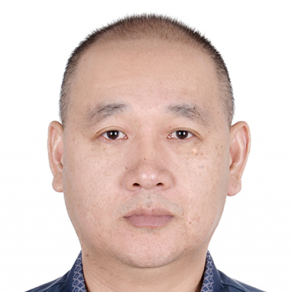

<!-- AUTO-GENERATED-BY: work/generate_obsidian_profiles.py -->

<!-- TEMPLATE: D:\workspace\信息收集整理\医生画像仓库\模板\医生画像模板.md -->

# 朱双喜

## 基础信息

| 字段 | 内容 |
|---|---|
| 姓名 | 朱双喜 |
| 医院 | 中山大学附属第一医院 |
| 科室 | 口腔颌面外科 |
| 职称/身份 | 副主任医师 |
| 来源链接 | [官网原文](https://www.fahsysu.org.cn/node/34929) |
| 采集日期 | 2026-08-13 |

## 简介/擅长

从事口腔颌面外科临床工作多年，擅长颌面外科的各类常见病、疑难病例的诊治； 擅长各类缺失牙的种植修复； 擅长儿童、青少年及成人各类错合畸形的矫治。 主要教育和工作经历 2006年中山大学硕士研究生毕业后留院工作至今 社会兼职： 广东省口腔医学会牙槽外科专业委员会常委员 广东省临床医学会牙种植专委会委员 广东省口腔医学会口腔颌面外科专业委员会委员 科研情况： 主持或参加国家级、省级和厅级基金六项。 在国内外发表论文二十余篇。

## 教育与进修经历

- 主要教育和工作经历 2006年中山大学硕士研究生毕业后留院工作至今 社会兼职： 广东省口腔医学会牙槽外科专业委员会常委员 广东省临床医学会牙种植专委会委员 广东省口腔医学会口腔颌面外科专业委员会委员 科研情况： 主持或参加国家级、省级和厅级基金六项。

## 科研项目与成果

- 主要教育和工作经历 2006年中山大学硕士研究生毕业后留院工作至今 社会兼职： 广东省口腔医学会牙槽外科专业委员会常委员 广东省临床医学会牙种植专委会委员 广东省口腔医学会口腔颌面外科专业委员会委员 科研情况： 主持或参加国家级、省级和厅级基金六项。

## 论文与学术产出

- 在国内外发表论文二十余篇。

## 可包装亮点

- 从事口腔颌面外科临床工作多年，擅长颌面外科的各类常见病、疑难病例的诊治；
- 医疗特长： 从事口腔颌面外科临床工作多年，擅长颌面外科的各类常见病、疑难病例的诊治；
- 主要教育和工作经历 2006年中山大学硕士研究生毕业后留院工作至今 社会兼职： 广东省口腔医学会牙槽外科专业委员会常委员 广东省临床医学会牙种植专委会委员 广东省口腔医学会口腔颌面外科专业委员会委员 科研情况： 主持或参加国家级、省级和厅级基金六项。
- 在国内外发表论文二十余篇。

## 重点疾病/人群标签

- 慢性病：
- 肿瘤：
- 生殖疾病：
- 免疫/风湿：
- 术后恢复/康复：
- 疑难重症：疑难

## 证据摘录

> 只摘录官网公开信息中的短句或关键字段，不复制大段原文。

- 官网身份字段：副主任医师
- 官网简介/擅长：从事口腔颌面外科临床工作多年，擅长颌面外科的各类常见病、疑难病例的诊治； 擅长各类缺失牙的种植修复； 擅长儿童、青少年及成人各类错合畸形的矫治。 主要教育和工作经历 2006年中山大学硕士研究生毕业后留院工作至今 社会兼职： 广东省口腔医学会牙槽外科专业委员会常委员 广东省临床医学会牙种植专委会委员 广东省口腔医学会口腔颌面外科专业委员会委员 科研情况： 主持或参加国家级、省级和厅级基金六项。 在国内外发表论文二十余篇。
- 官网亮眼经历线索：从事口腔颌面外科临床工作多年，擅长颌面外科的各类常见病、疑难病例的诊治； 医疗特长： 从事口腔颌面外科临床工作多年，擅长颌面外科的各类常见病、疑难病例的诊治； 主要教育和工作经历 2006年中山大学硕士研究生毕业后留院工作至今 社会兼职： 广东省口腔医学会牙槽外科专业委员会常委员 广东省临床医学会牙种植专委会委员 广东省口腔医学会口腔颌面外科专业委员会委员 科研情况： 主持或参加国家级、省级和厅级基金六项。 在国内外发表论文二十余篇。
- 来源链接：https://www.fahsysu.org.cn/node/34929

## BD 画像摘要

朱双喜医生可作为疑难重症方向的基础画像候选。后续 BD 使用应继续以官网来源和人工复核为准，不添加疗效承诺或无来源包装。

## 合规边界

- 仅使用医院官网、官方公众号、官方小程序等公开渠道。
- 不采集私人电话、私人微信、家庭住址、患者隐私或非公开排班信息。
- 不写“保证治愈”“疗效第一”“包治疑难杂症”等无法由官网证明的表述。
