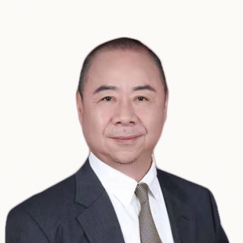

<!-- AUTO-GENERATED-BY: work/generate_obsidian_profiles.py -->

<!-- TEMPLATE: D:\workspace\信息收集整理\医生画像仓库\模板\医生画像模板.md -->

# 朱家源

## 基础信息

| 字段 | 内容 |
|---|---|
| 姓名 | 朱家源 |
| 医院 | 中山大学附属第一医院 |
| 科室 | 烧伤与创面修复科 |
| 职称/身份 | 主任医师/教授 |
| 来源链接 | [官网原文](https://www.fahsysu.org.cn/node/665) |
| 采集日期 | 2026-08-13 |

## 简介/擅长

从事烧伤、创面修复、整形抗衰康复临床工作41年。 擅长各种原因所致的烧烫伤、增生瘢痕、难愈合创面、糖尿病足、术后伤口不愈合、白癜风、色弱色脱等。 尤其利用创新自体表皮细胞移植再生技术在各种急/慢性难治创面、疤痕修复、大面积白癜风等，均有独到之处及疗效。 并采用物理治疗调节组织稳态平衡达到术后伤口无痕愈合。 在烧伤救治上，有数百例特重烧伤救治成功经验。 曾经治愈1例烧伤面积100%患者为当时世界纪录，媒体均有报导。 研究方向： 主持国家、省、市重点科研课题 国家自然科学基金项目计划---表皮干细胞源外泌体miR-335-3p靶向SOCS3诱导M2型巨噬细胞极化促进糖尿病创面愈合的机制研究 广东省科技重大发展专项资金项目（前沿与关键技术创新方向）---3D生物打印自体组织工程皮肤的研究（2016B090916001） 3.中山大学临床5010计划---快速构建组织工程皮肤修复创面的多中心随机对照临床试验 4.广州市科技计划(产学研协同创新重大专项目---3D打印技术快速构建自体组织工程皮肤的研究（1561000117） 5. 广州市卫生健康委员会正式将中山一院烧伤与修复科朱家源教授团队承担的“快速构建组织工程皮肤技术修复难...

## 科研项目与成果

- 研究方向： 主持国家、省、市重点科研课题 国家自然科学基金项目计划---表皮干细胞源外泌体miR-335-3p靶向SOCS3诱导M2型巨噬细胞极化促进糖尿病创面愈合的机制研究 广东省科技重大发展专项资金项目（前沿与关键技术创新方向）---3D生物打印自体组织工程皮肤的研究（2016B090916001） 3.中山大学临床5010计划---快速构建组织工程皮肤修复创面的多中心随机对照临床试验 4.广州市科技计划(产学研协同创新重大专项目---3D打印技术快速构建自体组织工程皮肤的研究（1561000117） 5.…

## 可包装亮点

- 研究方向： 主持国家、省、市重点科研课题 国家自然科学基金项目计划---表皮干细胞源外泌体miR-335-3p靶向SOCS3诱导M2型巨噬细胞极化促进糖尿病创面愈合的机制研究 广东省科技重大发展专项资金项目（前沿与关键技术创新方向）---3D生物打印自体组织工程皮肤的研究（2016B090916001） 3.中山大学临床5010计划---快速构建组织工程皮…
- 针对过去难治性创面诊治无康复，率先提出预防、重建结构、功能的生理性康复技术体系。
- 组织修复与再生过程是可以调控的，研发可调控创面修...

## 重点疾病/人群标签

- 慢性病：糖尿病、慢性、靶向、术后、康复、创面、烧伤、伤口、难治
- 肿瘤：糖尿病、慢性、靶向、术后、康复、创面、烧伤、伤口、难治
- 生殖疾病：
- 免疫/风湿：
- 术后恢复/康复：糖尿病、慢性、靶向、术后、康复、创面、烧伤、伤口、难治
- 疑难重症：糖尿病、慢性、靶向、术后、康复、创面、烧伤、伤口、难治

## 证据摘录

> 只摘录官网公开信息中的短句或关键字段，不复制大段原文。

- 官网身份字段：主任医师/教授
- 官网简介/擅长：从事烧伤、创面修复、整形抗衰康复临床工作41年。 擅长各种原因所致的烧烫伤、增生瘢痕、难愈合创面、糖尿病足、术后伤口不愈合、白癜风、色弱色脱等。 尤其利用创新自体表皮细胞移植再生技术在各种急/慢性难治创面、疤痕修复、大面积白癜风等，均有独到之处及疗效。 并采用物理治疗调节组织稳态平衡达到术后伤口无痕愈合。 在烧伤救治上，有数百例特重烧伤救治成功经验。 曾经治愈1例烧伤面积100%患者为当时世界纪录，媒体均有报导。 研究方向： 主持国家…
- 官网亮眼经历线索：研究方向： 主持国家、省、市重点科研课题 国家自然科学基金项目计划---表皮干细胞源外泌体miR-335-3p靶向SOCS3诱导M2型巨噬细胞极化促进糖尿病创面愈合的机制研究 广东省科技重大发展专项资金项目（前沿与关键技术创新方向）---3D生物打印自体组织工程皮肤的研究（2016B090916001） 3.中山大学临床5010计划---快速构建组织工程皮肤修复创面的多中心随机对照临床试验 4.广州市科技计划(产学研协同创新重大专项目…
- 来源链接：https://www.fahsysu.org.cn/node/665

## BD 画像摘要

朱家源医生可作为慢性病、肿瘤、术后恢复/康复、疑难重症方向的基础画像候选。后续 BD 使用应继续以官网来源和人工复核为准，不添加疗效承诺或无来源包装。

## 合规边界

- 仅使用医院官网、官方公众号、官方小程序等公开渠道。
- 不采集私人电话、私人微信、家庭住址、患者隐私或非公开排班信息。
- 不写“保证治愈”“疗效第一”“包治疑难杂症”等无法由官网证明的表述。
