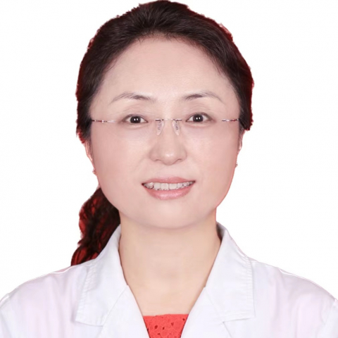

<!-- AUTO-GENERATED-BY: work/generate_obsidian_profiles.py -->

<!-- TEMPLATE: D:\workspace\信息收集整理\医生画像仓库\模板\医生画像模板.md -->

# 朱玲

## 基础信息

| 字段 | 内容 |
|---|---|
| 姓名 | 朱玲 |
| 医院 | 中山大学附属第一医院 |
| 科室 | 心血管儿科 |
| 职称/身份 | 副主任医师 |
| 来源链接 | [官网原文](https://www.fahsysu.org.cn/node/938) |
| 采集日期 | 2026-08-13 |

## 简介/擅长

从事临床儿科工作30年，熟悉儿科常见病及多发病的诊治。 曾师从于韩国首尔大学儿童医院小儿心脏科著名专家，擅长各种先天性心脏病微创介入治疗及儿童心脏外科术前术后的诊治、儿童后天性脏病，包括心肌炎、心包炎、心肌病、川崎病、风湿热及心脏瓣膜病、高血压、心律失常及急慢性心力衰竭等，尤其擅长儿童各种心律失常诊断与治疗，熟练掌握经胸及食道和心腔内超声心动图，儿童心血管介入及儿童心律失常射频消融术、儿童起搏器植入和随访。 研究方向：小儿心血管 主要教育和工作经历：1992年本科毕业，2000年硕士毕业，2005年博士毕业。 毕业以来一直从事于临床儿科心血管工作，2001年10月至2003年2月在韩国首尔大学儿童医院心脏科完成Fellow过程。 论著：曾发表文章近二十篇。 其他主要工作成绩（比如获奖情况）：获教育部回国留学生博士启动基金1项

## 教育与进修经历

- 研究方向：小儿心血管 主要教育和工作经历：1992年本科毕业，2000年硕士毕业，2005年博士毕业。
- 毕业以来一直从事于临床儿科心血管工作，2001年10月至2003年2月在韩国首尔大学儿童医院心脏科完成Fellow过程。
- 其他主要工作成绩（比如获奖情况）：获教育部回国留学生博士启动基金1项

## 科研项目与成果

- 其他主要工作成绩（比如获奖情况）：获教育部回国留学生博士启动基金1项

## 论文与学术产出

- 论著：曾发表文章近二十篇。

## 可包装亮点

- 论著：曾发表文章近二十篇。
- 其他主要工作成绩（比如获奖情况）：获教育部回国留学生博士启动基金1项

## 重点疾病/人群标签

- 慢性病：高血压、心力衰竭、慢性、风湿、术后
- 肿瘤：
- 生殖疾病：
- 免疫/风湿：高血压、心力衰竭、慢性、风湿、术后
- 术后恢复/康复：高血压、心力衰竭、慢性、风湿、术后
- 疑难重症：

## 证据摘录

> 只摘录官网公开信息中的短句或关键字段，不复制大段原文。

- 官网身份字段：副主任医师
- 官网简介/擅长：从事临床儿科工作30年，熟悉儿科常见病及多发病的诊治。 曾师从于韩国首尔大学儿童医院小儿心脏科著名专家，擅长各种先天性心脏病微创介入治疗及儿童心脏外科术前术后的诊治、儿童后天性脏病，包括心肌炎、心包炎、心肌病、川崎病、风湿热及心脏瓣膜病、高血压、心律失常及急慢性心力衰竭等，尤其擅长儿童各种心律失常诊断与治疗，熟练掌握经胸及食道和心腔内超声心动图，儿童心血管介入及儿童心律失常射频消融术、儿童起搏器植入和随访。 研究方向：小儿心血管 主要…
- 官网亮眼经历线索：论著：曾发表文章近二十篇。 其他主要工作成绩（比如获奖情况）：获教育部回国留学生博士启动基金1项
- 来源链接：https://www.fahsysu.org.cn/node/938

## BD 画像摘要

朱玲医生可作为慢性病、免疫/风湿/感染、术后恢复/康复方向的基础画像候选。后续 BD 使用应继续以官网来源和人工复核为准，不添加疗效承诺或无来源包装。

## 合规边界

- 仅使用医院官网、官方公众号、官方小程序等公开渠道。
- 不采集私人电话、私人微信、家庭住址、患者隐私或非公开排班信息。
- 不写“保证治愈”“疗效第一”“包治疑难杂症”等无法由官网证明的表述。
