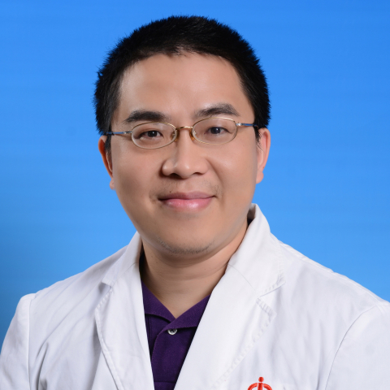

<!-- AUTO-GENERATED-BY: work/generate_obsidian_profiles.py -->

<!-- TEMPLATE: D:\workspace\信息收集整理\医生画像仓库\模板\医生画像模板.md -->

# 李宇彬

## 基础信息

| 字段 | 内容 |
|---|---|
| 姓名 | 李宇彬 |
| 医院 | 中山大学附属第一医院 |
| 科室 | 生殖医学中心 |
| 职称/身份 | 副主任医师 |
| 来源链接 | [官网原文](https://www.fahsysu.org.cn/node/611) |
| 采集日期 | 2026-08-13 |

## 简介/擅长

不孕症、各项辅助生殖临床技术、女性生殖力保存、复发性流产、生殖内分泌治疗 研究方向：不孕症、辅助生殖技术、女性生殖力保存（卵子、卵巢组织冷冻保存）、生殖内分泌、复发性流产、生殖伦理 主要教育和工作经历：1997年﹣2002年中山大学（北校区）临床医学系本科学习，获学士学位。 2002年﹣2007年中山大学附属第一医院生殖专科硕博连读，获博士学位。 2007年7月就职中山大学附属第一医院生殖中心。 2010年12月获聘主治医师。 2015年12月获聘副主任医师。 社会兼职：1. 广东省医学会生殖医学分会伦理学组副组长； 2. 广东省人类辅助生殖技术质量控制中心伦理学专业组员； 3. 广东省健康管理学会妇科肿瘤多学科协作专业委员会第1届委员会委员； 4. 华医学会计划生育学分会肿瘤生殖专科学组委员； 5. 中国优生科学协会生殖医学和生殖伦理学分会青年委员 论著： Endometriosis does not seem to be an influencing factor of hypertensive disorders of pregnancy in IVF / ICSI cycles. Reprod Biol End...

## 教育与进修经历

- 不孕症、各项辅助生殖临床技术、女性生殖力保存、复发性流产、生殖内分泌治疗 医疗特长：不孕症、各项辅助生殖临床技术、女性生殖力保存、复发性流产、生殖内分泌治疗 研究方向：不孕症、辅助生殖技术、女性生殖力保存（卵子、卵巢组织冷冻保存）、生殖内分泌、复发性流产、生殖伦理 主要教育和工作经历：1997年﹣2002年中山大学（北校区）临床医学系本科学习，获学士学位。
- 2002年﹣2007年中山大学附属第一医院生殖专科硕博连读，获博士学位。

## 可包装亮点

- 2015年12月获聘副主任医师。
- 社会兼职：1. 广东省医学会生殖医学分会伦理学组副组长；
- 3. 广东省健康管理学会妇科肿瘤多学科协作专业委员会第1届委员会委员；
- 4. 华医学会计划生育学分会肿瘤生殖专科学组委员；

## 重点疾病/人群标签

- 慢性病：糖尿病、肿瘤、生殖、不孕、卵巢、辅助生殖、胚胎、多囊、月经、疑难、多学科
- 肿瘤：糖尿病、肿瘤、生殖、不孕、卵巢、辅助生殖、胚胎、多囊、月经、疑难、多学科
- 生殖疾病：糖尿病、肿瘤、生殖、不孕、卵巢、辅助生殖、胚胎、多囊、月经、疑难、多学科
- 免疫/风湿：
- 术后恢复/康复：
- 疑难重症：糖尿病、肿瘤、生殖、不孕、卵巢、辅助生殖、胚胎、多囊、月经、疑难、多学科

## 证据摘录

> 只摘录官网公开信息中的短句或关键字段，不复制大段原文。

- 官网身份字段：副主任医师
- 官网简介/擅长：不孕症、各项辅助生殖临床技术、女性生殖力保存、复发性流产、生殖内分泌治疗 研究方向：不孕症、辅助生殖技术、女性生殖力保存（卵子、卵巢组织冷冻保存）、生殖内分泌、复发性流产、生殖伦理 主要教育和工作经历：1997年﹣2002年中山大学（北校区）临床医学系本科学习，获学士学位。 2002年﹣2007年中山大学附属第一医院生殖专科硕博连读，获博士学位。 2007年7月就职中山大学附属第一医院生殖中心。 2010年12月获聘主治医师。 201…
- 官网亮眼经历线索：2015年12月获聘副主任医师。 社会兼职：1. 广东省医学会生殖医学分会伦理学组副组长； 3. 广东省健康管理学会妇科肿瘤多学科协作专业委员会第1届委员会委员； 4. 华医学会计划生育学分会肿瘤生殖专科学组委员；
- 来源链接：https://www.fahsysu.org.cn/node/611

## BD 画像摘要

李宇彬医生可作为慢性病、肿瘤、生殖疾病、疑难重症方向的基础画像候选。后续 BD 使用应继续以官网来源和人工复核为准，不添加疗效承诺或无来源包装。

## 合规边界

- 仅使用医院官网、官方公众号、官方小程序等公开渠道。
- 不采集私人电话、私人微信、家庭住址、患者隐私或非公开排班信息。
- 不写“保证治愈”“疗效第一”“包治疑难杂症”等无法由官网证明的表述。
