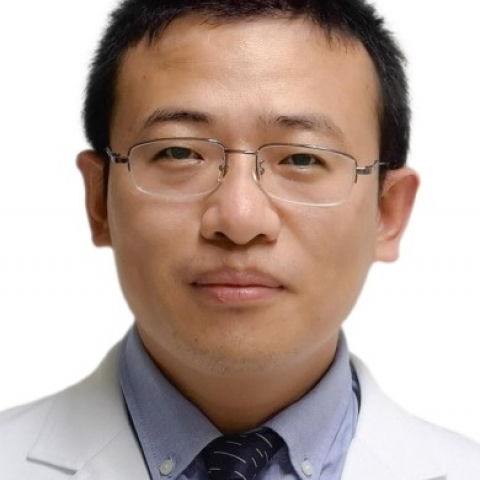

<!-- AUTO-GENERATED-BY: work/generate_obsidian_profiles.py -->

<!-- TEMPLATE: D:\workspace\信息收集整理\医生画像仓库\模板\医生画像模板.md -->

# 李广华

## 基础信息

| 字段 | 内容 |
|---|---|
| 姓名 | 李广华 |
| 医院 | 中山大学附属第一医院 |
| 科室 | 胃肠外科一科 |
| 职称/身份 | 副主任医师 |
| 来源链接 | [官网原文](https://www.fahsysu.org.cn/node/25542) |
| 采集日期 | 2026-08-13 |

## 简介/擅长

胃癌，结肠癌，直肠癌，食管癌、胃肠间质瘤(GIST）、小肠肿瘤等消化道肿瘤的外科根治性手术及综合治疗 遗传性家族性息肉病（FAP），林奇综合征(家族性肠癌)的外科治疗 胃、十二指肠溃疡疤痕梗阻，肠梗阻（肠粘连、克罗恩病、放射性肠损伤） 腹股沟疝、腹壁疝、切口疝，食管裂孔疝 胃食管反流病的微创外科治疗（长期反酸烧心； 合并食管裂孔疝； 巴雷特食管：Barrett’s食管； 反酸相关咳嗽、咽喉炎、哮喘等） 熟练微创手术，损伤小，病人康复快速。 研究方向:胃癌、结肠癌、直肠癌的外科治疗; 胃肠间质瘤(GIST)外科治和综合治疗及基础临床研究; 结直肠癌的早期诊断及外科治疗; 胃食管反流的外科治疗； 快速康复外科。 主要教育和工作经历: 2015年博士毕业于中山大学，一直从事于外科临床工作，2020年获聘副主任医师。 论著:主要研究领域为消化道恶性肿瘤的发病机制及治疗，致力于胃癌侵袭转移，尤其是消化道肿瘤与炎症微环境相关方面的研究。 在胃癌的炎症微环境及分子生物学等方面有比较丰富的研究经验。 至今已主持1项国家自然科学青年基金及1项省部市级基金资助课题的研究，已在 SCl收录杂志发表论文 20余篇，其中第一作者或通讯作者论文 ...

## 教育与进修经历

- 主要教育和工作经历: 2015年博士毕业于中山大学，一直从事于外科临床工作，2020年获聘副主任医师。

## 科研项目与成果

- 至今已主持1项国家自然科学青年基金及1项省部市级基金资助课题的研究，已在 SCl收录杂志发表论文 20余篇，其中第一作者或通讯作者论文 12 篇(最高影响因子IF=13.312)。

## 论文与学术产出

- 至今已主持1项国家自然科学青年基金及1项省部市级基金资助课题的研究，已在 SCl收录杂志发表论文 20余篇，其中第一作者或通讯作者论文 12 篇(最高影响因子IF=13.312)。
- 近年来发表的部分论文如下 [1] Li G, Wang Z, Ye J, Zhang X, Wu H,Peng J, Song w, Chen c, Cai S, He Y, XuJ:Uncontrolledinflammation induced by AEG-1promotes gastric cancer and poor prognosis.Cancer Res 2014,74:5541-52.(共同第一作者IF=12.5) [2]Liu Y, Chen W, Ruan R, Zhang Z, Wang…

## 可包装亮点

- 主要教育和工作经历: 2015年博士毕业于中山大学，一直从事于外科临床工作，2020年获聘副主任医师。
- 至今已主持1项国家自然科学青年基金及1项省部市级基金资助课题的研究，已在 SCl收录杂志发表论文 20余篇，其中第一作者或通讯作者论文 12 篇(最高影响因子IF=13.312)。
- 近年来发表的部分论文如下 [1] Li G, Wang Z, Ye J, Zhang X, Wu H,Peng J, Song w, Chen c, Cai S, He Y, XuJ:Uncontrolledinflammation induced by AEG-1promotes gastric cancer and poor prognosis.Can…

## 重点疾病/人群标签

- 慢性病：
- 肿瘤：肿瘤、癌、瘤、胃癌、肠癌、康复
- 生殖疾病：
- 免疫/风湿：
- 术后恢复/康复：肿瘤、癌、瘤、胃癌、肠癌、康复
- 疑难重症：

## 证据摘录

> 只摘录官网公开信息中的短句或关键字段，不复制大段原文。

- 官网身份字段：副主任医师
- 官网简介/擅长：胃癌，结肠癌，直肠癌，食管癌、胃肠间质瘤(GIST）、小肠肿瘤等消化道肿瘤的外科根治性手术及综合治疗 遗传性家族性息肉病（FAP），林奇综合征(家族性肠癌)的外科治疗 胃、十二指肠溃疡疤痕梗阻，肠梗阻（肠粘连、克罗恩病、放射性肠损伤） 腹股沟疝、腹壁疝、切口疝，食管裂孔疝 胃食管反流病的微创外科治疗（长期反酸烧心； 合并食管裂孔疝； 巴雷特食管：Barrett’s食管； 反酸相关咳嗽、咽喉炎、哮喘等） 熟练微创手术，损伤小，病人康复快…
- 官网亮眼经历线索：主要教育和工作经历: 2015年博士毕业于中山大学，一直从事于外科临床工作，2020年获聘副主任医师。 至今已主持1项国家自然科学青年基金及1项省部市级基金资助课题的研究，已在 SCl收录杂志发表论文 20余篇，其中第一作者或通讯作者论文 12 篇(最高影响因子IF=13.312)。 近年来发表的部分论文如下 [1] Li G, Wang Z, Ye J, Zhang X, Wu H,Peng J, Song w, Chen c, C…
- 来源链接：https://www.fahsysu.org.cn/node/25542

## BD 画像摘要

李广华医生可作为肿瘤、术后恢复/康复方向的基础画像候选。后续 BD 使用应继续以官网来源和人工复核为准，不添加疗效承诺或无来源包装。

## 合规边界

- 仅使用医院官网、官方公众号、官方小程序等公开渠道。
- 不采集私人电话、私人微信、家庭住址、患者隐私或非公开排班信息。
- 不写“保证治愈”“疗效第一”“包治疑难杂症”等无法由官网证明的表述。
