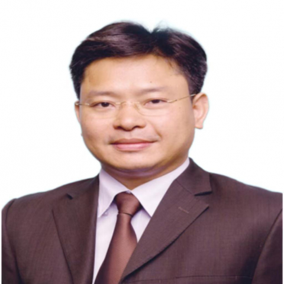

<!-- AUTO-GENERATED-BY: work/generate_obsidian_profiles.py -->

<!-- TEMPLATE: D:\workspace\信息收集整理\医生画像仓库\模板\医生画像模板.md -->

# 李引

## 基础信息

| 字段 | 内容 |
|---|---|
| 姓名 | 李引 |
| 医院 | 中山大学附属第一医院 |
| 科室 | 胃肠外科一科 |
| 职称/身份 | 主任医师 |
| 来源链接 | [官网原文](https://www.fahsysu.org.cn/node/741) |
| 采集日期 | 2026-08-13 |

## 简介/擅长

从事胃肠胰外科和疝外科的临床工作近三十年，具有丰富的临床实践经验,主持或参与众多疑难危重病人的救治并取得良好的成绩。 研究方向： 胃肠腹部外科疑难复杂病例的救治： 消化道恶性肿瘤的扩大根治性手术/腔镜下微创手术治疗（下段食管癌，胃癌，十二指肠癌，小肠癌，结直肠癌，胃肠道间质瘤）； 胰腺癌及神经内分泌肿瘤的手术治疗； 腹膜后疑难恶性肿瘤的手术治疗； 复杂的腹壁缺损修补手术（食道裂孔疝，切口疝，造口旁疝，脐疝，股疝，会阴疝等）； 常见胃肠肛门良性疾病的疑难病例手术治疗（炎性肠病，复杂肛瘘，混合痔，直肠脱垂，便秘等）； 胃肠腺瘤性息肉的内镜下诊治。 主要教育和工作经历： 1991.09~1996.06 广州医科大学临床医疗系获得大学本科学历 1996.07~2001.8 广州医科大学附属荔湾医院外科担任住院医师，获主治医师资格 2001.9~2004.6 中山大学附属第一医院胃肠胰外科学习，获硕士 2004.7 中山大学附属第一医院留校至今， 2013.6 博士毕业 2013.12 副主任医师 2024.12 主任医师 社会兼职： 广东省医学会外科学分会 委员 广东省临床医学会结直肠外科专业 常委 广东省保健协会肛肠保健分会...

## 教育与进修经历

- 主要教育和工作经历： 1991.09~1996.06 广州医科大学临床医疗系获得大学本科学历 1996.07~2001.8 广州医科大学附属荔湾医院外科担任住院医师，获主治医师资格 2001.9~2004.6 中山大学附属第一医院胃肠胰外科学习，获硕士 2004.7 中山大学附属第一医院留校至今， 2013.6 博士毕业 2013.12 副主任医师 2024.12 主任医师 社会兼职： 广东省医学会外科学分会 委员 广东省临床医学会结直肠外科专业 常委 广东省保健协会肛肠保健分会 常委 广东省健康管理学会胃肠病学…

## 可包装亮点

- 从事胃肠胰外科和疝外科的临床工作近三十年，具有丰富的临床实践经验,主持或参与众多疑难危重病人的救治并取得良好的成绩。
- 医疗特长：从事胃肠胰外科和疝外科的临床工作近三十年，具有丰富的临床实践经验,主持或参与众多疑难危重病人的救治并取得良好的成绩。
- 研究方向： 胃肠腹部外科疑难复杂病例的救治： 消化道恶性肿瘤的扩大根治性手术/腔镜下微创手术治疗（下段食管癌，胃癌，十二指肠癌，小肠癌，结直肠癌，胃肠道间质瘤）；
- 腹膜后疑难恶性肿瘤的手术治疗；

## 重点疾病/人群标签

- 慢性病：
- 肿瘤：肿瘤、癌、瘤、胃癌、肠癌、疑难、危重、复杂
- 生殖疾病：
- 免疫/风湿：
- 术后恢复/康复：
- 疑难重症：肿瘤、癌、瘤、胃癌、肠癌、疑难、危重、复杂

## 证据摘录

> 只摘录官网公开信息中的短句或关键字段，不复制大段原文。

- 官网身份字段：主任医师
- 官网简介/擅长：从事胃肠胰外科和疝外科的临床工作近三十年，具有丰富的临床实践经验,主持或参与众多疑难危重病人的救治并取得良好的成绩。 研究方向： 胃肠腹部外科疑难复杂病例的救治： 消化道恶性肿瘤的扩大根治性手术/腔镜下微创手术治疗（下段食管癌，胃癌，十二指肠癌，小肠癌，结直肠癌，胃肠道间质瘤）； 胰腺癌及神经内分泌肿瘤的手术治疗； 腹膜后疑难恶性肿瘤的手术治疗； 复杂的腹壁缺损修补手术（食道裂孔疝，切口疝，造口旁疝，脐疝，股疝，会阴疝等）； 常见胃肠…
- 官网亮眼经历线索：从事胃肠胰外科和疝外科的临床工作近三十年，具有丰富的临床实践经验,主持或参与众多疑难危重病人的救治并取得良好的成绩。 医疗特长：从事胃肠胰外科和疝外科的临床工作近三十年，具有丰富的临床实践经验,主持或参与众多疑难危重病人的救治并取得良好的成绩。 研究方向： 胃肠腹部外科疑难复杂病例的救治： 消化道恶性肿瘤的扩大根治性手术/腔镜下微创手术治疗（下段食管癌，胃癌，十二指肠癌，小肠癌，结直肠癌，胃肠道间质瘤）； 腹膜后疑难恶性肿瘤的手术治疗；
- 来源链接：https://www.fahsysu.org.cn/node/741

## BD 画像摘要

李引医生可作为肿瘤、疑难重症方向的基础画像候选。后续 BD 使用应继续以官网来源和人工复核为准，不添加疗效承诺或无来源包装。

## 合规边界

- 仅使用医院官网、官方公众号、官方小程序等公开渠道。
- 不采集私人电话、私人微信、家庭住址、患者隐私或非公开排班信息。
- 不写“保证治愈”“疗效第一”“包治疑难杂症”等无法由官网证明的表述。
