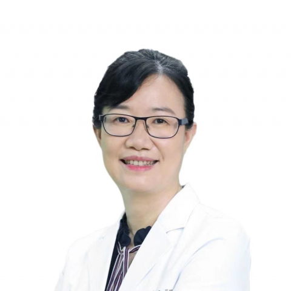

<!-- AUTO-GENERATED-BY: work/generate_obsidian_profiles.py -->

<!-- TEMPLATE: D:\workspace\信息收集整理\医生画像仓库\模板\医生画像模板.md -->

# 李易娟

## 基础信息

| 字段 | 内容 |
|---|---|
| 姓名 | 李易娟 |
| 医院 | 中山大学附属第一医院 |
| 科室 | 儿科ICU |
| 职称/身份 | 主任医师 |
| 来源链接 | [官网原文](https://www.fahsysu.org.cn/node/866) |
| 采集日期 | 2026-08-13 |

## 简介/擅长

## 教育与进修经历

- 中山医科大学临床医学系全英班毕业后一直在院本部工作，曾到奥地利因斯布鲁克医科大学新生儿科、美国加州大学进修学习。

## 科研项目与成果

- 主持及参与多项省部级科研课题，以第一作者/通讯作者在国内外核心期刊发表论著二十余篇，参编专著5部。

## 论文与学术产出

- 主持及参与多项省部级科研课题，以第一作者/通讯作者在国内外核心期刊发表论著二十余篇，参编专著5部。

## 可包装亮点

- 对儿童急危重症的救治特别是脓毒症、急性呼吸窘迫综合征患儿的呼吸及营养支持、重症神经疾病诊治积累了较丰富的临床经验。
- 中山医科大学临床医学系全英班毕业后一直在院本部工作，曾到奥地利因斯布鲁克医科大学新生儿科、美国加州大学进修学习。
- 主持及参与多项省部级科研课题，以第一作者/通讯作者在国内外核心期刊发表论著二十余篇，参编专著5部。

## 重点疾病/人群标签

- 慢性病：
- 肿瘤：
- 生殖疾病：
- 免疫/风湿：
- 术后恢复/康复：营养、重症、急危重、高危
- 疑难重症：营养、重症、急危重、高危

## 证据摘录

> 只摘录官网公开信息中的短句或关键字段，不复制大段原文。

- 官网身份字段：主任医师
- 官网亮眼经历线索：对儿童急危重症的救治特别是脓毒症、急性呼吸窘迫综合征患儿的呼吸及营养支持、重症神经疾病诊治积累了较丰富的临床经验。 中山医科大学临床医学系全英班毕业后一直在院本部工作，曾到奥地利因斯布鲁克医科大学新生儿科、美国加州大学进修学习。 主持及参与多项省部级科研课题，以第一作者/通讯作者在国内外核心期刊发表论著二十余篇，参编专著5部。
- 来源链接：https://www.fahsysu.org.cn/node/866

## BD 画像摘要

李易娟医生可作为术后恢复/康复、疑难重症方向的基础画像候选。后续 BD 使用应继续以官网来源和人工复核为准，不添加疗效承诺或无来源包装。

## 合规边界

- 仅使用医院官网、官方公众号、官方小程序等公开渠道。
- 不采集私人电话、私人微信、家庭住址、患者隐私或非公开排班信息。
- 不写“保证治愈”“疗效第一”“包治疑难杂症”等无法由官网证明的表述。
