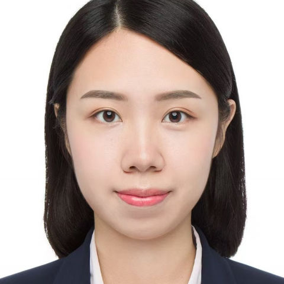

<!-- AUTO-GENERATED-BY: work/generate_obsidian_profiles.py -->

<!-- TEMPLATE: D:\workspace\信息收集整理\医生画像仓库\模板\医生画像模板.md -->

# 李晓哲

## 基础信息

| 字段 | 内容 |
|---|---|
| 姓名 | 李晓哲 |
| 医院 | 中山大学附属第一医院 |
| 科室 | 血液内科 |
| 职称/身份 | 副主任医师 |
| 来源链接 | [官网原文](https://www.fahsysu.org.cn/node/35916) |
| 采集日期 | 2026-08-13 |

## 简介/擅长

各种血液系统常见疾病诊治，尤其是多发性骨髓瘤及其他浆细胞疾病领域有较深的造诣 研究方向：多发性骨髓瘤及其他浆细胞的诊治 主要教育经历： 2009-2017：中山大学中山医学院临床医学八年制 博士研究生 主要工作经历： 2017-2020：中山大学附属第一医院血液内科，住院医师 2020-2024：中山大学附属第一医院血液内科，主治医师 2025至今：中山大学附属第一医院血液内科，副主任医师 社会兼职： 第十二届中华医学会血液学分会青年学组委员 广东省健康管理协会血液病学专业委员会委员 中国中西医结合学会血液学专业委员会青年委员 科研情况：发表多篇SCI论文并主持和参与国家自然科学基金。

## 可包装亮点

- 各种血液系统常见疾病诊治，尤其是多发性骨髓瘤及其他浆细胞疾病领域有较深的造诣 医疗特长：各种血液系统常见疾病诊治，尤其是多发性骨髓瘤及其他浆细胞疾病领域有较深的造诣 研究方向：多发性骨髓瘤及其他浆细胞的诊治 主要教育经历： 2009-2017：中山大学中山医学院临床医学八年制 博士研究生 主要工作经历： 2017-2020：中山大学附属第一医院血液内科，住…

## 重点疾病/人群标签

- 慢性病：
- 肿瘤：瘤
- 生殖疾病：
- 免疫/风湿：
- 术后恢复/康复：
- 疑难重症：

## 证据摘录

> 只摘录官网公开信息中的短句或关键字段，不复制大段原文。

- 官网身份字段：副主任医师
- 官网简介/擅长：各种血液系统常见疾病诊治，尤其是多发性骨髓瘤及其他浆细胞疾病领域有较深的造诣 研究方向：多发性骨髓瘤及其他浆细胞的诊治 主要教育经历： 2009-2017：中山大学中山医学院临床医学八年制 博士研究生 主要工作经历： 2017-2020：中山大学附属第一医院血液内科，住院医师 2020-2024：中山大学附属第一医院血液内科，主治医师 2025至今：中山大学附属第一医院血液内科，副主任医师 社会兼职： 第十二届中华医学会血液学分会青年…
- 官网亮眼经历线索：各种血液系统常见疾病诊治，尤其是多发性骨髓瘤及其他浆细胞疾病领域有较深的造诣 医疗特长：各种血液系统常见疾病诊治，尤其是多发性骨髓瘤及其他浆细胞疾病领域有较深的造诣 研究方向：多发性骨髓瘤及其他浆细胞的诊治 主要教育经历： 2009-2017：中山大学中山医学院临床医学八年制 博士研究生 主要工作经历： 2017-2020：中山大学附属第一医院血液内科，住院医师 2020-2024：中山大学附属第一医院血液内科，主治医师 2025至今…
- 来源链接：https://www.fahsysu.org.cn/node/35916

## BD 画像摘要

李晓哲医生可作为肿瘤方向的基础画像候选。后续 BD 使用应继续以官网来源和人工复核为准，不添加疗效承诺或无来源包装。

## 合规边界

- 仅使用医院官网、官方公众号、官方小程序等公开渠道。
- 不采集私人电话、私人微信、家庭住址、患者隐私或非公开排班信息。
- 不写“保证治愈”“疗效第一”“包治疑难杂症”等无法由官网证明的表述。
