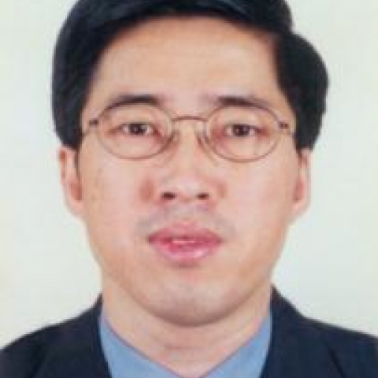

<!-- AUTO-GENERATED-BY: work/generate_obsidian_profiles.py -->

<!-- TEMPLATE: D:\workspace\信息收集整理\医生画像仓库\模板\医生画像模板.md -->

# 李晓飞

## 基础信息

| 字段 | 内容 |
|---|---|
| 姓名 | 李晓飞 |
| 医院 | 中山大学附属第一医院 |
| 科室 | 泌尿外科 |
| 职称/身份 | 主任医师/教授 |
| 来源链接 | [官网原文](https://www.fahsysu.org.cn/node/674) |
| 采集日期 | 2026-08-13 |

## 简介/擅长

泌尿系肿瘤、肾上腺、肾、输尿管、前列腺癌、膀胱肿瘤的诊断和治疗、擅长于达芬奇机器人辅助肾实质肾肿瘤切除、肾上腺肿瘤切除、全膀胱切除术、肾癌根治、肾盂输尿管肿瘤根治术。 研究方向：泌尿系统肿瘤。 主要教育和工作经历：1985年毕业于湖南医科大学医疗系，1987年中山医科大学攻读临床医学博士学位。 1992年博士毕业后在中山医科大学附一院泌尿外科工作至今。 从事泌尿系肿瘤研究工作近40年。 1994年晋升副教授及副主任医师，2004年晋升主任医师及博士生导师。 论著：发表国内外核心论文近50余篇，SCI多篇。 专著：参编《泌尿外科手术学》等专著。 其他主要工作成绩（比如获奖情况）：主持和参与卫生部、广东省科委、市科委等基金近十余项。

## 教育与进修经历

- 主要教育和工作经历：1985年毕业于湖南医科大学医疗系，1987年中山医科大学攻读临床医学博士学位。
- 1992年博士毕业后在中山医科大学附一院泌尿外科工作至今。

## 科研项目与成果

- 其他主要工作成绩（比如获奖情况）：主持和参与卫生部、广东省科委、市科委等基金近十余项。

## 论文与学术产出

- 论著：发表国内外核心论文近50余篇，SCI多篇。
- 专著：参编《泌尿外科手术学》等专著。

## 可包装亮点

- 1994年晋升副教授及副主任医师，2004年晋升主任医师及博士生导师。
- 论著：发表国内外核心论文近50余篇，SCI多篇。
- 其他主要工作成绩（比如获奖情况）：主持和参与卫生部、广东省科委、市科委等基金近十余项。

## 重点疾病/人群标签

- 慢性病：
- 肿瘤：肿瘤、癌
- 生殖疾病：
- 免疫/风湿：
- 术后恢复/康复：
- 疑难重症：

## 证据摘录

> 只摘录官网公开信息中的短句或关键字段，不复制大段原文。

- 官网身份字段：主任医师/教授
- 官网简介/擅长：泌尿系肿瘤、肾上腺、肾、输尿管、前列腺癌、膀胱肿瘤的诊断和治疗、擅长于达芬奇机器人辅助肾实质肾肿瘤切除、肾上腺肿瘤切除、全膀胱切除术、肾癌根治、肾盂输尿管肿瘤根治术。 研究方向：泌尿系统肿瘤。 主要教育和工作经历：1985年毕业于湖南医科大学医疗系，1987年中山医科大学攻读临床医学博士学位。 1992年博士毕业后在中山医科大学附一院泌尿外科工作至今。 从事泌尿系肿瘤研究工作近40年。 1994年晋升副教授及副主任医师，2004年晋升…
- 官网亮眼经历线索：1994年晋升副教授及副主任医师，2004年晋升主任医师及博士生导师。 论著：发表国内外核心论文近50余篇，SCI多篇。 其他主要工作成绩（比如获奖情况）：主持和参与卫生部、广东省科委、市科委等基金近十余项。
- 来源链接：https://www.fahsysu.org.cn/node/674

## BD 画像摘要

李晓飞医生可作为肿瘤方向的基础画像候选。后续 BD 使用应继续以官网来源和人工复核为准，不添加疗效承诺或无来源包装。

## 合规边界

- 仅使用医院官网、官方公众号、官方小程序等公开渠道。
- 不采集私人电话、私人微信、家庭住址、患者隐私或非公开排班信息。
- 不写“保证治愈”“疗效第一”“包治疑难杂症”等无法由官网证明的表述。
