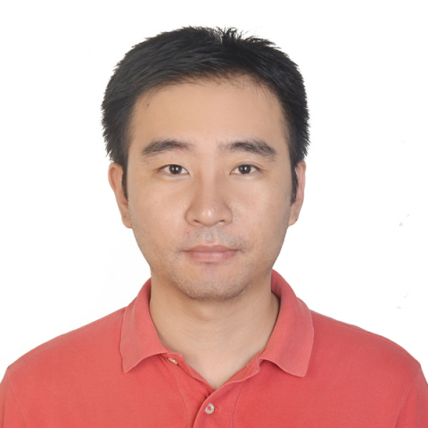

<!-- AUTO-GENERATED-BY: work/generate_obsidian_profiles.py -->

<!-- TEMPLATE: D:\workspace\信息收集整理\医生画像仓库\模板\医生画像模板.md -->

# 李泽民

## 基础信息

| 字段 | 内容 |
|---|---|
| 姓名 | 李泽民 |
| 医院 | 中山大学附属第一医院 |
| 科室 | 脊柱外科 |
| 职称/身份 | 主任医师 |
| 来源链接 | [官网原文](https://www.fahsysu.org.cn/node/5614) |
| 采集日期 | 2026-08-13 |

## 简介/擅长

中山大学博士，副主任医师。 专注于脊柱外科疾病的诊疗，曾受“2012-2013年中山大学博士国际合作项目” 资助至美国芝加哥RUSH医学中心脊柱外科访学1年。 主攻退变性脊柱疾病、脊柱脊髓创伤与脊柱畸形的外科治疗，尤其在颈椎病、腰椎管狭窄症、腰椎间盘突出症、脊柱创伤、脊柱感染和脊柱肿瘤的诊断治疗方面积累了较丰富的临床经验，并熟悉各类脊柱外科微创技术。 研究方向： 退变性脊柱疾病、腰腿痛的发病机制与微创治疗 主要教育和工作经历： 教育经历： 2004/09-2009/06，华中科技大学，同济医学院，学士 2009/09-2014/06，中山大学，附属第一医院脊柱外科，博士（硕博连读） 2012/12-2013/12，美国芝加哥RUSH 医学中心，脊柱外科，博士联合培养 工作经历： 2014/06-2016/12，中山大学，附属第一医院脊柱外科，住院医师 2017/01-2018/12，中山大学，附属第一医院脊柱外科，主治医师 2019/01至今，中山大学，附属第一医院脊柱外科，副主任医师 社会兼职： 广东省康复医学会脊柱脊髓分会微创脊柱外科专委会委员 广东省基层医药学会脊柱专委会委员 论著： 在Osteoarthriti...

## 科研项目与成果

- 专注于脊柱外科疾病的诊疗，曾受“2012-2013年中山大学博士国际合作项目”资助至美国芝加哥RUSH医学中心脊柱外科访学1年。
- 参译 其他主要工作成绩（比如获奖情况）： 主持国家自然青年科学基金1项、广东省医学科研项目1项，主要参与人参加各类国家及省部级科研项目10余项。

## 论文与学术产出

- 专著： 《TheIntervertebral Disc》,Springer, ISBN: 978-3-7091-1534-3. 参编 《脊柱手术关键技术图谱》, 人民军医出版社, ISBN: 978-7-5091-4361-2. 参编 《椎间盘》；

## 可包装亮点

- 中山大学博士，副主任医师。
- 专注于脊柱外科疾病的诊疗，曾受“2012-2013年中山大学博士国际合作项目”资助至美国芝加哥RUSH医学中心脊柱外科访学1年。
- 医疗特长： 中山大学博士，副主任医师。

## 重点疾病/人群标签

- 慢性病：
- 肿瘤：肿瘤、感染、康复
- 生殖疾病：
- 免疫/风湿：肿瘤、感染、康复
- 术后恢复/康复：肿瘤、感染、康复
- 疑难重症：

## 证据摘录

> 只摘录官网公开信息中的短句或关键字段，不复制大段原文。

- 官网身份字段：主任医师
- 官网简介/擅长：中山大学博士，副主任医师。 专注于脊柱外科疾病的诊疗，曾受“2012-2013年中山大学博士国际合作项目” 资助至美国芝加哥RUSH医学中心脊柱外科访学1年。 主攻退变性脊柱疾病、脊柱脊髓创伤与脊柱畸形的外科治疗，尤其在颈椎病、腰椎管狭窄症、腰椎间盘突出症、脊柱创伤、脊柱感染和脊柱肿瘤的诊断治疗方面积累了较丰富的临床经验，并熟悉各类脊柱外科微创技术。 研究方向： 退变性脊柱疾病、腰腿痛的发病机制与微创治疗 主要教育和工作经历： 教育经…
- 官网亮眼经历线索：中山大学博士，副主任医师。 专注于脊柱外科疾病的诊疗，曾受“2012-2013年中山大学博士国际合作项目”资助至美国芝加哥RUSH医学中心脊柱外科访学1年。 医疗特长： 中山大学博士，副主任医师。 专注于脊柱外科疾病的诊疗，曾受“2012-2013年中山大学博士国际合作项目” 资助至美国芝加哥RUSH医学中心脊柱外科访学1年。
- 来源链接：https://www.fahsysu.org.cn/node/5614

## BD 画像摘要

李泽民医生可作为肿瘤、免疫/风湿/感染、术后恢复/康复方向的基础画像候选。后续 BD 使用应继续以官网来源和人工复核为准，不添加疗效承诺或无来源包装。

## 合规边界

- 仅使用医院官网、官方公众号、官方小程序等公开渠道。
- 不采集私人电话、私人微信、家庭住址、患者隐私或非公开排班信息。
- 不写“保证治愈”“疗效第一”“包治疑难杂症”等无法由官网证明的表述。
