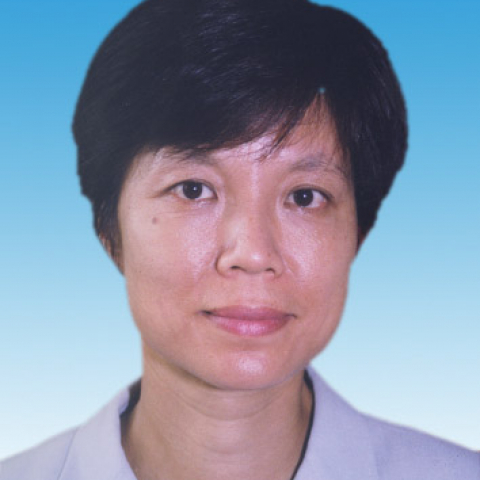

<!-- AUTO-GENERATED-BY: work/generate_obsidian_profiles.py -->

<!-- TEMPLATE: D:\workspace\信息收集整理\医生画像仓库\模板\医生画像模板.md -->

# 李洵桦

## 基础信息

| 字段 | 内容 |
|---|---|
| 姓名 | 李洵桦 |
| 医院 | 中山大学附属第一医院 |
| 科室 | 神经一科 |
| 职称/身份 | 主任医师 |
| 来源链接 | [官网原文](https://www.fahsysu.org.cn/node/882) |
| 采集日期 | 2026-08-13 |

## 简介/擅长

熟练掌握各种神经系统常见病、危重病和多种疑难疾病的诊断和治疗原则。 以神经系统遗传性疾病和神经肌肉疾病作为主要研究方向，专长于对这类疾病的诊断和治疗，主要病种包括： 1、以运动障碍为主要表现的遗传病：肝豆状核变性、脊髓小脑性共济失调、发作性运动障碍病、遗传性痉挛性截瘫、肌张力障碍等； 2、神经肌肉疾病：运动神经元病、代谢相关的肌病； 3、朊蛋白病：CJD和FFI等。 主要教育和工作经历： 1987年和1995年分别获中山医科大学神经病学硕士和博士学位。 在中山一院从事神经科临床、教学和科研工作20余年。 社会兼职： 广东省医学会神经病学分会病理学组副组长。 论著： 在国内外核心医学杂志发表论文60余篇。 专著： 神经遗传病学. 副主编之一. 北京：人民卫生出版社，2011 神经内科病例讨论精选. 副主编之一. 北京：人民卫生出版社，2011 肝豆状核变性. 主编之一. 北京：人民卫生出版社，2012 其他主要工作成绩（比如获奖情况）： 获卫生部科技进步三等奖一项。

## 教育与进修经历

- 主要教育和工作经历： 1987年和1995年分别获中山医科大学神经病学硕士和博士学位。

## 科研项目与成果

- 在中山一院从事神经科临床、教学和科研工作20余年。

## 论文与学术产出

- 论著： 在国内外核心医学杂志发表论文60余篇。
- 专著： 神经遗传病学. 副主编之一. 北京：人民卫生出版社，2011 神经内科病例讨论精选. 副主编之一. 北京：人民卫生出版社，2011 肝豆状核变性. 主编之一. 北京：人民卫生出版社，2012 其他主要工作成绩（比如获奖情况）： 获卫生部科技进步三等奖一项。

## 可包装亮点

- 熟练掌握各种神经系统常见病、危重病和多种疑难疾病的诊断和治疗原则。
- 以神经系统遗传性疾病和神经肌肉疾病作为主要 医疗特长： 熟练掌握各种神经系统常见病、危重病和多种疑难疾病的诊断和治疗原则。
- 社会兼职： 广东省医学会神经病学分会病理学组副组长。
- 论著： 在国内外核心医学杂志发表论文60余篇。

## 重点疾病/人群标签

- 慢性病：代谢、疑难、危重
- 肿瘤：
- 生殖疾病：
- 免疫/风湿：
- 术后恢复/康复：
- 疑难重症：代谢、疑难、危重

## 证据摘录

> 只摘录官网公开信息中的短句或关键字段，不复制大段原文。

- 官网身份字段：主任医师
- 官网简介/擅长：熟练掌握各种神经系统常见病、危重病和多种疑难疾病的诊断和治疗原则。 以神经系统遗传性疾病和神经肌肉疾病作为主要研究方向，专长于对这类疾病的诊断和治疗，主要病种包括： 1、以运动障碍为主要表现的遗传病：肝豆状核变性、脊髓小脑性共济失调、发作性运动障碍病、遗传性痉挛性截瘫、肌张力障碍等； 2、神经肌肉疾病：运动神经元病、代谢相关的肌病； 3、朊蛋白病：CJD和FFI等。 主要教育和工作经历： 1987年和1995年分别获中山医科大学神经病…
- 官网亮眼经历线索：熟练掌握各种神经系统常见病、危重病和多种疑难疾病的诊断和治疗原则。 以神经系统遗传性疾病和神经肌肉疾病作为主要 医疗特长： 熟练掌握各种神经系统常见病、危重病和多种疑难疾病的诊断和治疗原则。 社会兼职： 广东省医学会神经病学分会病理学组副组长。 论著： 在国内外核心医学杂志发表论文60余篇。
- 来源链接：https://www.fahsysu.org.cn/node/882

## BD 画像摘要

李洵桦医生可作为慢性病、疑难重症方向的基础画像候选。后续 BD 使用应继续以官网来源和人工复核为准，不添加疗效承诺或无来源包装。

## 合规边界

- 仅使用医院官网、官方公众号、官方小程序等公开渠道。
- 不采集私人电话、私人微信、家庭住址、患者隐私或非公开排班信息。
- 不写“保证治愈”“疗效第一”“包治疑难杂症”等无法由官网证明的表述。
