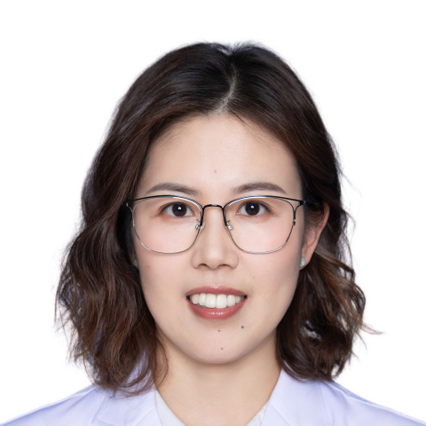

<!-- AUTO-GENERATED-BY: work/generate_obsidian_profiles.py -->

<!-- TEMPLATE: D:\workspace\信息收集整理\医生画像仓库\模板\医生画像模板.md -->

# 李淑娟

## 基础信息

| 字段 | 内容 |
|---|---|
| 姓名 | 李淑娟 |
| 医院 | 中山大学附属第一医院 |
| 科室 | 心血管儿科 |
| 职称/身份 | 主任医师 |
| 来源链接 | [官网原文](https://www.fahsysu.org.cn/node/25429) |
| 采集日期 | 2026-08-13 |

## 简介/擅长

从事儿科心血管专业十余年，精通儿童与青少年心血管专科疾病。 对先天性心脏病、心肌炎、心肌病、心力衰竭、高血压、肺高压、川崎病、风湿热、心律失常（包括各种早搏）、心悸、胸闷、晕厥、化疗后心肌损伤等疾病诊疗，尤其是心脏功能评估与调整治疗具有丰富经验。 熟练操作超声心动图（包括胎儿超声心动图）、心导管检查与介入治疗。 从事胎儿心血管异常咨询工作。 曾先后至香港大学玛丽医院及美国西南医学中心进修学习数年。 研究方向： 儿童心血管疾病、结构性心脏病诊治与心脏功能评估。 主要包括：先天性心脏病； 心肌炎； 心肌病； 心衰； 儿童胸闷、心悸、头晕、晕厥； 早搏； 高血压； 肺高压； 川崎病； 风湿热； 化疗后心肌损伤； 胎儿心血管异常等。 主要教育和工作经历： 2007年硕士毕业于山东医科大学（本硕连读）。 毕业后一直在中山大学附属第一医院心儿科从事医教研工作。 2014年取得中山大学博士学位。 2013-2014年曾至香港大小玛丽医院进修学习。 2017-2020年曾至美国德州大学西南医学中心进修学习。 社会兼职： 广东省医学会儿科心血管病学组副组长、广东省医师协会小儿心血管医师分会委员、广东省健康管理学会心血管病学专业委员、广东...

## 教育与进修经历

- 曾先后至香港大学玛丽医院及美国西南医学中心进修学习数年。

## 可包装亮点

- 曾先后至香港大学玛丽医院及美国西南医学中心进修学习数年。
- 2013-2014年曾至香港大小玛丽医院进修学习。
- 2017-2020年曾至美国德州大学西南医学中心进修学习。
- 社会兼职： 广东省医学会儿科心血管病学组副组长、广东省医师协会小儿心血管医师分会委员、广东省健康管理学会心血管病学专业委员、广东省女医师协会儿科医师专委会委员、广东省卫生经济学会医共体分会儿科专委会委员。

## 重点疾病/人群标签

- 慢性病：高血压、心力衰竭、心衰、化疗、风湿
- 肿瘤：高血压、心力衰竭、心衰、化疗、风湿
- 生殖疾病：
- 免疫/风湿：高血压、心力衰竭、心衰、化疗、风湿
- 术后恢复/康复：
- 疑难重症：

## 证据摘录

> 只摘录官网公开信息中的短句或关键字段，不复制大段原文。

- 官网身份字段：主任医师
- 官网简介/擅长：从事儿科心血管专业十余年，精通儿童与青少年心血管专科疾病。 对先天性心脏病、心肌炎、心肌病、心力衰竭、高血压、肺高压、川崎病、风湿热、心律失常（包括各种早搏）、心悸、胸闷、晕厥、化疗后心肌损伤等疾病诊疗，尤其是心脏功能评估与调整治疗具有丰富经验。 熟练操作超声心动图（包括胎儿超声心动图）、心导管检查与介入治疗。 从事胎儿心血管异常咨询工作。 曾先后至香港大学玛丽医院及美国西南医学中心进修学习数年。 研究方向： 儿童心血管疾病、结构性心…
- 官网亮眼经历线索：曾先后至香港大学玛丽医院及美国西南医学中心进修学习数年。 2013-2014年曾至香港大小玛丽医院进修学习。 2017-2020年曾至美国德州大学西南医学中心进修学习。 社会兼职： 广东省医学会儿科心血管病学组副组长、广东省医师协会小儿心血管医师分会委员、广东省健康管理学会心血管病学专业委员、广东省女医师协会儿科医师专委会委员、广东省卫生经济学会医共体分会儿科专委会委员。
- 来源链接：https://www.fahsysu.org.cn/node/25429

## BD 画像摘要

李淑娟医生可作为慢性病、肿瘤、免疫/风湿/感染方向的基础画像候选。后续 BD 使用应继续以官网来源和人工复核为准，不添加疗效承诺或无来源包装。

## 合规边界

- 仅使用医院官网、官方公众号、官方小程序等公开渠道。
- 不采集私人电话、私人微信、家庭住址、患者隐私或非公开排班信息。
- 不写“保证治愈”“疗效第一”“包治疑难杂症”等无法由官网证明的表述。
