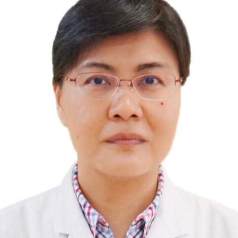

<!-- AUTO-GENERATED-BY: work/generate_obsidian_profiles.py -->

<!-- TEMPLATE: D:\workspace\信息收集整理\医生画像仓库\模板\医生画像模板.md -->

# 李燕虹

## 基础信息

| 字段 | 内容 |
|---|---|
| 姓名 | 李燕虹 |
| 医院 | 中山大学附属第一医院 |
| 科室 | 儿科一科 |
| 职称/身份 | 主任医师 |
| 来源链接 | [官网原文](https://www.fahsysu.org.cn/node/855) |
| 采集日期 | 2026-08-13 |

## 简介/擅长

儿科内分泌疾病的诊治，包括生长发育异常：如各种矮小症（包括生长激素缺乏症、小于胎龄儿和特发性矮小等），性早熟（中枢性性早熟和外周性性早熟），青春发育延迟（如体质性生长和青春发育延迟、性腺功能障碍等）、性发育障碍性疾病（包括小阴茎、隐睾、外生殖器畸形等）； 肾上腺疾病（包括先天性肾上腺皮质增生症和）； 甲状腺疾病； 肥胖和糖尿病。 在儿科内分泌疾病诊治方面经验丰富，尤其擅长儿童矮小症及性早熟的诊治。 研究方向： 儿童矮小症病因分析及诊治，青春期内分泌疾病诊治，儿童脂肪重积聚与远期代谢综合征关系、先天性甲状腺功能低下相关调控基因等。 主要教育和工作经历： 1993年中山医科大学医学系本科毕业，后一直于中山大学附属第一医院儿科从事临床工作，1999年开始儿科内分泌临床及研究工作。 2004年获儿科内分泌专业博士学位。 2007年赴日本东京国立成育医疗中心内分泌代谢科进修并开展儿童肥胖病因及性早熟相关基因等课题研究。 2019年12月“Henning Anderson Educational Program in PaediatricEndocrinology”儿科内分泌短训班。 社会兼职： 中华医学会儿科学分会内分泌遗传代谢...

## 教育与进修经历

- 主要教育和工作经历： 1993年中山医科大学医学系本科毕业，后一直于中山大学附属第一医院儿科从事临床工作，1999年开始儿科内分泌临床及研究工作。
- 2004年获儿科内分泌专业博士学位。
- 2007年赴日本东京国立成育医疗中心内分泌代谢科进修并开展儿童肥胖病因及性早熟相关基因等课题研究。

## 科研项目与成果

- 2007年赴日本东京国立成育医疗中心内分泌代谢科进修并开展儿童肥胖病因及性早熟相关基因等课题研究。

## 论文与学术产出

- 社会兼职： 中华医学会儿科学分会内分泌遗传代谢学组委员 中国医师协会青春期健康与医学专业委员会常务委员、社会工作组组长 中华医学会儿科学分会内分泌遗传代谢学组-华南协作组副组长 广东省儿科学会内分泌学组委员（第十三、四届） 《中华儿科杂志》、《中华内分泌代谢杂志》通讯编委，《中国实用儿科杂志》编委 论著：以第一作者/通讯作者在国内核心期刊及国外SCI收录期刊杂志发表学术论文多篇，多次在亚太和欧洲儿科内分泌会议等国际、国内大会宣读论文，其中关于儿童生长激素缺乏症诊断的论文在第2届亚太儿科内分泌会议上获优胜奖。
- 代表性论文 1、李燕虹, 马华梅, 陈红珊, 等. 广州女孩青春期发育模式的纵向研究. 中华儿科杂志, 2009;

## 可包装亮点

- 2007年赴日本东京国立成育医疗中心内分泌代谢科进修并开展儿童肥胖病因及性早熟相关基因等课题研究。
- 社会兼职： 中华医学会儿科学分会内分泌遗传代谢学组委员 中国医师协会青春期健康与医学专业委员会常务委员、社会工作组组长 中华医学会儿科学分会内分泌遗传代谢学组-华南协作组副组长 广东省儿科学会内分泌学组委员（第十三、四届） 《中华儿科杂志》、《中华内分泌代谢杂志》通讯编委，《中国实用儿科杂志》编委 论著：以第一作者/通讯作者在国内核心期刊及国外SCI收录期…

## 重点疾病/人群标签

- 慢性病：糖尿病、代谢、肿瘤、瘤、生殖、功能障碍
- 肿瘤：糖尿病、代谢、肿瘤、瘤、生殖、功能障碍
- 生殖疾病：糖尿病、代谢、肿瘤、瘤、生殖、功能障碍
- 免疫/风湿：
- 术后恢复/康复：糖尿病、代谢、肿瘤、瘤、生殖、功能障碍
- 疑难重症：

## 证据摘录

> 只摘录官网公开信息中的短句或关键字段，不复制大段原文。

- 官网身份字段：主任医师
- 官网简介/擅长：儿科内分泌疾病的诊治，包括生长发育异常：如各种矮小症（包括生长激素缺乏症、小于胎龄儿和特发性矮小等），性早熟（中枢性性早熟和外周性性早熟），青春发育延迟（如体质性生长和青春发育延迟、性腺功能障碍等）、性发育障碍性疾病（包括小阴茎、隐睾、外生殖器畸形等）； 肾上腺疾病（包括先天性肾上腺皮质增生症和）； 甲状腺疾病； 肥胖和糖尿病。 在儿科内分泌疾病诊治方面经验丰富，尤其擅长儿童矮小症及性早熟的诊治。 研究方向： 儿童矮小症病因分析及诊治…
- 官网亮眼经历线索：2007年赴日本东京国立成育医疗中心内分泌代谢科进修并开展儿童肥胖病因及性早熟相关基因等课题研究。 社会兼职： 中华医学会儿科学分会内分泌遗传代谢学组委员 中国医师协会青春期健康与医学专业委员会常务委员、社会工作组组长 中华医学会儿科学分会内分泌遗传代谢学组-华南协作组副组长 广东省儿科学会内分泌学组委员（第十三、四届） 《中华儿科杂志》、《中华内分泌代谢杂志》通讯编委，《中国实用儿科杂志》编委 论著：以第一作者/通讯作者在国内核心期…
- 来源链接：https://www.fahsysu.org.cn/node/855

## BD 画像摘要

李燕虹医生可作为慢性病、肿瘤、生殖疾病、术后恢复/康复方向的基础画像候选。后续 BD 使用应继续以官网来源和人工复核为准，不添加疗效承诺或无来源包装。

## 合规边界

- 仅使用医院官网、官方公众号、官方小程序等公开渠道。
- 不采集私人电话、私人微信、家庭住址、患者隐私或非公开排班信息。
- 不写“保证治愈”“疗效第一”“包治疑难杂症”等无法由官网证明的表述。
