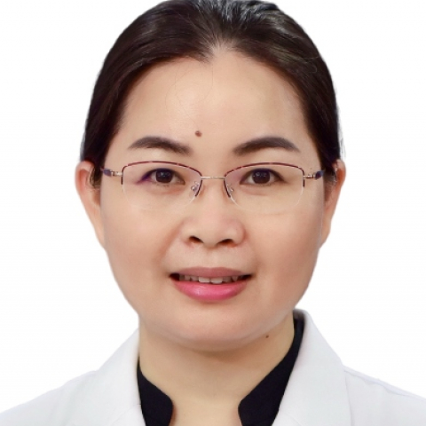

<!-- AUTO-GENERATED-BY: work/generate_obsidian_profiles.py -->

<!-- TEMPLATE: D:\workspace\信息收集整理\医生画像仓库\模板\医生画像模板.md -->

# 李珠玉

## 基础信息

| 字段 | 内容 |
|---|---|
| 姓名 | 李珠玉 |
| 医院 | 中山大学附属第一医院 |
| 科室 | 产科 |
| 职称/身份 | 副主任医师 |
| 来源链接 | [官网原文](https://www.fahsysu.org.cn/node/31109) |
| 采集日期 | 2026-08-13 |

## 简介/擅长

长期从事产科临床工作，专业方向为母胎医学。 在优生咨询、产前筛查与产前诊断、妊娠期糖尿病、妊娠期高血压疾病、胎儿生长受限、剖宫产术后妊娠管理、辅助生殖受孕后妊娠管理、妊娠合并甲状腺疾病、妊娠合并系统性红斑狼疮等内科疾病等有较丰富的临床经验。 掌握各种产科手术及助产技术，手术技能娴熟。 主要教育和工作经历： 2008年毕业于中山大学中山医学院，后免试推荐攻读中山大学附属第一医院妇产科研究生，2011年毕业后留院从事产科临床工作至今。 2024年至今攻读香港中文大学母胎医学理学硕士课程。 社会兼职： 广东省医学会生殖免疫与优生学分会青年委员会副主任委员 ， 广东省医师协会母胎医学医师分会常务委员； 广东省健康管理学会母胎医学专业委员会常务委员； 广东省医学会围产医学分会妊娠期糖尿病学组成员兼秘书； 广东省医学会妇产科学分会多胎妊娠与早产学组秘书。 科研情况： 以第一作者及通讯作者（含共同）发表SCI论著10篇，主持或参与国家自然科学基金及省市级课题多项。

## 教育与进修经历

- 主要教育和工作经历： 2008年毕业于中山大学中山医学院，后免试推荐攻读中山大学附属第一医院妇产科研究生，2011年毕业后留院从事产科临床工作至今。

## 科研项目与成果

- 主要教育和工作经历： 2008年毕业于中山大学中山医学院，后免试推荐攻读中山大学附属第一医院妇产科研究生，2011年毕业后留院从事产科临床工作至今。
- 科研情况： 以第一作者及通讯作者（含共同）发表SCI论著10篇，主持或参与国家自然科学基金及省市级课题多项。

## 论文与学术产出

- 科研情况： 以第一作者及通讯作者（含共同）发表SCI论著10篇，主持或参与国家自然科学基金及省市级课题多项。

## 可包装亮点

- 社会兼职： 广东省医学会生殖免疫与优生学分会青年委员会副主任委员 ， 广东省医师协会母胎医学医师分会常务委员；
- 广东省健康管理学会母胎医学专业委员会常务委员；
- 广东省医学会围产医学分会妊娠期糖尿病学组成员兼秘书；
- 广东省医学会妇产科学分会多胎妊娠与早产学组秘书。

## 重点疾病/人群标签

- 慢性病：高血压、糖尿病、生殖、辅助生殖、免疫、红斑狼疮、术后
- 肿瘤：
- 生殖疾病：高血压、糖尿病、生殖、辅助生殖、免疫、红斑狼疮、术后
- 免疫/风湿：高血压、糖尿病、生殖、辅助生殖、免疫、红斑狼疮、术后
- 术后恢复/康复：高血压、糖尿病、生殖、辅助生殖、免疫、红斑狼疮、术后
- 疑难重症：

## 证据摘录

> 只摘录官网公开信息中的短句或关键字段，不复制大段原文。

- 官网身份字段：副主任医师
- 官网简介/擅长：长期从事产科临床工作，专业方向为母胎医学。 在优生咨询、产前筛查与产前诊断、妊娠期糖尿病、妊娠期高血压疾病、胎儿生长受限、剖宫产术后妊娠管理、辅助生殖受孕后妊娠管理、妊娠合并甲状腺疾病、妊娠合并系统性红斑狼疮等内科疾病等有较丰富的临床经验。 掌握各种产科手术及助产技术，手术技能娴熟。 主要教育和工作经历： 2008年毕业于中山大学中山医学院，后免试推荐攻读中山大学附属第一医院妇产科研究生，2011年毕业后留院从事产科临床工作至今。 2…
- 官网亮眼经历线索：社会兼职： 广东省医学会生殖免疫与优生学分会青年委员会副主任委员 ， 广东省医师协会母胎医学医师分会常务委员； 广东省健康管理学会母胎医学专业委员会常务委员； 广东省医学会围产医学分会妊娠期糖尿病学组成员兼秘书； 广东省医学会妇产科学分会多胎妊娠与早产学组秘书。
- 来源链接：https://www.fahsysu.org.cn/node/31109

## BD 画像摘要

李珠玉医生可作为慢性病、生殖疾病、免疫/风湿/感染、术后恢复/康复方向的基础画像候选。后续 BD 使用应继续以官网来源和人工复核为准，不添加疗效承诺或无来源包装。

## 合规边界

- 仅使用医院官网、官方公众号、官方小程序等公开渠道。
- 不采集私人电话、私人微信、家庭住址、患者隐私或非公开排班信息。
- 不写“保证治愈”“疗效第一”“包治疑难杂症”等无法由官网证明的表述。
