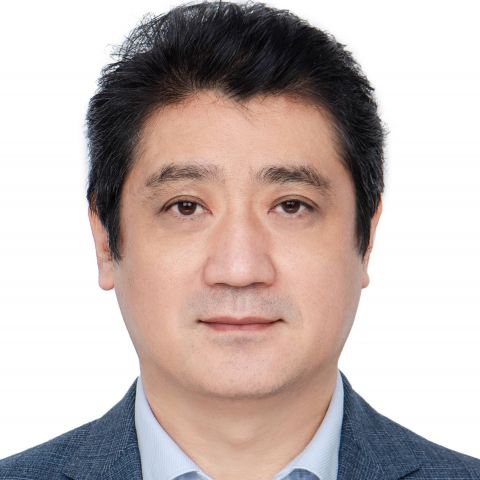

<!-- AUTO-GENERATED-BY: work/generate_obsidian_profiles.py -->

<!-- TEMPLATE: D:\workspace\信息收集整理\医生画像仓库\模板\医生画像模板.md -->

# 李祥

## 基础信息

| 字段 | 内容 |
|---|---|
| 姓名 | 李祥 |
| 医院 | 中山大学附属第一医院 |
| 科室 | 口腔颌面外科 |
| 职称/身份 | 副主任医师 |
| 来源链接 | [官网原文](https://www.fahsysu.org.cn/node/34931) |
| 采集日期 | 2026-08-13 |

## 简介/擅长

长期从事口腔临床工作30多年，擅长各类牙缺失的微创种植，即拔即种，美学种植及修复，各类骨缺损的骨增量种植手术：上颌窦内、外提升，骨劈开等； 半口、全口牙缺失的种植修复。 擅长各类复杂牙，埋伏牙、阻生牙的微创拔除，拔牙后的位点保存，修复前的牙槽骨修整。 以及颌面外科的各类常见病、疑难病例的诊治 主要教育和工作经历 1994年中山医科大学口腔系本科毕业 2001年中山医科大学口腔系硕士研究生毕业 2010年中山大学附属第一医院博士毕业 2015年中山大学附属第一医院口腔科外科副主任医师 社会兼职： 广东省口腔医学会牙槽外科专业委员会常委 广东省临床医学会牙种植专委会常委 广东省口腔医学会口腔颌面外科专业委员会委员

## 教育与进修经历

- 以及颌面外科的各类常见病、疑难病例的诊治 主要教育和工作经历 1994年中山医科大学口腔系本科毕业 2001年中山医科大学口腔系硕士研究生毕业 2010年中山大学附属第一医院博士毕业 2015年中山大学附属第一医院口腔科外科副主任医师 社会兼职： 广东省口腔医学会牙槽外科专业委员会常委 广东省临床医学会牙种植专委会常委 广东省口腔医学会口腔颌面外科专业委员会委员

## 可包装亮点

- 以及颌面外科的各类常见病、疑难病例的诊治 医疗特长： 长期从事口腔临床工作30多年，擅长各类牙缺失的微创种植，即拔即种，美学种植及修复，各类骨缺损的骨增量种植手术：上颌窦内、外提升，骨劈开等；
- 以及颌面外科的各类常见病、疑难病例的诊治 主要教育和工作经历 1994年中山医科大学口腔系本科毕业 2001年中山医科大学口腔系硕士研究生毕业 2010年中山大学附属第一医院博士毕业 2015年中山大学附属第一医院口腔科外科副主任医师 社会兼职： 广东省口腔医学会牙槽外科专业委员会常委 广东省临床医学会牙种植专委会常委 广东省口腔医学会口腔颌面外科专业委员…

## 重点疾病/人群标签

- 慢性病：
- 肿瘤：
- 生殖疾病：
- 免疫/风湿：
- 术后恢复/康复：
- 疑难重症：疑难、复杂

## 证据摘录

> 只摘录官网公开信息中的短句或关键字段，不复制大段原文。

- 官网身份字段：副主任医师
- 官网简介/擅长：长期从事口腔临床工作30多年，擅长各类牙缺失的微创种植，即拔即种，美学种植及修复，各类骨缺损的骨增量种植手术：上颌窦内、外提升，骨劈开等； 半口、全口牙缺失的种植修复。 擅长各类复杂牙，埋伏牙、阻生牙的微创拔除，拔牙后的位点保存，修复前的牙槽骨修整。 以及颌面外科的各类常见病、疑难病例的诊治 主要教育和工作经历 1994年中山医科大学口腔系本科毕业 2001年中山医科大学口腔系硕士研究生毕业 2010年中山大学附属第一医院博士毕业 2…
- 官网亮眼经历线索：以及颌面外科的各类常见病、疑难病例的诊治 医疗特长： 长期从事口腔临床工作30多年，擅长各类牙缺失的微创种植，即拔即种，美学种植及修复，各类骨缺损的骨增量种植手术：上颌窦内、外提升，骨劈开等； 以及颌面外科的各类常见病、疑难病例的诊治 主要教育和工作经历 1994年中山医科大学口腔系本科毕业 2001年中山医科大学口腔系硕士研究生毕业 2010年中山大学附属第一医院博士毕业 2015年中山大学附属第一医院口腔科外科副主任医师 社会兼职…
- 来源链接：https://www.fahsysu.org.cn/node/34931

## BD 画像摘要

李祥医生可作为疑难重症方向的基础画像候选。后续 BD 使用应继续以官网来源和人工复核为准，不添加疗效承诺或无来源包装。

## 合规边界

- 仅使用医院官网、官方公众号、官方小程序等公开渠道。
- 不采集私人电话、私人微信、家庭住址、患者隐私或非公开排班信息。
- 不写“保证治愈”“疗效第一”“包治疑难杂症”等无法由官网证明的表述。
