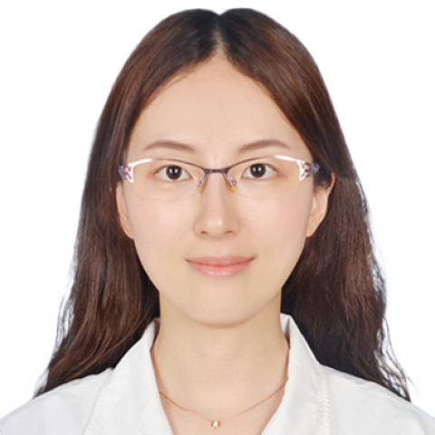

<!-- AUTO-GENERATED-BY: work/generate_obsidian_profiles.py -->

<!-- TEMPLATE: D:\workspace\信息收集整理\医生画像仓库\模板\医生画像模板.md -->

# 李薇

## 基础信息

| 字段 | 内容 |
|---|---|
| 姓名 | 李薇 |
| 医院 | 中山大学附属第一医院 |
| 科室 | 超声医学科 |
| 职称/身份 | 副主任医师 |
| 来源链接 | [官网原文](https://www.fahsysu.org.cn/node/29084) |
| 采集日期 | 2026-08-13 |

## 简介/擅长

从事心血管疾病诊断及研究工作，擅长先天性心脏病、心脏瓣膜病、心肌病、高血压、冠心病及心力衰竭等疾病的超声诊断及鉴别诊断，尤其在心脏超声造影方面积累了丰富经验。 研究方向： 心血管超声诊断 主要教育和工作经历： 2012.09 ~ 2015.06 中山大学影像医学与核医学博士，导师：吕明德教授 社会兼职： 广东省介入心脏学会心脏超声分会委员，广东省健康管理学会脂肪肝多学科诊治专业委员会青年委员，广东省医师协会心脏重症医师分会委员 论著： 多篇中英文论著 其他主要工作成绩（比如获奖情况）： 重视医教研同步发展，主持国家自然科学基金青年基金与广东省自然科学基金。

## 科研项目与成果

- 研究方向： 心血管超声诊断 主要教育和工作经历： 2012.09 ~ 2015.06 中山大学影像医学与核医学博士，导师：吕明德教授 社会兼职： 广东省介入心脏学会心脏超声分会委员，广东省健康管理学会脂肪肝多学科诊治专业委员会青年委员，广东省医师协会心脏重症医师分会委员 论著： 多篇中英文论著 其他主要工作成绩（比如获奖情况）： 重视医教研同步发展，主持国家自然科学基金青年基金与广东省自然科学基金。

## 可包装亮点

- 研究方向： 心血管超声诊断 主要教育和工作经历： 2012.09 ~ 2015.06 中山大学影像医学与核医学博士，导师：吕明德教授 社会兼职： 广东省介入心脏学会心脏超声分会委员，广东省健康管理学会脂肪肝多学科诊治专业委员会青年委员，广东省医师协会心脏重症医师分会委员 论著： 多篇中英文论著 其他主要工作成绩（比如获奖情况）： 重视医教研同步发展，主持国…

## 重点疾病/人群标签

- 慢性病：高血压、冠心病、心力衰竭、重症、多学科
- 肿瘤：
- 生殖疾病：
- 免疫/风湿：
- 术后恢复/康复：
- 疑难重症：高血压、冠心病、心力衰竭、重症、多学科

## 证据摘录

> 只摘录官网公开信息中的短句或关键字段，不复制大段原文。

- 官网身份字段：副主任医师
- 官网简介/擅长：从事心血管疾病诊断及研究工作，擅长先天性心脏病、心脏瓣膜病、心肌病、高血压、冠心病及心力衰竭等疾病的超声诊断及鉴别诊断，尤其在心脏超声造影方面积累了丰富经验。 研究方向： 心血管超声诊断 主要教育和工作经历： 2012.09 ~ 2015.06 中山大学影像医学与核医学博士，导师：吕明德教授 社会兼职： 广东省介入心脏学会心脏超声分会委员，广东省健康管理学会脂肪肝多学科诊治专业委员会青年委员，广东省医师协会心脏重症医师分会委员 论著：…
- 官网亮眼经历线索：研究方向： 心血管超声诊断 主要教育和工作经历： 2012.09 ~ 2015.06 中山大学影像医学与核医学博士，导师：吕明德教授 社会兼职： 广东省介入心脏学会心脏超声分会委员，广东省健康管理学会脂肪肝多学科诊治专业委员会青年委员，广东省医师协会心脏重症医师分会委员 论著： 多篇中英文论著 其他主要工作成绩（比如获奖情况）： 重视医教研同步发展，主持国家自然科学基金青年基金与广东省自然科学基金。
- 来源链接：https://www.fahsysu.org.cn/node/29084

## BD 画像摘要

李薇医生可作为慢性病、疑难重症方向的基础画像候选。后续 BD 使用应继续以官网来源和人工复核为准，不添加疗效承诺或无来源包装。

## 合规边界

- 仅使用医院官网、官方公众号、官方小程序等公开渠道。
- 不采集私人电话、私人微信、家庭住址、患者隐私或非公开排班信息。
- 不写“保证治愈”“疗效第一”“包治疑难杂症”等无法由官网证明的表述。
