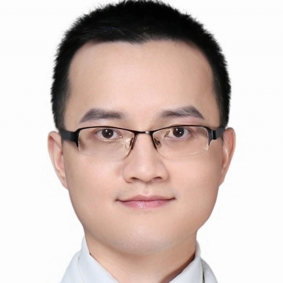

<!-- AUTO-GENERATED-BY: work/generate_obsidian_profiles.py -->

<!-- TEMPLATE: D:\workspace\信息收集整理\医生画像仓库\模板\医生画像模板.md -->

# 杨其运

## 基础信息

| 字段 | 内容 |
|---|---|
| 姓名 | 杨其运 |
| 医院 | 中山大学附属第一医院 |
| 科室 | 泌尿外科、男科 |
| 职称/身份 | 副主任医师 |
| 来源链接 | [官网原文](https://www.fahsysu.org.cn/node/31142) |
| 采集日期 | 2026-08-13 |

## 简介/擅长

泌尿外科及男科常见病、多发病的规范诊治，如男 性性功能障碍（勃起功能障碍、早泄）、 泌尿系结石、泌尿及生殖系统肿瘤、男 性不育、前列腺疾病 等 ； 熟练开展 显微镜（显微镜精索静脉结扎术、精索静脉转流、输精管复通、输精管-附睾吻合），输尿管镜、输尿管软镜和经皮肾镜（肾、输尿管结石碎石、狭窄扩张），腹腔镜（肾上腺、肾肿瘤切除）、以及 男性生殖器整形（包皮过长、阴茎弯曲 、隐匿阴茎、阴茎假体置入）等 手术。 教育经历： 2006-9至2011-6 中山大学 中山医学 本科/学士学位； 2011-9至2016-6 中山大学 附属第一医院 研究生/博士学位（硕博连读）； 工作经历： 2016-7至2019-12 中山大学附属第一医院 泌尿外科 住院医师； 2020-01至2022-12 中山大学附属第一医院 泌尿外科 主治医师； 2023-01至今 中山大学附属第一医院 泌尿外科 副主任医师； 社会兼职： （1）中华医学会 男科学分会 青年学组 委员； （2）中华医学会 男科学分会 性功能障碍学组 秘书； （3）广东省医学会 男科学分会 男性电生理诊治技术学组 副组长； （4）广东省健康管理学会 男性健康管理委员会 常委兼副秘...

## 教育与进修经历

- 教育经历： 2006-9至2011-6 中山大学 中山医学 本科/学士学位；
- 2011-9至2016-6 中山大学 附属第一医院 研究生/博士学位（硕博连读）；

## 科研项目与成果

- 主持国家自然科学基金青年一项，广东省自然科学基金一项，国家卫健委医药卫生发展中心项目一项，参与国家级及省部项目十余项。

## 论文与学术产出

- 科 研情况 ： 发表论文二十余篇，其中以第一/共同第一作者、通讯/共同通讯作者发表SCI论文10篇。

## 可包装亮点

- 2023-01至今 中山大学附属第一医院 泌尿外科 副主任医师；
- 社会兼职： （1）中华医学会 男科学分会 青年学组 委员；
- （2）中华医学会 男科学分会 性功能障碍学组 秘书；
- （3）广东省医学会 男科学分会 男性电生理诊治技术学组 副组长；

## 重点疾病/人群标签

- 慢性病：
- 肿瘤：肿瘤、生殖、功能障碍
- 生殖疾病：肿瘤、生殖、功能障碍
- 免疫/风湿：
- 术后恢复/康复：肿瘤、生殖、功能障碍
- 疑难重症：

## 证据摘录

> 只摘录官网公开信息中的短句或关键字段，不复制大段原文。

- 官网身份字段：副主任医师
- 官网简介/擅长：泌尿外科及男科常见病、多发病的规范诊治，如男 性性功能障碍（勃起功能障碍、早泄）、 泌尿系结石、泌尿及生殖系统肿瘤、男 性不育、前列腺疾病 等 ； 熟练开展 显微镜（显微镜精索静脉结扎术、精索静脉转流、输精管复通、输精管-附睾吻合），输尿管镜、输尿管软镜和经皮肾镜（肾、输尿管结石碎石、狭窄扩张），腹腔镜（肾上腺、肾肿瘤切除）、以及 男性生殖器整形（包皮过长、阴茎弯曲 、隐匿阴茎、阴茎假体置入）等 手术。 教育经历： 2006-9至20…
- 官网亮眼经历线索：2023-01至今 中山大学附属第一医院 泌尿外科 副主任医师； 社会兼职： （1）中华医学会 男科学分会 青年学组 委员； （2）中华医学会 男科学分会 性功能障碍学组 秘书； （3）广东省医学会 男科学分会 男性电生理诊治技术学组 副组长；
- 来源链接：https://www.fahsysu.org.cn/node/31142

## BD 画像摘要

杨其运医生可作为肿瘤、生殖疾病、术后恢复/康复方向的基础画像候选。后续 BD 使用应继续以官网来源和人工复核为准，不添加疗效承诺或无来源包装。

## 合规边界

- 仅使用医院官网、官方公众号、官方小程序等公开渠道。
- 不采集私人电话、私人微信、家庭住址、患者隐私或非公开排班信息。
- 不写“保证治愈”“疗效第一”“包治疑难杂症”等无法由官网证明的表述。
