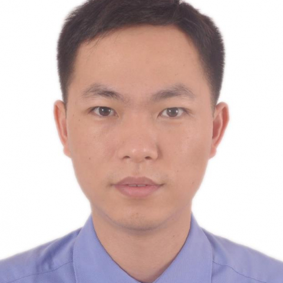

<!-- AUTO-GENERATED-BY: work/generate_obsidian_profiles.py -->

<!-- TEMPLATE: D:\workspace\信息收集整理\医生画像仓库\模板\医生画像模板.md -->

# 杨子波

## 基础信息

| 字段 | 内容 |
|---|---|
| 姓名 | 杨子波 |
| 医院 | 中山大学附属第一医院 |
| 科室 | 关节外科 |
| 职称/身份 | 副主任医师 |
| 来源链接 | [官网原文](https://www.fahsysu.org.cn/node/5627) |
| 采集日期 | 2026-08-13 |

## 简介/擅长

2005年起专攻关节骨病和运动损伤疾病的诊治，2012及2013年先后在加拿大伦敦市医学科学中心以及北医三院运动医学研究所进行关节修复与重建外科和运动医学疾病的专科培训，在关节置换手术及关节镜手术领域积累了丰富的临床经验。 擅长应用关节镜微创手术技术处理肩、髋、膝、踝关节运动损伤疾病，如肩袖撕裂修补、肩关节脱位修补和重建、钙化性肌腱炎清除、肩关节上盂唇复合体损伤（SLAP损伤）修复、踝关节扭伤后韧带损伤修复以及膝关节镜下常见手术（如交叉韧带断裂、内侧髌股韧带断裂、侧副韧带断裂、半月板撕裂修复或重建手术）等等。 另外在应用膝关节、髋关节置换手术治疗膝关节退行性疾病、股骨头坏死、髋关节发育不良等疾病方面也有着丰富的经验。 研究方向： 运动医学与关节镜手术技术； 关节置换手术在髋膝关节疾病中的应用。 主要教育和工作经历： 2012年：加拿大伦敦市医学科学中心进修髋膝关节置换技术； 2013年：北京大学第三医院运动医学研究所进修关节镜手术技术。 社会兼职： 广东省医师协会运动医学医师分会第二届委员会委员 广东省医学会创伤学分会第三届委员会青年委员会委员 中华关节外科杂志通讯编委 论著：发表国内外论文20余篇（SCI论文10篇）...

## 教育与进修经历

- 2005年起专攻关节骨病和运动损伤疾病的诊治，2012及2013年先后在加拿大伦敦市医学科学中心以及北医三院运动医学研究所进行关节修复与重建外科和运动医学疾病的专科培训，在关节置换手术及关节镜手术领域积累了丰富的临床经验。
- 医疗特长： 2005年起专攻关节骨病和运动损伤疾病的诊治，2012及2013年先后在加拿大伦敦市医学科学中心以及北医三院运动医学研究所进行关节修复与重建外科和运动医学疾病的专科培训，在关节置换手术及关节镜手术领域积累了丰富的临床经验。
- 主要教育和工作经历： 2012年：加拿大伦敦市医学科学中心进修髋膝关节置换技术；
- 2013年：北京大学第三医院运动医学研究所进修关节镜手术技术。

## 论文与学术产出

- 社会兼职： 广东省医师协会运动医学医师分会第二届委员会委员 广东省医学会创伤学分会第三届委员会青年委员会委员 中华关节外科杂志通讯编委 论著：发表国内外论文20余篇（SCI论文10篇） 其他主要工作成绩（比如获奖情况）： 获2008年度“广东省青年岗位能手”表彰 获第十六届亚运会“阳光志愿者”表彰 2011~2013年全国高等医学院校大学生临床技能竞赛中山大学校队培训教官，三年均获全国特等奖，并获中山大学“优秀教官奖”。

## 可包装亮点

- 主要教育和工作经历： 2012年：加拿大伦敦市医学科学中心进修髋膝关节置换技术；
- 2013年：北京大学第三医院运动医学研究所进修关节镜手术技术。
- 社会兼职： 广东省医师协会运动医学医师分会第二届委员会委员 广东省医学会创伤学分会第三届委员会青年委员会委员 中华关节外科杂志通讯编委 论著：发表国内外论文20余篇（SCI论文10篇） 其他主要工作成绩（比如获奖情况）： 获2008年度“广东省青年岗位能手”表彰 获第十六届亚运会“阳光志愿者”表彰 2011~2013年全国高等医学院校大学生临床技能竞赛中山…

## 重点疾病/人群标签

- 慢性病：
- 肿瘤：
- 生殖疾病：
- 免疫/风湿：
- 术后恢复/康复：
- 疑难重症：

## 证据摘录

> 只摘录官网公开信息中的短句或关键字段，不复制大段原文。

- 官网身份字段：副主任医师
- 官网简介/擅长：2005年起专攻关节骨病和运动损伤疾病的诊治，2012及2013年先后在加拿大伦敦市医学科学中心以及北医三院运动医学研究所进行关节修复与重建外科和运动医学疾病的专科培训，在关节置换手术及关节镜手术领域积累了丰富的临床经验。 擅长应用关节镜微创手术技术处理肩、髋、膝、踝关节运动损伤疾病，如肩袖撕裂修补、肩关节脱位修补和重建、钙化性肌腱炎清除、肩关节上盂唇复合体损伤（SLAP损伤）修复、踝关节扭伤后韧带损伤修复以及膝关节镜下常见手术（如交…
- 官网亮眼经历线索：主要教育和工作经历： 2012年：加拿大伦敦市医学科学中心进修髋膝关节置换技术； 2013年：北京大学第三医院运动医学研究所进修关节镜手术技术。 社会兼职： 广东省医师协会运动医学医师分会第二届委员会委员 广东省医学会创伤学分会第三届委员会青年委员会委员 中华关节外科杂志通讯编委 论著：发表国内外论文20余篇（SCI论文10篇） 其他主要工作成绩（比如获奖情况）： 获2008年度“广东省青年岗位能手”表彰 获第十六届亚运会“阳光志愿者…
- 来源链接：https://www.fahsysu.org.cn/node/5627

## BD 画像摘要

杨子波医生可作为中山大学附属第一医院关节外科的基础医生资料入库。当前重点方向以总底表标签为准，官网未展示的信息保持空白。

## 合规边界

- 仅使用医院官网、官方公众号、官方小程序等公开渠道。
- 不采集私人电话、私人微信、家庭住址、患者隐私或非公开排班信息。
- 不写“保证治愈”“疗效第一”“包治疑难杂症”等无法由官网证明的表述。
