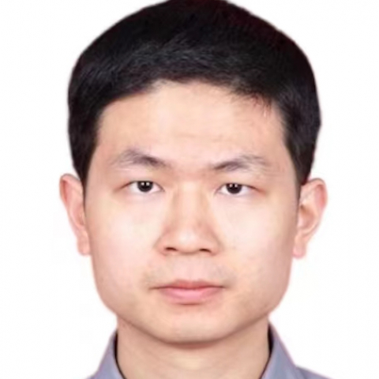

<!-- AUTO-GENERATED-BY: work/generate_obsidian_profiles.py -->

<!-- TEMPLATE: D:\workspace\信息收集整理\医生画像仓库\模板\医生画像模板.md -->

# 杨震

## 基础信息

| 字段 | 内容 |
|---|---|
| 姓名 | 杨震 |
| 医院 | 中山大学附属第一医院 |
| 科室 | 急诊科 |
| 职称/身份 | 主任医师/教授 |
| 来源链接 | [官网原文](https://www.fahsysu.org.cn/node/933) |
| 采集日期 | 2026-08-13 |

## 简介/擅长

## 教育与进修经历

- 工作经历：2007年博士毕业于中山大学附属第一医院，毕业后在中山大学附属第一医院从事临床、教学及科研工作。

## 科研项目与成果

- 工作经历：2007年博士毕业于中山大学附属第一医院，毕业后在中山大学附属第一医院从事临床、教学及科研工作。
- 入选首届广东省杰出青年医学人才、广东省高等学校“千百十工程”第七批校级培养对象、广州市科技计划珠江新星项目和中山大学附属第一医院第三批优秀青年人才支持计划。

## 可包装亮点

- 社会兼职：中国医药教育协会胸痛专委会副主委，广东省生物医学工程学会生物3D打印与再生医学分会副主委，广东省预防医学会急症预防与救治专委会常委，广东省健康管理学会急诊与灾难医学专科联盟专业委员会常委。
- 入选首届广东省杰出青年医学人才、广东省高等学校“千百十工程”第七批校级培养对象、广州市科技计划珠江新星项目和中山大学附属第一医院第三批优秀青年人才支持计划。

## 重点疾病/人群标签

- 慢性病：高血压、冠心病、心力衰竭
- 肿瘤：
- 生殖疾病：
- 免疫/风湿：
- 术后恢复/康复：
- 疑难重症：

## 证据摘录

> 只摘录官网公开信息中的短句或关键字段，不复制大段原文。

- 官网身份字段：主任医师/教授
- 官网亮眼经历线索：社会兼职：中国医药教育协会胸痛专委会副主委，广东省生物医学工程学会生物3D打印与再生医学分会副主委，广东省预防医学会急症预防与救治专委会常委，广东省健康管理学会急诊与灾难医学专科联盟专业委员会常委。 入选首届广东省杰出青年医学人才、广东省高等学校“千百十工程”第七批校级培养对象、广州市科技计划珠江新星项目和中山大学附属第一医院第三批优秀青年人才支持计划。
- 来源链接：https://www.fahsysu.org.cn/node/933

## BD 画像摘要

杨震医生可作为慢性病方向的基础画像候选。后续 BD 使用应继续以官网来源和人工复核为准，不添加疗效承诺或无来源包装。

## 合规边界

- 仅使用医院官网、官方公众号、官方小程序等公开渠道。
- 不采集私人电话、私人微信、家庭住址、患者隐私或非公开排班信息。
- 不写“保证治愈”“疗效第一”“包治疑难杂症”等无法由官网证明的表述。
