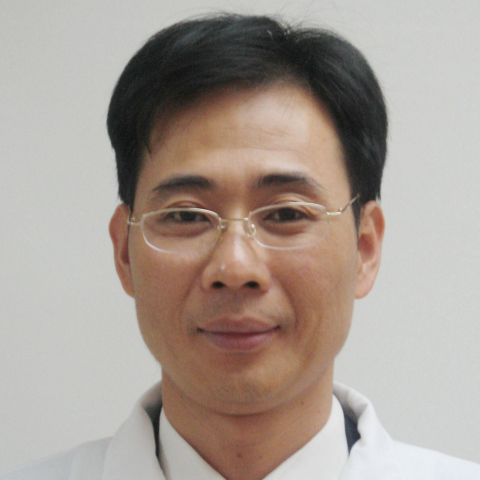

<!-- AUTO-GENERATED-BY: work/generate_obsidian_profiles.py -->

<!-- TEMPLATE: D:\workspace\信息收集整理\医生画像仓库\模板\医生画像模板.md -->

# 林佳平

## 基础信息

| 字段 | 内容 |
|---|---|
| 姓名 | 林佳平 |
| 医院 | 中山大学附属第一医院 |
| 科室 | 神经外科 |
| 职称/身份 | 主任医师 |
| 来源链接 | [官网原文](https://www.fahsysu.org.cn/node/633) |
| 采集日期 | 2026-08-13 |

## 简介/擅长

1991年毕业于中山医科大学，后获得硕士、博士学位，长期从事神经外科临床、教学、科研工作，擅长各种颅脑肿瘤的显微手术治疗，包括脑膜瘤、颅咽管瘤、胶质瘤、血管母细胞瘤、神经鞘瘤等。 在儿童常见病：包括髓母细胞瘤、室管膜瘤、脑积水、脑膜脑膨出等有丰富的诊治经验。 尤其擅长鞍区、松果体区、脑室内等中线部位肿瘤的显微手术治疗。 研究方向： 颅咽管瘤基础与临床研究； 儿童髓母细胞瘤的基础和临床研究； 脑积水的基础和临床研究； 主要教育和工作经历： 1991年毕业于中山医科大学临床医学系，1998年获中山医科大学硕士学位，2003年获中山大学临床医学神经外科学博士学位。 社会兼职： 论著： 儿童髓母细胞瘤患者临床因素与预后的相关性分析； 中华神经医学杂志； 2011年第10卷第6期； 儿童后颅窝肿瘤合并脑积水的治疗及预后分析； 中华神经医学杂志； 2011年第10卷第5期； 可调压与非可调压分流管治疗儿童交通性脑积水的疗效对比研究； 中华神经医学杂志； 2011年第10卷第3期； 颅咽管瘤显微手术中垂体柄辨认和保留的研究； 中华显微外科杂志； 2011年第34卷第1期； 显微手术治疗单纯第三脑室内颅咽管瘤； 中华显微外科杂志； 2...

## 教育与进修经历

- 1991年毕业于中山医科大学，后获得硕士、博士学位，长期从事神经外科临床、教学、科研工作，擅长各种颅脑肿瘤的显微手术治疗，包括脑膜瘤、颅咽管瘤、胶质瘤、血管母细胞瘤、神经鞘瘤等。
- 医疗特长： 1991年毕业于中山医科大学，后获得硕士、博士学位，长期从事神经外科临床、教学、科研工作，擅长各种颅脑肿瘤的显微手术治疗，包括脑膜瘤、颅咽管瘤、胶质瘤、血管母细胞瘤、神经鞘瘤等。
- 主要教育和工作经历： 1991年毕业于中山医科大学临床医学系，1998年获中山医科大学硕士学位，2003年获中山大学临床医学神经外科学博士学位。

## 科研项目与成果

- 1991年毕业于中山医科大学，后获得硕士、博士学位，长期从事神经外科临床、教学、科研工作，擅长各种颅脑肿瘤的显微手术治疗，包括脑膜瘤、颅咽管瘤、胶质瘤、血管母细胞瘤、神经鞘瘤等。
- 医疗特长： 1991年毕业于中山医科大学，后获得硕士、博士学位，长期从事神经外科临床、教学、科研工作，擅长各种颅脑肿瘤的显微手术治疗，包括脑膜瘤、颅咽管瘤、胶质瘤、血管母细胞瘤、神经鞘瘤等。

## 可包装亮点

- 《原癌基因AEG-1调控胶质瘤细胞凋亡的生物学功能及其分子机制》，国家自然科学基金，立项编号：30900569。
- 专著： 廖威明主编《外科学（修订版）-医学专业必修课考试辅导教材》，科学技术出版社出版，2004. 其他主要工作成绩（比如获奖情况）： “复杂性连头婴分离术”获2004年广东省科技进步三等奖。
- “垂体肿瘤临床与基础研究”获得者2003年教育部二等奖

## 重点疾病/人群标签

- 慢性病：
- 肿瘤：肿瘤、癌、瘤、术后、复杂
- 生殖疾病：
- 免疫/风湿：
- 术后恢复/康复：肿瘤、癌、瘤、术后、复杂
- 疑难重症：肿瘤、癌、瘤、术后、复杂

## 证据摘录

> 只摘录官网公开信息中的短句或关键字段，不复制大段原文。

- 官网身份字段：主任医师
- 官网简介/擅长：1991年毕业于中山医科大学，后获得硕士、博士学位，长期从事神经外科临床、教学、科研工作，擅长各种颅脑肿瘤的显微手术治疗，包括脑膜瘤、颅咽管瘤、胶质瘤、血管母细胞瘤、神经鞘瘤等。 在儿童常见病：包括髓母细胞瘤、室管膜瘤、脑积水、脑膜脑膨出等有丰富的诊治经验。 尤其擅长鞍区、松果体区、脑室内等中线部位肿瘤的显微手术治疗。 研究方向： 颅咽管瘤基础与临床研究； 儿童髓母细胞瘤的基础和临床研究； 脑积水的基础和临床研究； 主要教育和工作经历…
- 官网亮眼经历线索：《原癌基因AEG-1调控胶质瘤细胞凋亡的生物学功能及其分子机制》，国家自然科学基金，立项编号：30900569。 专著： 廖威明主编《外科学（修订版）-医学专业必修课考试辅导教材》，科学技术出版社出版，2004. 其他主要工作成绩（比如获奖情况）： “复杂性连头婴分离术”获2004年广东省科技进步三等奖。 “垂体肿瘤临床与基础研究”获得者2003年教育部二等奖
- 来源链接：https://www.fahsysu.org.cn/node/633

## BD 画像摘要

林佳平医生可作为肿瘤、术后恢复/康复、疑难重症方向的基础画像候选。后续 BD 使用应继续以官网来源和人工复核为准，不添加疗效承诺或无来源包装。

## 合规边界

- 仅使用医院官网、官方公众号、官方小程序等公开渠道。
- 不采集私人电话、私人微信、家庭住址、患者隐私或非公开排班信息。
- 不写“保证治愈”“疗效第一”“包治疑难杂症”等无法由官网证明的表述。
