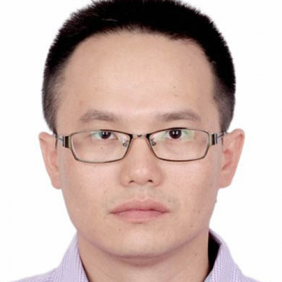

<!-- AUTO-GENERATED-BY: work/generate_obsidian_profiles.py -->

<!-- TEMPLATE: D:\workspace\信息收集整理\医生画像仓库\模板\医生画像模板.md -->

# 林水宾

## 基础信息

| 字段 | 内容 |
|---|---|
| 姓名 | 林水宾 |
| 医院 | 中山大学附属第一医院 |
| 科室 | 转化医学研究中心 |
| 职称/身份 | 研究员 |
| 来源链接 | [官网原文](https://www.fahsysu.org.cn/node/5821) |
| 采集日期 | 2026-08-13 |

## 简介/擅长

国家杰出青年、优秀青年科学基金获得者，国家重点研发计划国合重点专项首席科学家，广东省杰青，广东省珠江人才计划青年拔尖人才。 美国基因和细胞治疗协会会刊 Molecular Therapy 杂志 (Cell Press，IF=12.1)副主编。 从事肿瘤mRNA翻译异常调控的致病功能和机制研究，以通讯/第一作者（共同）发表Nature, Nature Metabolism, Molecular Cell (3篇), Nature Protocols, Nature Communications (2篇)，Cell Reports等论文20多篇, 受邀为Nature Reviews撰写综述。 多次入选“中国高被引学者”和“全球前2%顶尖科学家”榜单。 研究方向： 1）mRNA翻译异常对肿瘤和干细胞的调控功能和机制研究； 2）新型翻译调控因子鉴定和功能研究； 3）mRNA翻译异常相关疾病的诊疗干预转化医学研究。 主要教育和工作经历： 2000-2004 学士 福建省厦门大学生命科学学院，国家生物科学人才培养基地班 2004-2007 硕士 福建省厦门大学生命科学学院，生物医学科学系 2007-2012 博士 美国佛罗里达大学...

## 教育与进修经历

- 主要教育和工作经历： 2000-2004 学士 福建省厦门大学生命科学学院，国家生物科学人才培养基地班 2004-2007 硕士 福建省厦门大学生命科学学院，生物医学科学系 2007-2012 博士 美国佛罗里达大学医学院（College of Medicine, University of Florida, USA） 2012-2017 博士后 美国哈佛大学医学院，波士顿儿童医院 (Harvard Medical School, Boston Children's Hospital) 2017-至今 中山大学附…

## 科研项目与成果

- 科研特长： 国家杰出青年、优秀青年科学基金获得者，国家重点研发计划国合重点专项首席科学家，广东省杰青，广东省珠江人才计划青年拔尖人才。

## 论文与学术产出

- 美国基因和细胞治疗协会会刊 Molecular Therapy 杂志 (Cell Press，IF=12.1)副主编。
- 从事肿瘤mRNA翻译异常调控的致病功能和机制研究，以通讯/第一作者（共同）发表Nature, Nature Metabolism, Molecular Cell (3篇), Nature Protocols, Nature Communications (2篇)，Cell Reports等论文20多篇, 受邀为Nature Reviews撰写综述。

## 可包装亮点

- 科研特长： 国家杰出青年、优秀青年科学基金获得者，国家重点研发计划国合重点专项首席科学家，广东省杰青，广东省珠江人才计划青年拔尖人才。
- 美国基因和细胞治疗协会会刊 Molecular Therapy 杂志 (Cell Press，IF=12.1)副主编。
- 从事肿瘤mRNA翻译异常调控的致病功能和机制研究，以通讯/第一作者（共同）发表Nature, Nature Metabolism, Molecular Cell (3篇), Nature Protocols, Nature Communications (2篇)，Cell Reports等论文20多篇, 受邀为Nature Reviews撰写综述。
- 主要教育和工作经历： 2000-2004 学士 福建省厦门大学生命科学学院，国家生物科学人才培养基地班 2004-2007 硕士 福建省厦门大学生命科学学院，生物医学科学系 2007-2012 博士 美国佛罗里达大学医学院（C...

## 重点疾病/人群标签

- 慢性病：
- 肿瘤：肿瘤
- 生殖疾病：
- 免疫/风湿：
- 术后恢复/康复：
- 疑难重症：

## 证据摘录

> 只摘录官网公开信息中的短句或关键字段，不复制大段原文。

- 官网身份字段：研究员
- 官网简介/擅长：国家杰出青年、优秀青年科学基金获得者，国家重点研发计划国合重点专项首席科学家，广东省杰青，广东省珠江人才计划青年拔尖人才。 美国基因和细胞治疗协会会刊 Molecular Therapy 杂志 (Cell Press，IF=12.1)副主编。 从事肿瘤mRNA翻译异常调控的致病功能和机制研究，以通讯/第一作者（共同）发表Nature, Nature Metabolism, Molecular Cell (3篇), Nature Pro…
- 官网亮眼经历线索：科研特长： 国家杰出青年、优秀青年科学基金获得者，国家重点研发计划国合重点专项首席科学家，广东省杰青，广东省珠江人才计划青年拔尖人才。 美国基因和细胞治疗协会会刊 Molecular Therapy 杂志 (Cell Press，IF=12.1)副主编。 从事肿瘤mRNA翻译异常调控的致病功能和机制研究，以通讯/第一作者（共同）发表Nature, Nature Metabolism, Molecular Cell (3篇), Natu…
- 来源链接：https://www.fahsysu.org.cn/node/5821

## BD 画像摘要

林水宾医生可作为肿瘤方向的基础画像候选。后续 BD 使用应继续以官网来源和人工复核为准，不添加疗效承诺或无来源包装。

## 合规边界

- 仅使用医院官网、官方公众号、官方小程序等公开渠道。
- 不采集私人电话、私人微信、家庭住址、患者隐私或非公开排班信息。
- 不写“保证治愈”“疗效第一”“包治疑难杂症”等无法由官网证明的表述。
