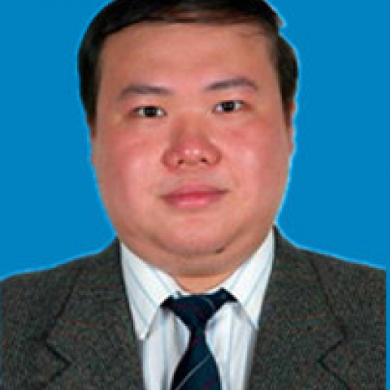

<!-- AUTO-GENERATED-BY: work/generate_obsidian_profiles.py -->

<!-- TEMPLATE: D:\workspace\信息收集整理\医生画像仓库\模板\医生画像模板.md -->

# 林维浩

## 基础信息

| 字段 | 内容 |
|---|---|
| 姓名 | 林维浩 |
| 医院 | 中山大学附属第一医院 |
| 科室 | 甲状腺外科 |
| 职称/身份 | 副主任医师 |
| 来源链接 | [官网原文](https://www.fahsysu.org.cn/node/726) |
| 采集日期 | 2026-08-13 |

## 简介/擅长

对乳腺、甲状腺及甲状旁腺疾病的诊治有丰富的临床经验。 擅长甲状腺、甲状旁腺良恶性疾病的诊治及手术治疗。 对乳腺良恶性疾病的诊治及手术治疗有丰富的经验，对乳腺癌化疗、靶向和内分泌等综合性治疗有深入研究。 研究方向： 1、乳腺癌的侵袭转移机制及治疗 2、甲状腺恶性肿瘤的外科治疗 主要教育和工作经历： 2011年09月-2014年06月 中山大学附属第一医院 硕士 2005年09月至今 中山大学附属第一医院甲状腺乳腺外科 主治医师、副主任医师 发表论文20余篇，在国内核心期刊及国外医学杂志发表，部分被SCI收录。

## 论文与学术产出

- 研究方向： 1、乳腺癌的侵袭转移机制及治疗 2、甲状腺恶性肿瘤的外科治疗 主要教育和工作经历： 2011年09月-2014年06月 中山大学附属第一医院 硕士 2005年09月至今 中山大学附属第一医院甲状腺乳腺外科 主治医师、副主任医师 发表论文20余篇，在国内核心期刊及国外医学杂志发表，部分被SCI收录。

## 可包装亮点

- 研究方向： 1、乳腺癌的侵袭转移机制及治疗 2、甲状腺恶性肿瘤的外科治疗 主要教育和工作经历： 2011年09月-2014年06月 中山大学附属第一医院 硕士 2005年09月至今 中山大学附属第一医院甲状腺乳腺外科 主治医师、副主任医师 发表论文20余篇，在国内核心期刊及国外医学杂志发表，部分被SCI收录。

## 重点疾病/人群标签

- 慢性病：
- 肿瘤：肿瘤、化疗、靶向、乳腺癌
- 生殖疾病：
- 免疫/风湿：
- 术后恢复/康复：
- 疑难重症：

## 证据摘录

> 只摘录官网公开信息中的短句或关键字段，不复制大段原文。

- 官网身份字段：副主任医师
- 官网简介/擅长：对乳腺、甲状腺及甲状旁腺疾病的诊治有丰富的临床经验。 擅长甲状腺、甲状旁腺良恶性疾病的诊治及手术治疗。 对乳腺良恶性疾病的诊治及手术治疗有丰富的经验，对乳腺癌化疗、靶向和内分泌等综合性治疗有深入研究。 研究方向： 1、乳腺癌的侵袭转移机制及治疗 2、甲状腺恶性肿瘤的外科治疗 主要教育和工作经历： 2011年09月-2014年06月 中山大学附属第一医院 硕士 2005年09月至今 中山大学附属第一医院甲状腺乳腺外科 主治医师、副主任医…
- 官网亮眼经历线索：研究方向： 1、乳腺癌的侵袭转移机制及治疗 2、甲状腺恶性肿瘤的外科治疗 主要教育和工作经历： 2011年09月-2014年06月 中山大学附属第一医院 硕士 2005年09月至今 中山大学附属第一医院甲状腺乳腺外科 主治医师、副主任医师 发表论文20余篇，在国内核心期刊及国外医学杂志发表，部分被SCI收录。
- 来源链接：https://www.fahsysu.org.cn/node/726

## BD 画像摘要

林维浩医生可作为肿瘤方向的基础画像候选。后续 BD 使用应继续以官网来源和人工复核为准，不添加疗效承诺或无来源包装。

## 合规边界

- 仅使用医院官网、官方公众号、官方小程序等公开渠道。
- 不采集私人电话、私人微信、家庭住址、患者隐私或非公开排班信息。
- 不写“保证治愈”“疗效第一”“包治疑难杂症”等无法由官网证明的表述。
