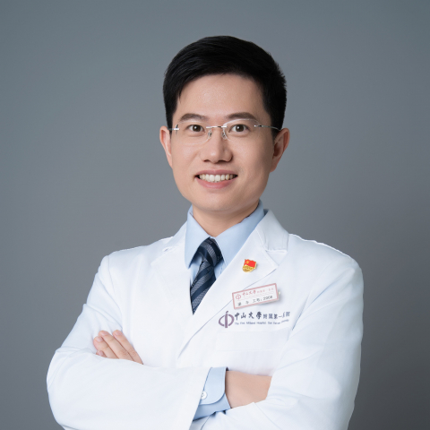

<!-- AUTO-GENERATED-BY: work/generate_obsidian_profiles.py -->

<!-- TEMPLATE: D:\workspace\信息收集整理\医生画像仓库\模板\医生画像模板.md -->

# 梁丰

## 基础信息

| 字段 | 内容 |
|---|---|
| 姓名 | 梁丰 |
| 医院 | 中山大学附属第一医院 |
| 科室 | 神经外科 |
| 职称/身份 | 主任医师 |
| 来源链接 | [官网原文](https://www.fahsysu.org.cn/node/25607) |
| 采集日期 | 2026-08-13 |

## 简介/擅长

专攻脑血管病，从2006年七年制临床硕士开始专注脑血管病治疗至今已20年，对脑动脉瘤、烟雾病、脑海绵状血管瘤、脑动静脉畸形、搏动性耳鸣（静脉窦憩室、狭窄）的诊治有丰富经验。 擅长显微手术和介入手术，2011年在美国跟随神经介入开创者Vinuela教授学习，接受系统、规范的神经介入手术培训，熟练掌握临床前沿技术，尤其擅长脑动脉瘤的各种介入手术和锁孔夹闭手术、烟雾病搭桥手术、大脑半球海绵状血管瘤精准导航手术，年手术量逾500台。 主要教育和工作经历： 中山大学七年制硕士（2001-2008）、博士（2013-2016） 中山大学优秀毕业生（2008） 美国加州大学洛杉矶分校神经介入科访问学者（2011-2012） 中山大学附属第一医院医师（2008-2013）、主治医师（2013-2020）、副主任医师（2020-2025）、主任医师（2025至今） 社会兼职： 广东省医学会神经外科分会青年委员会副主任委员 广东省卒中学会血管神经外科分会副主任委员 中国医师协会神经外科分会脑血管病学组委员 中国医师协会神经介入分会脑动静脉畸形学组委员 中国卒中学会复合神经外科分会委员 广东省医学会神经介入学分会常务委员 广东省医师协会神经...

## 教育与进修经历

- 擅长显微手术和介入手术，2011年在美国跟随神经介入开创者Vinuela教授学习，接受系统、规范的神经介入手术培训，熟练掌握临床前沿技术，尤其擅长脑动脉瘤的各种介入手术和锁孔夹闭手术、烟雾病搭桥手术、大脑半球海绵状血管瘤精准导航手术，年手术量逾500台。
- 主要教育和工作经历： 中山大学七年制硕士（2001-2008）、博士（2013-2016） 中山大学优秀毕业生（2008） 美国加州大学洛杉矶分校神经介入科访问学者（2011-2012） 中山大学附属第一医院医师（2008-2013）、主治医师（2013-2020）、副主任医师（2020-2025）、主任医师（2025至今） 社会兼职： 广东省医学会神经外科分会青年委员会副主任委员 广东省卒中学会血管神经外科分会副主任委员 中国医师协会神经外科分会脑血管病学组委员 中国医师协会神经介入分会脑动静脉畸形学组委员 中…

## 可包装亮点

- 擅长显微手术和介入手术，2011年在美国跟随神经介入开创者Vinuela教授学习，接受系统、规范的神经介入手术培训，熟练掌握临床前沿技术，尤其擅长脑动脉瘤的各种介入手术和锁孔夹闭手术、烟雾病搭桥手术、大脑半球海绵状血管瘤精准导航手术，年手术量逾500台。
- 主要教育和工作经历： 中山大学七年制硕士（2001-2008）、博士（2013-2016） 中山大学优秀毕业生（2008） 美国加州大学洛杉矶分校神经介入科访问学者（2011-2012） 中山大学附属第一医院医师（2008-2013）、主治医师（2013-2020）、副主任医师（2020-2025）、主任医师（2025至...

## 重点疾病/人群标签

- 慢性病：
- 肿瘤：瘤
- 生殖疾病：
- 免疫/风湿：
- 术后恢复/康复：
- 疑难重症：

## 证据摘录

> 只摘录官网公开信息中的短句或关键字段，不复制大段原文。

- 官网身份字段：主任医师
- 官网简介/擅长：专攻脑血管病，从2006年七年制临床硕士开始专注脑血管病治疗至今已20年，对脑动脉瘤、烟雾病、脑海绵状血管瘤、脑动静脉畸形、搏动性耳鸣（静脉窦憩室、狭窄）的诊治有丰富经验。 擅长显微手术和介入手术，2011年在美国跟随神经介入开创者Vinuela教授学习，接受系统、规范的神经介入手术培训，熟练掌握临床前沿技术，尤其擅长脑动脉瘤的各种介入手术和锁孔夹闭手术、烟雾病搭桥手术、大脑半球海绵状血管瘤精准导航手术，年手术量逾500台。 主要教育…
- 官网亮眼经历线索：擅长显微手术和介入手术，2011年在美国跟随神经介入开创者Vinuela教授学习，接受系统、规范的神经介入手术培训，熟练掌握临床前沿技术，尤其擅长脑动脉瘤的各种介入手术和锁孔夹闭手术、烟雾病搭桥手术、大脑半球海绵状血管瘤精准导航手术，年手术量逾500台。 擅长显微手术和介入手术，2011年在美国跟随神经介入开创者Vinuela教授学习，接受系统、规范的神经介入手术培训，熟练掌握临床前沿技术，尤其擅长脑动脉瘤的各种介入手术和锁孔夹闭手术…
- 来源链接：https://www.fahsysu.org.cn/node/25607

## BD 画像摘要

梁丰医生可作为肿瘤方向的基础画像候选。后续 BD 使用应继续以官网来源和人工复核为准，不添加疗效承诺或无来源包装。

## 合规边界

- 仅使用医院官网、官方公众号、官方小程序等公开渠道。
- 不采集私人电话、私人微信、家庭住址、患者隐私或非公开排班信息。
- 不写“保证治愈”“疗效第一”“包治疑难杂症”等无法由官网证明的表述。
