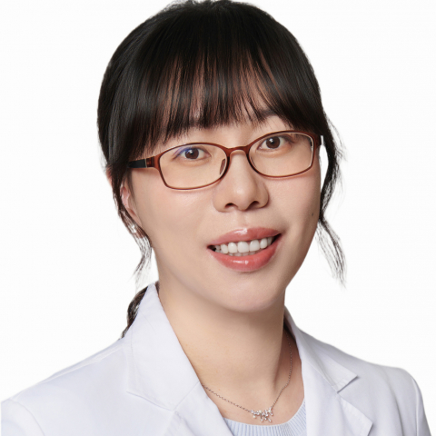

<!-- AUTO-GENERATED-BY: work/generate_obsidian_profiles.py -->

<!-- TEMPLATE: D:\workspace\信息收集整理\医生画像仓库\模板\医生画像模板.md -->

# 梁巍巍

## 基础信息

| 字段 | 内容 |
|---|---|
| 姓名 | 梁巍巍 |
| 医院 | 中山大学附属第一医院 |
| 科室 | 内分泌内科 |
| 职称/身份 | 副主任医师 |
| 来源链接 | [官网原文](https://www.fahsysu.org.cn/node/35743) |
| 采集日期 | 2026-08-13 |

## 简介/擅长

糖尿病及并发症、甲状腺疾病、垂体-肾上腺疾病、继发性高血压、痛风、肥胖症、骨质疏松等疾病的诊治。 研究方向： 甲状腺肿瘤及糖尿病的发病机制。 主要教育和工作经历： 2015年毕业于中山大学获内科学博士学位，后长期于中山大学附属第一医院内分泌科工作。 社会兼职： 广东省医师协会内分泌科医师分会青年医师工作组副组长 广东省老年保健协会骨质疏松预防与康复专业委员会委员 科研业绩： 主持国家自然科学基金及广东省自然科学基金各1项，以第一或并列第一作者在 Thyroid、JCEM等杂志上发表SCI论文数篇。

## 教育与进修经历

- 主要教育和工作经历： 2015年毕业于中山大学获内科学博士学位，后长期于中山大学附属第一医院内分泌科工作。

## 科研项目与成果

- 社会兼职： 广东省医师协会内分泌科医师分会青年医师工作组副组长 广东省老年保健协会骨质疏松预防与康复专业委员会委员 科研业绩： 主持国家自然科学基金及广东省自然科学基金各1项，以第一或并列第一作者在 Thyroid、JCEM等杂志上发表SCI论文数篇。

## 论文与学术产出

- 社会兼职： 广东省医师协会内分泌科医师分会青年医师工作组副组长 广东省老年保健协会骨质疏松预防与康复专业委员会委员 科研业绩： 主持国家自然科学基金及广东省自然科学基金各1项，以第一或并列第一作者在 Thyroid、JCEM等杂志上发表SCI论文数篇。

## 可包装亮点

- 社会兼职： 广东省医师协会内分泌科医师分会青年医师工作组副组长 广东省老年保健协会骨质疏松预防与康复专业委员会委员 科研业绩： 主持国家自然科学基金及广东省自然科学基金各1项，以第一或并列第一作者在 Thyroid、JCEM等杂志上发表SCI论文数篇。

## 重点疾病/人群标签

- 慢性病：高血压、糖尿病、肿瘤、康复
- 肿瘤：高血压、糖尿病、肿瘤、康复
- 生殖疾病：
- 免疫/风湿：
- 术后恢复/康复：高血压、糖尿病、肿瘤、康复
- 疑难重症：

## 证据摘录

> 只摘录官网公开信息中的短句或关键字段，不复制大段原文。

- 官网身份字段：副主任医师
- 官网简介/擅长：糖尿病及并发症、甲状腺疾病、垂体-肾上腺疾病、继发性高血压、痛风、肥胖症、骨质疏松等疾病的诊治。 研究方向： 甲状腺肿瘤及糖尿病的发病机制。 主要教育和工作经历： 2015年毕业于中山大学获内科学博士学位，后长期于中山大学附属第一医院内分泌科工作。 社会兼职： 广东省医师协会内分泌科医师分会青年医师工作组副组长 广东省老年保健协会骨质疏松预防与康复专业委员会委员 科研业绩： 主持国家自然科学基金及广东省自然科学基金各1项，以第一或并列…
- 官网亮眼经历线索：社会兼职： 广东省医师协会内分泌科医师分会青年医师工作组副组长 广东省老年保健协会骨质疏松预防与康复专业委员会委员 科研业绩： 主持国家自然科学基金及广东省自然科学基金各1项，以第一或并列第一作者在 Thyroid、JCEM等杂志上发表SCI论文数篇。
- 来源链接：https://www.fahsysu.org.cn/node/35743

## BD 画像摘要

梁巍巍医生可作为慢性病、肿瘤、术后恢复/康复方向的基础画像候选。后续 BD 使用应继续以官网来源和人工复核为准，不添加疗效承诺或无来源包装。

## 合规边界

- 仅使用医院官网、官方公众号、官方小程序等公开渠道。
- 不采集私人电话、私人微信、家庭住址、患者隐私或非公开排班信息。
- 不写“保证治愈”“疗效第一”“包治疑难杂症”等无法由官网证明的表述。
