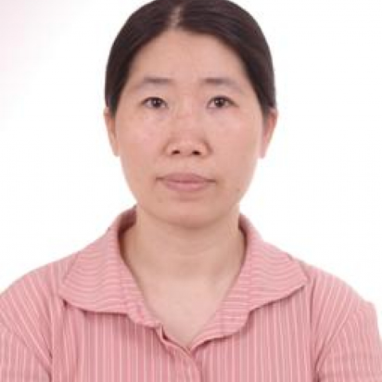

<!-- AUTO-GENERATED-BY: work/generate_obsidian_profiles.py -->

<!-- TEMPLATE: D:\workspace\信息收集整理\医生画像仓库\模板\医生画像模板.md -->

# 梁明懿

## 基础信息

| 字段 | 内容 |
|---|---|
| 姓名 | 梁明懿 |
| 医院 | 中山大学附属第一医院 |
| 科室 | 妇科 |
| 职称/身份 | 副主任医师 |
| 来源链接 | [官网原文](https://www.fahsysu.org.cn/node/460) |
| 采集日期 | 2026-08-13 |

## 简介/擅长

毕业后一直从事妇产科临床工作20余年，熟悉妇产科各种疾病的诊断和治疗，特别中止妊娠的方法应用,避孕方法的选择应用及子宫内膜异位症的诊治有较丰富的临床经验。 研究方向：流产与避孕 主要教育和工作经历：1989年广州医学院本科毕业后一直从事妇产科临床工作 社会兼职： 论著： 专著： 其他主要工作成绩（比如获奖情况）：

## 教育与进修经历

- 毕业后一直从事妇产科临床工作20余年，熟悉妇产科各种疾病的诊断和治疗，特别中止妊娠的方法应用,避孕方法的选择应用及子宫内膜异位症的诊治有较丰富的临床经验。
- 医疗特长： 毕业后一直从事妇产科临床工作20余年，熟悉妇产科各种疾病的诊断和治疗，特别中止妊娠的方法应用,避孕方法的选择应用及子宫内膜异位症的诊治有较丰富的临床经验。
- 研究方向：流产与避孕 主要教育和工作经历：1989年广州医学院本科毕业后一直从事妇产科临床工作 社会兼职： 论著： 专著： 其他主要工作成绩（比如获奖情况）：

## 可包装亮点

- 研究方向：流产与避孕 主要教育和工作经历：1989年广州医学院本科毕业后一直从事妇产科临床工作 社会兼职： 论著： 专著： 其他主要工作成绩（比如获奖情况）：

## 重点疾病/人群标签

- 慢性病：
- 肿瘤：
- 生殖疾病：
- 免疫/风湿：
- 术后恢复/康复：
- 疑难重症：

## 证据摘录

> 只摘录官网公开信息中的短句或关键字段，不复制大段原文。

- 官网身份字段：副主任医师
- 官网简介/擅长：毕业后一直从事妇产科临床工作20余年，熟悉妇产科各种疾病的诊断和治疗，特别中止妊娠的方法应用,避孕方法的选择应用及子宫内膜异位症的诊治有较丰富的临床经验。 研究方向：流产与避孕 主要教育和工作经历：1989年广州医学院本科毕业后一直从事妇产科临床工作 社会兼职： 论著： 专著： 其他主要工作成绩（比如获奖情况）：
- 官网亮眼经历线索：研究方向：流产与避孕 主要教育和工作经历：1989年广州医学院本科毕业后一直从事妇产科临床工作 社会兼职： 论著： 专著： 其他主要工作成绩（比如获奖情况）：
- 来源链接：https://www.fahsysu.org.cn/node/460

## BD 画像摘要

梁明懿医生可作为中山大学附属第一医院妇科的基础医生资料入库。当前重点方向以总底表标签为准，官网未展示的信息保持空白。

## 合规边界

- 仅使用医院官网、官方公众号、官方小程序等公开渠道。
- 不采集私人电话、私人微信、家庭住址、患者隐私或非公开排班信息。
- 不写“保证治愈”“疗效第一”“包治疑难杂症”等无法由官网证明的表述。
