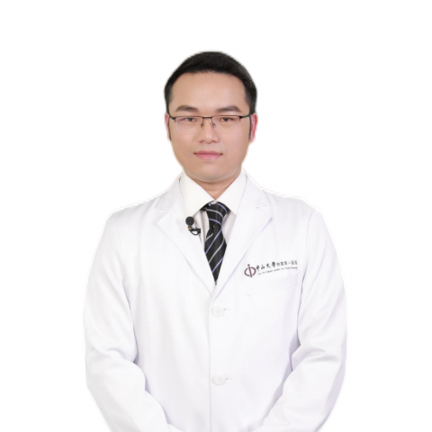

<!-- AUTO-GENERATED-BY: work/generate_obsidian_profiles.py -->

<!-- TEMPLATE: D:\workspace\信息收集整理\医生画像仓库\模板\医生画像模板.md -->

# 梁炎春

## 基础信息

| 字段 | 内容 |
|---|---|
| 姓名 | 梁炎春 |
| 医院 | 中山大学附属第一医院 |
| 科室 | 妇科 |
| 职称/身份 | 副主任医师 |
| 来源链接 | [官网原文](https://www.fahsysu.org.cn/node/25410) |
| 采集日期 | 2026-08-13 |

## 简介/擅长

特别擅长子宫内膜异位症、子宫腺肌病、子宫肌瘤、宫腔内疾病的临床诊治，也熟练掌握妇科常见病、多发病的宫腔镜、腹腔镜微创手术治疗，如子宫内膜异位症、子宫腺肌症、卵巢巧克力囊肿、深部浸润型子宫内膜异位症、卵巢良恶性肿瘤（畸胎瘤、囊腺瘤、纤维瘤、卵巢囊肿、卵巢癌等）、子宫肌瘤、宫颈良恶性病变（宫颈病变、宫颈癌等）、子宫内膜相关性疾病（子宫内膜不典型增生、子宫内膜癌等）、宫腔粘连、胚胎组织物残留、剖宫产疤痕憩室、子宫脱垂等。 此外，也同时掌握各种开腹手术技术（如卵巢癌全面分期手术、宫颈癌根治术、子宫内膜癌全面分期手术等），特别擅长子宫腺肌症保留子宫手术治疗。 研究方向：子宫内膜异位症的发病机制、子宫内膜异位症相关性疼痛的发生机制。 主要教育和工作经历：2014年获得中山大学临床医学（八年制）博士学位后，一直在中山大学附属第一医院妇科工作至今。 社会兼职：广东省医学会妇产科学分会委员会子宫内膜异位症学组副组长，中国优生科学协会妇科加速康复外科专业委员会委员，中国研究型医院学会妇产科学专业委员会青年委员，中国妇幼保健协会妇幼微创专业委员会妇科腹腔镜学组青年委员，《妇产与遗传（电子版）》杂志编委 论著：在国内外核心期刊发表论文40余篇...

## 教育与进修经历

- 主要教育和工作经历：2014年获得中山大学临床医学（八年制）博士学位后，一直在中山大学附属第一医院妇科工作至今。
- 在临床工作的同时，担任中山大学临床五年制、八年制理论大课《妇产科学》的授课老师，以及负责临床医学五年制、八年制、MBBS留学生以及外国交流生的见习、实习带教工作。

## 科研项目与成果

- 其他主要工作成绩（比如获奖情况）： （1）主持的科研基金项目包括国家级2项（国家青年科学基金、面上项目各1项），省级7项，市级1项，校级11项。
- 此外还积极参与指导本科学生参与和申请多项省级和校级的大学生科研基金，指导学生发表多篇高质量的专业论文。
- 指导硕士研究生4人，积极开展子宫内膜异位症的发病机制的相关研究，并取得多项省级、国家级的基金支持。

## 论文与学术产出

- 社会兼职：广东省医学会妇产科学分会委员会子宫内膜异位症学组副组长，中国优生科学协会妇科加速康复外科专业委员会委员，中国研究型医院学会妇产科学专业委员会青年委员，中国妇幼保健协会妇幼微创专业委员会妇科腹腔镜学组青年委员，《妇产与遗传（电子版）》杂志编委 论著：在国内外核心期刊发表论文40余篇，其中以第一作者或通讯作者发表的SCI文章有8篇。
- 此外还积极参与指导本科学生参与和申请多项省级和校级的大学生科研基金，指导学生发表多篇高质量的专业论文。

## 可包装亮点

- 社会兼职：广东省医学会妇产科学分会委员会子宫内膜异位症学组副组长，中国优生科学协会妇科加速康复外科专业委员会委员，中国研究型医院学会妇产科学专业委员会青年委员，中国妇幼保健协会妇幼微创专业委员会妇科腹腔镜学组青年委员，《妇产与遗传（电子版）》杂志编委 论著：在国内外核心期刊发表论文40余篇，其中以第一作者或通讯作者发表的SCI文章有8篇。
- 专著：《子宫内膜异位症诊断和治疗实用指南》，副主译。
- 其他主要工作成绩（比如获奖情况）： （1）主持的科研基金项目包括国家级2项（国家青年科学基金、面上项目各1项），省级7项，市级1项，校级11项。
- 2021年入选中山大学附属第一医院柯麟新星人才计划。

## 重点疾病/人群标签

- 慢性病：
- 肿瘤：肿瘤、癌、瘤、卵巢、胚胎、康复、疼痛
- 生殖疾病：肿瘤、癌、瘤、卵巢、胚胎、康复、疼痛
- 免疫/风湿：
- 术后恢复/康复：肿瘤、癌、瘤、卵巢、胚胎、康复、疼痛
- 疑难重症：

## 证据摘录

> 只摘录官网公开信息中的短句或关键字段，不复制大段原文。

- 官网身份字段：副主任医师
- 官网简介/擅长：特别擅长子宫内膜异位症、子宫腺肌病、子宫肌瘤、宫腔内疾病的临床诊治，也熟练掌握妇科常见病、多发病的宫腔镜、腹腔镜微创手术治疗，如子宫内膜异位症、子宫腺肌症、卵巢巧克力囊肿、深部浸润型子宫内膜异位症、卵巢良恶性肿瘤（畸胎瘤、囊腺瘤、纤维瘤、卵巢囊肿、卵巢癌等）、子宫肌瘤、宫颈良恶性病变（宫颈病变、宫颈癌等）、子宫内膜相关性疾病（子宫内膜不典型增生、子宫内膜癌等）、宫腔粘连、胚胎组织物残留、剖宫产疤痕憩室、子宫脱垂等。 此外，也同时掌握各…
- 官网亮眼经历线索：社会兼职：广东省医学会妇产科学分会委员会子宫内膜异位症学组副组长，中国优生科学协会妇科加速康复外科专业委员会委员，中国研究型医院学会妇产科学专业委员会青年委员，中国妇幼保健协会妇幼微创专业委员会妇科腹腔镜学组青年委员，《妇产与遗传（电子版）》杂志编委 论著：在国内外核心期刊发表论文40余篇，其中以第一作者或通讯作者发表的SCI文章有8篇。 专著：《子宫内膜异位症诊断和治疗实用指南》，副主译。 其他主要工作成绩（比如获奖情况）： （1）…
- 来源链接：https://www.fahsysu.org.cn/node/25410

## BD 画像摘要

梁炎春医生可作为肿瘤、生殖疾病、术后恢复/康复方向的基础画像候选。后续 BD 使用应继续以官网来源和人工复核为准，不添加疗效承诺或无来源包装。

## 合规边界

- 仅使用医院官网、官方公众号、官方小程序等公开渠道。
- 不采集私人电话、私人微信、家庭住址、患者隐私或非公开排班信息。
- 不写“保证治愈”“疗效第一”“包治疑难杂症”等无法由官网证明的表述。
