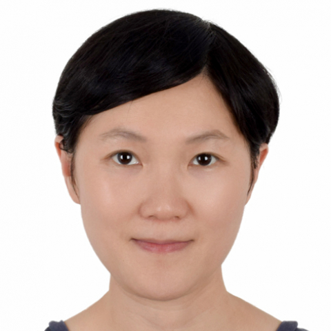

<!-- AUTO-GENERATED-BY: work/generate_obsidian_profiles.py -->

<!-- TEMPLATE: D:\workspace\信息收集整理\医生画像仓库\模板\医生画像模板.md -->

# 梁颖茵

## 基础信息

| 字段 | 内容 |
|---|---|
| 姓名 | 梁颖茵 |
| 医院 | 中山大学附属第一医院 |
| 科室 | 神经一科 |
| 职称/身份 | 副主任医师 |
| 来源链接 | [官网原文](https://www.fahsysu.org.cn/node/32589) |
| 采集日期 | 2026-08-13 |

## 简介/擅长

从事神经内科工作20余年。 2000年毕业于中山医科大学临床医学系，2014年取得博士学位。 擅长神经内科疾病的诊治，尤其是神经肌肉病、神经遗传病、罕见病、眩晕等疾病的诊断和治疗。 工作经历：2000年7月至今中山大学附属第一医院东院神经内科 社会兼职： 广东省中西医结合学会神经肌肉病与临床神经电生理专业委员会委员 中国医师协会神经内科医师分会神经遗传专业委员会委员。 广东省药学罕见病分会神经学组委员。 在国内外发表论文多篇，参与多项国家和省级科研基金项目。 研究成果多次在学术会议汇报交流。 论著： Liang Y , Li G, Chen S, He R, Zhou X, Chen Y, Xu X, Zhu R, Zhang C. Muscle MRI findings in a one-year-old girl with merosin-deficient congenital muscular dystrophy type 1A due to LAMA2 mutation: A case report. Biomed Rep. 2017 Aug; 7(2):193-196. doi: 10.3892/br.20...

## 教育与进修经历

- 2000年毕业于中山医科大学临床医学系，2014年取得博士学位。

## 科研项目与成果

- 在国内外发表论文多篇，参与多项国家和省级科研基金项目。
- 研究成果多次在学术会议汇报交流。

## 论文与学术产出

- 在国内外发表论文多篇，参与多项国家和省级科研基金项目。

## 可包装亮点

- 工作经历：2000年7月至今中山大学附属第一医院东院神经内科 社会兼职： 广东省中西医结合学会神经肌肉病与临床神经电生理专业委员会委员 中国医师协会神经内科医师分会神经遗传专业委员会委员。
- 在国内外发表论文多篇，参与多项国家和省级科研基金项目。

## 重点疾病/人群标签

- 慢性病：
- 肿瘤：
- 生殖疾病：
- 免疫/风湿：
- 术后恢复/康复：营养、罕见
- 疑难重症：营养、罕见

## 证据摘录

> 只摘录官网公开信息中的短句或关键字段，不复制大段原文。

- 官网身份字段：副主任医师
- 官网简介/擅长：从事神经内科工作20余年。 2000年毕业于中山医科大学临床医学系，2014年取得博士学位。 擅长神经内科疾病的诊治，尤其是神经肌肉病、神经遗传病、罕见病、眩晕等疾病的诊断和治疗。 工作经历：2000年7月至今中山大学附属第一医院东院神经内科 社会兼职： 广东省中西医结合学会神经肌肉病与临床神经电生理专业委员会委员 中国医师协会神经内科医师分会神经遗传专业委员会委员。 广东省药学罕见病分会神经学组委员。 在国内外发表论文多篇，参与多项…
- 官网亮眼经历线索：工作经历：2000年7月至今中山大学附属第一医院东院神经内科 社会兼职： 广东省中西医结合学会神经肌肉病与临床神经电生理专业委员会委员 中国医师协会神经内科医师分会神经遗传专业委员会委员。 在国内外发表论文多篇，参与多项国家和省级科研基金项目。
- 来源链接：https://www.fahsysu.org.cn/node/32589

## BD 画像摘要

梁颖茵医生可作为术后恢复/康复、疑难重症方向的基础画像候选。后续 BD 使用应继续以官网来源和人工复核为准，不添加疗效承诺或无来源包装。

## 合规边界

- 仅使用医院官网、官方公众号、官方小程序等公开渠道。
- 不采集私人电话、私人微信、家庭住址、患者隐私或非公开排班信息。
- 不写“保证治愈”“疗效第一”“包治疑难杂症”等无法由官网证明的表述。
